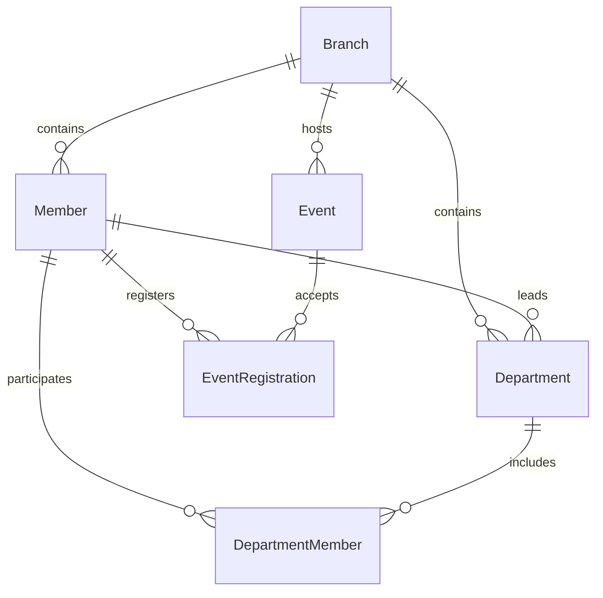

# API Specification Design Document

## Overview

This design document outlines the creation of a comprehensive OpenAPI 3.0 specification for the Kairos Church Management System API. The specification will serve as the definitive contract between frontend applications, backend services, and database systems, ensuring consistent integration and development practices across all components.

The API specification will be generated from the existing NestJS controllers and DTOs, enhanced with comprehensive documentation, examples, and validation rules. It will follow OpenAPI 3.0 standards and include all necessary components for complete API documentation.

## Architecture

### Specification Structure

The OpenAPI specification will follow this hierarchical structure:

```
openapi.yaml
├── info (API metadata)
├── servers (environment configurations)
├── paths (endpoint definitions)
│   ├── /members (member management endpoints)
│   ├── /departments (department management endpoints)
│   └── /events (event management endpoints)
├── components
│   ├── schemas (data models)
│   ├── responses (reusable response definitions)
│   ├── parameters (reusable parameter definitions)
│   ├── examples (request/response examples)
│   └── securitySchemes (authentication definitions)
└── tags (endpoint grouping)
```

### Generation Strategy

1. **Automated Extraction**: Use NestJS Swagger decorators to automatically generate base specification
2. **Manual Enhancement**: Add detailed descriptions, examples, and business context
3. **Validation Integration**: Ensure specification matches actual DTO validation rules
4. **Documentation Generation**: Create human-readable documentation from specification

## Components and Interfaces

### Core Data Models

#### Member Schema
```yaml
Member:
  type: object
  required: [id, branchId, firstName, lastName]
  properties:
    id:
      type: string
      description: Unique member identifier
      example: "1"
    branchId:
      type: string
      description: Branch identifier
      example: "branch-1"
    firstName:
      type: string
      minLength: 1
      maxLength: 50
      description: Member's first name
      example: "John"
    lastName:
      type: string
      minLength: 1
      maxLength: 50
      description: Member's last name
      example: "Doe"
    email:
      type: string
      format: email
      description: Member's email address
      example: "john.doe@example.com"
    phone:
      type: string
      pattern: '^[+]?[0-9\s\-\(\)]+$'
      description: Member's phone number
      example: "+1234567890"
    # ... additional fields
```

#### Department Schema
```yaml
Department:
  type: object
  required: [id, branchId, name]
  properties:
    id:
      type: string
      description: Unique department identifier
    branchId:
      type: string
      description: Branch identifier
    name:
      type: string
      minLength: 1
      maxLength: 100
      description: Department name
    description:
      type: string
      maxLength: 500
      description: Department description
    # ... additional fields
```

#### Event Schema
```yaml
Event:
  type: object
  required: [id, branchId, name, startDate]
  properties:
    id:
      type: string
      description: Unique event identifier
    branchId:
      type: string
      description: Branch identifier
    name:
      type: string
      minLength: 1
      maxLength: 100
      description: Event name
    startDate:
      type: string
      format: date-time
      description: Event start date and time
    # ... additional fields
```

### API Endpoints

#### Members Endpoints
- `GET /members` - List members with filtering and pagination
- `GET /members/{id}` - Get specific member details
- `GET /members/stats` - Get member statistics
- `POST /members` - Create new member
- `PUT /members/{id}` - Update existing member
- `PUT /members/{id}/restore` - Restore archived member
- `DELETE /members/{id}` - Archive member

#### Departments Endpoints
- `GET /departments` - List departments with filtering
- `GET /departments/{id}` - Get specific department details
- `GET /departments/stats` - Get department statistics
- `POST /departments` - Create new department
- `PUT /departments/{id}` - Update existing department
- `DELETE /departments/{id}` - Archive department
- `POST /departments/{id}/members` - Add member to department
- `DELETE /departments/{id}/members/{memberId}` - Remove member from department

#### Events Endpoints
- `GET /events` - List events with filtering
- `GET /events/{id}` - Get specific event details
- `GET /events/stats` - Get event statistics
- `POST /events` - Create new event
- `PUT /events/{id}` - Update existing event
- `DELETE /events/{id}` - Archive event
- `POST /events/{id}/register` - Register member for event
- `DELETE /events/{id}/register/{memberId}` - Unregister member from event

### Response Structures

#### Success Response Format
```yaml
SuccessResponse:
  type: object
  properties:
    data:
      description: Response data
    pagination:
      $ref: '#/components/schemas/PaginationMeta'
      description: Pagination metadata (for list endpoints)
```

#### Error Response Format
```yaml
ErrorResponse:
  type: object
  required: [statusCode, message, error]
  properties:
    statusCode:
      type: integer
      description: HTTP status code
      example: 400
    message:
      type: string
      description: Error message
      example: "Validation failed"
    error:
      type: string
      description: Error type
      example: "Bad Request"
```

#### Pagination Metadata
```yaml
PaginationMeta:
  type: object
  required: [page, limit, total, pages]
  properties:
    page:
      type: integer
      minimum: 1
      description: Current page number
    limit:
      type: integer
      minimum: 1
      maximum: 100
      description: Items per page
    total:
      type: integer
      minimum: 0
      description: Total number of items
    pages:
      type: integer
      minimum: 0
      description: Total number of pages
```

## Data Models

### Entity Relationships



### Field Specifications

#### Common Field Types
- **ID Fields**: String type, UUID format preferred
- **Name Fields**: String type, 1-100 character limit
- **Description Fields**: String type, 0-500 character limit
- **Email Fields**: String type, email format validation
- **Phone Fields**: String type, international format support
- **Date Fields**: String type, ISO 8601 date-time format
- **Boolean Fields**: Boolean type, default values specified

#### Validation Rules
- **Required Fields**: Clearly marked in schema definitions
- **String Lengths**: Minimum and maximum length constraints
- **Format Validation**: Email, phone, date format requirements
- **Enum Values**: Predefined value lists for categorical fields
- **Numeric Ranges**: Minimum and maximum value constraints

## Error Handling

### HTTP Status Codes
- **200 OK**: Successful GET, PUT operations
- **201 Created**: Successful POST operations
- **400 Bad Request**: Validation errors, malformed requests
- **401 Unauthorized**: Authentication required
- **403 Forbidden**: Insufficient permissions
- **404 Not Found**: Resource not found
- **409 Conflict**: Resource conflict (duplicate email, etc.)
- **422 Unprocessable Entity**: Business logic validation errors
- **500 Internal Server Error**: Server-side errors

### Error Response Examples
```yaml
ValidationError:
  example:
    statusCode: 400
    message: ["firstName must not be empty", "email must be a valid email"]
    error: "Bad Request"

NotFoundError:
  example:
    statusCode: 404
    message: "Member with ID 999 not found"
    error: "Not Found"

ConflictError:
  example:
    statusCode: 409
    message: "Member with email john.doe@example.com already exists"
    error: "Conflict"
```

## Testing Strategy

### Specification Validation
The API specification will be validated using multiple approaches to ensure accuracy and completeness:

#### Schema Validation Tests
- **Structure Validation**: Verify OpenAPI specification follows correct format
- **Reference Validation**: Ensure all $ref references resolve correctly
- **Example Validation**: Validate all examples against their schemas
- **Constraint Validation**: Verify field constraints match implementation

#### Contract Testing
- **Request Validation**: Test that API accepts requests matching specification
- **Response Validation**: Verify API responses conform to specification schemas
- **Error Testing**: Validate error responses match documented formats
- **Edge Case Testing**: Test boundary conditions and validation limits

#### Documentation Testing
- **Example Accuracy**: Verify all examples work with actual API
- **Description Completeness**: Ensure all endpoints have clear descriptions
- **Parameter Documentation**: Validate parameter descriptions and constraints
- **Response Documentation**: Verify response format documentation

### Property-Based Testing Integration
Property-based tests will be generated from the OpenAPI specification to validate:
- **Data Type Consistency**: All fields match specified types
- **Validation Rule Compliance**: Input validation matches specification
- **Response Format Consistency**: All responses follow documented schemas
- **Error Handling Consistency**: Error responses match specification

The testing framework will use the OpenAPI specification as the source of truth for generating test cases, ensuring the implementation always matches the documented contract.

## Correctness Properties

*A property is a characteristic or behavior that should hold true across all valid executions of a system-essentially, a formal statement about what the system should do. Properties serve as the bridge between human-readable specifications and machine-verifiable correctness guarantees.*

### Property Reflection

After analyzing all acceptance criteria, several properties can be consolidated to eliminate redundancy:

- Properties related to schema completeness (1.3, 2.1, 3.4) can be combined into a comprehensive schema validation property
- Properties about consistency (2.2, 2.3, 2.4) can be unified into a single consistency validation property  
- Properties about example validation (4.1, 4.3, 7.4) can be merged into one example correctness property
- Properties about documentation completeness (7.1, 7.2, 7.5) can be consolidated into a documentation quality property

### Core Properties

**Property 1: OpenAPI Specification Completeness**
*For any* controller endpoint in the NestJS application, the generated OpenAPI specification should include complete endpoint definitions with HTTP methods, paths, parameters, request schemas, and response schemas
**Validates: Requirements 1.1, 1.2**

**Property 2: Schema Validation Consistency**  
*For any* DTO class with validation decorators, the corresponding OpenAPI schema should include identical validation constraints including field types, required/optional status, string lengths, number ranges, and format requirements
**Validates: Requirements 1.3, 2.1, 2.2, 3.4**

**Property 3: Request-Response Schema Accuracy**
*For any* API endpoint, POST and PUT request schemas should exactly match the DTO definitions, and response schemas should accurately represent the actual response structure
**Validates: Requirements 1.4, 1.5, 2.3**

**Property 4: Error Response Standardization**
*For any* error condition, the OpenAPI specification should document standardized error response formats with correct HTTP status codes that match the actual API behavior
**Validates: Requirements 2.4, 4.2, 5.3**

**Property 5: Runtime Validation Consistency**
*For any* request that conforms to the OpenAPI schema, the API should accept it, and for any request that violates the schema, the API should reject it with appropriate error responses
**Validates: Requirements 2.5**

**Property 6: Entity Relationship Documentation**
*For any* database entity with relationships, the OpenAPI specification should document all foreign key relationships and referential integrity constraints
**Validates: Requirements 3.1, 3.3**

**Property 7: Data Type Compatibility**
*For any* field in the OpenAPI specification, the data type should be compatible with the corresponding database column type and NestJS DTO type
**Validates: Requirements 3.2**

**Property 8: Example Validation Correctness**
*For any* example in the OpenAPI specification, it should validate successfully against its corresponding schema and work correctly when executed against the actual API
**Validates: Requirements 4.1, 4.3, 7.4**

**Property 9: Boundary Condition Documentation**
*For any* field with validation constraints, the OpenAPI specification should document and enforce the exact boundary conditions and validation limits
**Validates: Requirements 4.4**

**Property 10: Machine-Readable Test Generation**
*For any* endpoint in the OpenAPI specification, automated test cases should be generatable and executable, producing valid test results
**Validates: Requirements 4.5**

**Property 11: Security Scheme Completeness**
*For any* endpoint requiring authentication or authorization, the OpenAPI specification should define complete security schemes with proper authentication mechanisms and permission requirements
**Validates: Requirements 5.1, 5.2, 5.4, 5.5**

**Property 12: Environment Configuration Accuracy**
*For any* deployment environment, the OpenAPI specification should provide correct server URLs, base paths, and environment-specific configuration information
**Validates: Requirements 6.1, 6.4**

**Property 13: Documentation Quality Consistency**
*For any* endpoint, parameter, or schema in the OpenAPI specification, it should have clear, non-empty descriptions with appropriate business context and usage examples
**Validates: Requirements 7.1, 7.2, 7.5**

**Property 14: Pagination Documentation Uniformity**
*For any* list endpoint, the OpenAPI specification should consistently document pagination parameters and response metadata following the same schema pattern
**Validates: Requirements 8.2**

**Property 15: Query Optimization Documentation**
*For any* endpoint supporting filtering or sorting, the OpenAPI specification should document all available query parameters with their effects and constraints
**Validates: Requirements 8.3**

**Property 16: OpenAPI Specification Round-Trip Validation**
*For any* valid OpenAPI specification document, parsing and re-serializing it should produce an equivalent specification that validates against OpenAPI 3.0 schema
**Validates: Requirements 1.1, 4.5**