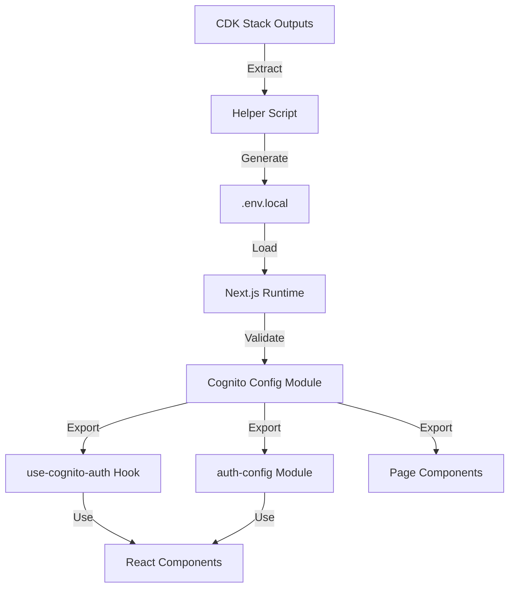

# Design Document: Cognito Configuration Centralization

## Overview

This design establishes a centralized configuration management system for AWS Cognito authentication in the Next.js application. The system eliminates hardcoded Cognito values scattered across multiple files and creates a single source of truth that loads all configuration from environment variables.

The design introduces a new configuration module (`apps/src/config/cognito.ts`) that validates and exports all Cognito-related values, a helper script to extract CDK stack outputs, and a migration strategy to update all existing code that currently uses hardcoded values.

## Architecture

### High-Level Architecture



### Configuration Flow

1. **Infrastructure Deployment**: CDK stack deploys Cognito resources and outputs configuration values
2. **Configuration Extraction**: Helper script queries CloudFormation and generates `.env.local` file
3. **Application Startup**: Next.js loads environment variables
4. **Configuration Validation**: Config module validates all required variables are present
5. **Configuration Distribution**: All components/hooks import from the central config module

### Directory Structure

```
apps/
├── src/
│   ├── config/
│   │   └── cognito.ts          # New: Central configuration module
│   ├── hooks/
│   │   └── use-cognito-auth.ts # Updated: Import from config
│   ├── lib/
│   │   └── auth-config.ts      # Updated: Import from config
│   └── app/
│       ├── signup/
│       │   └── page.tsx        # Updated: Import from config
│       └── auth/
│           └── change-password/
│               └── page.tsx    # Updated: Import from config
├── scripts/
│   └── extract-cognito-config.sh # New: CDK output extraction script
└── .env.local                   # Updated: All Cognito variables
```

## Components and Interfaces

### 1. Cognito Configuration Module

**File**: `apps/src/config/cognito.ts`

**Purpose**: Single source of truth for all Cognito configuration values with validation.

**Interface**:

```typescript
// Type definitions
export interface CognitoConfig {
  userPoolId: string;
  clientId: string;
  region: string;
  domain: string;
  authority: string;
}

export interface CognitoUrls {
  signIn: string;
  signUp: string;
  forgotPassword: string;
  mfa: string;
  confirmSignUp: string;
  resetPassword: string;
  logout: string;
}

// Configuration validation and export
export const cognitoConfig: CognitoConfig;
export const cognitoUrls: CognitoUrls;

// Helper functions
export function getBaseUrl(): string;
export function buildAuthUrl(
  type: keyof CognitoUrls,
  additionalParams?: Record<string, string>
): string;
export function buildLogoutUrl(redirectUri?: string): string;
```

**Implementation Details**:

```typescript
// Environment variable validation
function getRequiredEnv(key: string, description: string): string {
  const value = process.env[key];
  if (!value) {
    throw new Error(
      `Missing required environment variable: ${key}\n` +
      `Description: ${description}\n` +
      `Please set this variable in your .env.local file.\n` +
      `See .env.local.example for the correct format.`
    );
  }
  return value;
}

// Validate environment variables at module load time
const userPoolId = getRequiredEnv(
  'NEXT_PUBLIC_COGNITO_USER_POOL_ID',
  'Cognito User Pool ID (e.g., eu-north-1_XXXXXXXXX)'
);

const clientId = getRequiredEnv(
  'NEXT_PUBLIC_COGNITO_CLIENT_ID',
  'Cognito User Pool Client ID'
);

const region = getRequiredEnv(
  'NEXT_PUBLIC_COGNITO_REGION',
  'AWS Region (e.g., eu-north-1)'
);

const domain = getRequiredEnv(
  'NEXT_PUBLIC_COGNITO_DOMAIN',
  'Cognito Domain URL (e.g., https://your-domain.auth.region.amazoncognito.com)'
);

const authority = getRequiredEnv(
  'NEXT_PUBLIC_COGNITO_AUTHORITY',
  'OIDC Authority URL (e.g., https://cognito-idp.region.amazonaws.com/userPoolId)'
);

// Export validated configuration
export const cognitoConfig: CognitoConfig = {
  userPoolId,
  clientId,
  region,
  domain,
  authority,
};

// Dynamic base URL detection
export function getBaseUrl(): string {
  if (typeof window !== 'undefined') {
    return window.location.origin;
  }
  return process.env.NEXT_PUBLIC_BASE_URL || 'http://localhost:3001';
}

// Build Cognito URLs
export const cognitoUrls: CognitoUrls = {
  signIn: `${domain}/login`,
  signUp: `${domain}/signup`,
  forgotPassword: `${domain}/forgotPassword`,
  mfa: `${domain}/mfa`,
  confirmSignUp: `${domain}/confirmSignUp`,
  resetPassword: `${domain}/resetPassword`,
  logout: `${domain}/logout`,
};

// Helper to build auth URLs with parameters
export function buildAuthUrl(
  type: keyof CognitoUrls,
  additionalParams: Record<string, string> = {}
): string {
  const baseUrl = cognitoUrls[type];
  const params = new URLSearchParams({
    client_id: clientId,
    response_type: 'code',
    scope: 'openid email phone',
    redirect_uri: `${getBaseUrl()}/dashboard`,
    ...additionalParams,
  });
  return `${baseUrl}?${params.toString()}`;
}

// Helper to build logout URL
export function buildLogoutUrl(redirectUri?: string): string {
  const params = new URLSearchParams({
    client_id: clientId,
    logout_uri: redirectUri || getBaseUrl(),
  });
  return `${cognitoUrls.logout}?${params.toString()}`;
}
```

### 2. Updated auth-config Module

**File**: `apps/src/lib/auth-config.ts`

**Changes**: Import all values from `cognito.ts` instead of using hardcoded fallbacks.

**Updated Implementation**:

```typescript
import { cognitoConfig, getBaseUrl, cognitoUrls, buildAuthUrl, buildLogoutUrl } from '../config/cognito';

export const cognitoAuthConfig = {
  authority: cognitoConfig.authority,
  client_id: cognitoConfig.clientId,
  redirect_uri: `${getBaseUrl()}/dashboard`,
  response_type: "code",
  scope: "openid email phone",
  post_logout_redirect_uri: getBaseUrl(),
  automaticSilentRenew: false,
  loadUserInfo: true,
  revokeAccessTokenOnSignout: true,
  includeIdTokenInSilentRenew: false,
  onSigninCallback: () => {
    window.history.replaceState({}, document.title, window.location.pathname);
  },
  metadata: {
    issuer: cognitoConfig.authority,
    authorization_endpoint: `${cognitoConfig.domain}/oauth2/authorize`,
    token_endpoint: `${cognitoConfig.domain}/oauth2/token`,
    userinfo_endpoint: `${cognitoConfig.domain}/oauth2/userInfo`,
    end_session_endpoint: `${cognitoConfig.domain}/logout`,
    jwks_uri: `${cognitoConfig.authority}/.well-known/jwks.json`,
  },
};

export const cognitoDomain = cognitoConfig.domain;
export const logoutUri = getBaseUrl();

// Re-export helper functions
export { cognitoUrls, buildAuthUrl, buildLogoutUrl };
```

### 3. Updated use-cognito-auth Hook

**File**: `apps/src/hooks/use-cognito-auth.ts`

**Changes**: Remove all hardcoded Client IDs and import from config module.

**Key Updates**:

```typescript
import { cognitoConfig, buildLogoutUrl, buildAuthUrl } from '../config/cognito';

// Replace all instances of hardcoded clientId with:
const clientId = cognitoConfig.clientId;

// Replace localStorage key construction with:
const storageKey = `oidc.user:${cognitoConfig.authority}:${cognitoConfig.clientId}`;

// Use buildLogoutUrl helper instead of manual construction
const logoutUrl = buildLogoutUrl();
```

### 4. Updated Page Components

**Files**: 
- `apps/src/app/signup/page.tsx`
- `apps/src/app/auth/change-password/page.tsx`

**Changes**: Import configuration from central module instead of using hardcoded values.

**Key Updates**:

```typescript
import { cognitoConfig, buildAuthUrl } from '../../config/cognito';

// Replace hardcoded clientId with:
const clientId = cognitoConfig.clientId;

// Use buildAuthUrl helper for redirects:
const signUpUrl = buildAuthUrl('signUp');
```

### 5. CDK Output Extraction Script

**File**: `apps/scripts/extract-cognito-config.sh`

**Purpose**: Extract CDK stack outputs and generate `.env.local` file.

**Implementation**:

```bash
#!/bin/bash

# Configuration
STACK_NAME="${1:-KcmsAuthStack-dev}"
ENV_FILE=".env.local"
BACKUP_FILE=".env.local.backup"

echo "Extracting Cognito configuration from CDK stack: $STACK_NAME"

# Check AWS CLI is installed
if ! command -v aws &> /dev/null; then
    echo "Error: AWS CLI is not installed"
    echo "Install it with: pip install awscli"
    exit 1
fi

# Check AWS credentials
if ! aws sts get-caller-identity &> /dev/null; then
    echo "Error: AWS credentials not configured"
    echo "Run: aws configure"
    exit 1
fi

# Get stack outputs
echo "Querying CloudFormation stack outputs..."
OUTPUTS=$(aws cloudformation describe-stacks \
    --stack-name "$STACK_NAME" \
    --query 'Stacks[0].Outputs' \
    --output json 2>&1)

if [ $? -ne 0 ]; then
    echo "Error: Failed to get stack outputs"
    echo "$OUTPUTS"
    exit 1
fi

# Extract values
USER_POOL_ID=$(echo "$OUTPUTS" | jq -r '.[] | select(.OutputKey=="UserPoolId") | .OutputValue')
CLIENT_ID=$(echo "$OUTPUTS" | jq -r '.[] | select(.OutputKey=="UserPoolClientId") | .OutputValue')
DOMAIN_URL=$(echo "$OUTPUTS" | jq -r '.[] | select(.OutputKey=="CognitoDomainUrl") | .OutputValue')
AUTHORITY_URL=$(echo "$OUTPUTS" | jq -r '.[] | select(.OutputKey=="AuthorityUrl") | .OutputValue')

# Get region from stack
REGION=$(aws cloudformation describe-stacks \
    --stack-name "$STACK_NAME" \
    --query 'Stacks[0].StackId' \
    --output text | cut -d: -f4)

# Validate all values were found
if [ -z "$USER_POOL_ID" ] || [ -z "$CLIENT_ID" ] || [ -z "$DOMAIN_URL" ] || [ -z "$AUTHORITY_URL" ]; then
    echo "Error: Could not extract all required values from stack outputs"
    echo "USER_POOL_ID: $USER_POOL_ID"
    echo "CLIENT_ID: $CLIENT_ID"
    echo "DOMAIN_URL: $DOMAIN_URL"
    echo "AUTHORITY_URL: $AUTHORITY_URL"
    exit 1
fi

# Backup existing .env.local if it exists
if [ -f "$ENV_FILE" ]; then
    echo "Backing up existing $ENV_FILE to $BACKUP_FILE"
    cp "$ENV_FILE" "$BACKUP_FILE"
fi

# Generate .env.local file
echo "Generating $ENV_FILE..."
cat > "$ENV_FILE" << EOF
# Cognito Configuration
# Auto-generated from CDK stack: $STACK_NAME
# Generated at: $(date)

# User Pool ID
NEXT_PUBLIC_COGNITO_USER_POOL_ID=$USER_POOL_ID

# Client ID
NEXT_PUBLIC_COGNITO_CLIENT_ID=$CLIENT_ID

# AWS Region
NEXT_PUBLIC_COGNITO_REGION=$REGION

# Cognito Domain
NEXT_PUBLIC_COGNITO_DOMAIN=$DOMAIN_URL

# Authority URL (OIDC issuer)
NEXT_PUBLIC_COGNITO_AUTHORITY=$AUTHORITY_URL

# Optional: Base URL for your application (auto-detected if not set)
# NEXT_PUBLIC_BASE_URL=http://localhost:3001
EOF

echo "✓ Configuration extracted successfully!"
echo ""
echo "Generated environment variables:"
echo "  NEXT_PUBLIC_COGNITO_USER_POOL_ID=$USER_POOL_ID"
echo "  NEXT_PUBLIC_COGNITO_CLIENT_ID=$CLIENT_ID"
echo "  NEXT_PUBLIC_COGNITO_REGION=$REGION"
echo "  NEXT_PUBLIC_COGNITO_DOMAIN=$DOMAIN_URL"
echo "  NEXT_PUBLIC_COGNITO_AUTHORITY=$AUTHORITY_URL"
echo ""
echo "Next steps:"
echo "  1. Review the generated $ENV_FILE"
echo "  2. Restart your Next.js development server"
echo "  3. Test authentication flows"
```

## Data Models

### Environment Variables Schema

```typescript
interface EnvironmentVariables {
  // Required variables
  NEXT_PUBLIC_COGNITO_USER_POOL_ID: string;      // Format: region_XXXXXXXXX
  NEXT_PUBLIC_COGNITO_CLIENT_ID: string;         // Format: alphanumeric string
  NEXT_PUBLIC_COGNITO_REGION: string;            // Format: AWS region (e.g., eu-north-1)
  NEXT_PUBLIC_COGNITO_DOMAIN: string;            // Format: https://domain.auth.region.amazoncognito.com
  NEXT_PUBLIC_COGNITO_AUTHORITY: string;         // Format: https://cognito-idp.region.amazonaws.com/userPoolId
  
  // Optional variables
  NEXT_PUBLIC_BASE_URL?: string;                 // Format: http://localhost:3001 or https://domain.com
}
```

### Configuration Object Schema

```typescript
interface CognitoConfig {
  userPoolId: string;        // Validated User Pool ID
  clientId: string;          // Validated Client ID
  region: string;            // Validated AWS region
  domain: string;            // Validated Cognito domain URL
  authority: string;         // Validated OIDC authority URL
}

interface CognitoUrls {
  signIn: string;            // {domain}/login
  signUp: string;            // {domain}/signup
  forgotPassword: string;    // {domain}/forgotPassword
  mfa: string;               // {domain}/mfa
  confirmSignUp: string;     // {domain}/confirmSignUp
  resetPassword: string;     // {domain}/resetPassword
  logout: string;            // {domain}/logout
}
```

## Correctness Properties

*A property is a characteristic or behavior that should hold true across all valid executions of a system—essentially, a formal statement about what the system should do. Properties serve as the bridge between human-readable specifications and machine-verifiable correctness guarantees.*


### Property 1: Configuration Values from Environment Variables

*For any* required Cognito configuration value (userPoolId, clientId, region, domain, authority), when the corresponding environment variable is set, the exported configuration should contain that exact value from the environment variable.

**Validates: Requirements 1.2**

### Property 2: Missing Environment Variables Produce Descriptive Errors

*For any* required environment variable (NEXT_PUBLIC_COGNITO_USER_POOL_ID, NEXT_PUBLIC_COGNITO_CLIENT_ID, NEXT_PUBLIC_COGNITO_REGION, NEXT_PUBLIC_COGNITO_DOMAIN, NEXT_PUBLIC_COGNITO_AUTHORITY), when that variable is missing or empty, loading the configuration module should throw an error that includes the variable name, a description of what it's for, and a reference to .env.local.example.

**Validates: Requirements 1.3, 2.3, 7.1, 7.3, 7.4**

### Property 3: No Hardcoded Cognito Values in Source Code

*For any* known Cognito identifier (the hardcoded client IDs "2cvsui7davtdgfdfdkd5600djl" and "7mqmc57sb18ideegj293pk81ib", the hardcoded user pool ID "eu-north-1_OM97wjySK", the hardcoded domain "eu-north-1om97wjysk.auth.eu-north-1.amazoncognito.com"), searching the source code files (excluding .env files and the config module itself) should return zero occurrences.

**Validates: Requirements 3.1, 3.2, 3.3, 3.4, 3.5**

### Property 4: All Configuration Consumers Import from Config Module

*For any* file that uses Cognito configuration (use-cognito-auth.ts, auth-config.ts, change-password/page.tsx, signup/page.tsx), that file should import from '../config/cognito' or '../../config/cognito' and should not directly access process.env.NEXT_PUBLIC_COGNITO_* variables.

**Validates: Requirements 4.1, 4.2, 4.3, 4.4, 4.5**

### Property 5: Base URL Detection with Proper Fallback

*For any* execution context (browser with window defined, SSR with NEXT_PUBLIC_BASE_URL set, SSR without NEXT_PUBLIC_BASE_URL), the getBaseUrl function should return the appropriate value: window.location.origin in browser, the environment variable value when set in SSR, or 'http://localhost:3001' as the default fallback.

**Validates: Requirements 2.5, 8.1, 8.2, 8.3**

## Error Handling

### Configuration Validation Errors

**Error Type**: Missing Environment Variable

**Trigger**: Required environment variable is not set or is empty

**Behavior**:
- Throw error immediately when config module is imported
- Error message format:
  ```
  Missing required environment variable: NEXT_PUBLIC_COGNITO_USER_POOL_ID
  Description: Cognito User Pool ID (e.g., eu-north-1_XXXXXXXXX)
  Please set this variable in your .env.local file.
  See .env.local.example for the correct format.
  ```
- Application fails to start (fail-fast behavior)

**Recovery**: User must set the missing variable in `.env.local` and restart the application

### CDK Extraction Script Errors

**Error Type**: AWS CLI Not Installed

**Trigger**: `aws` command not found

**Behavior**:
- Script exits with error code 1
- Display message: "Error: AWS CLI is not installed. Install it with: pip install awscli"

**Recovery**: User must install AWS CLI

**Error Type**: AWS Credentials Not Configured

**Trigger**: `aws sts get-caller-identity` fails

**Behavior**:
- Script exits with error code 1
- Display message: "Error: AWS credentials not configured. Run: aws configure"

**Recovery**: User must configure AWS credentials

**Error Type**: Stack Not Found

**Trigger**: CloudFormation stack does not exist

**Behavior**:
- Script exits with error code 1
- Display CloudFormation error message

**Recovery**: User must deploy CDK stack first or provide correct stack name

**Error Type**: Missing Stack Outputs

**Trigger**: Stack exists but required outputs are missing

**Behavior**:
- Script exits with error code 1
- Display which outputs are missing

**Recovery**: User must redeploy CDK stack with correct outputs

### Runtime Errors

**Error Type**: Invalid Configuration at Runtime

**Trigger**: Configuration values are malformed (though validation is minimal)

**Behavior**:
- OAuth flows fail with Cognito errors
- Display authentication errors to user

**Recovery**: User must verify environment variables match CDK outputs

## Testing Strategy

### Dual Testing Approach

The testing strategy employs both unit tests and property-based tests to ensure comprehensive coverage:

- **Unit tests**: Verify specific examples, edge cases, and error conditions
- **Property tests**: Verify universal properties across all inputs

Both approaches are complementary and necessary for complete validation.

### Unit Testing

Unit tests focus on:

1. **Configuration Module Validation**
   - Test that config module exports all required fields
   - Test error messages for each missing environment variable
   - Test that error messages contain required information (variable name, description, reference to example file)
   - Test fail-fast behavior (errors thrown at module load time)

2. **Helper Function Behavior**
   - Test `getBaseUrl()` in browser context (window defined)
   - Test `getBaseUrl()` in SSR context with NEXT_PUBLIC_BASE_URL set
   - Test `getBaseUrl()` in SSR context without NEXT_PUBLIC_BASE_URL (default fallback)
   - Test `buildAuthUrl()` with various auth types and parameters
   - Test `buildLogoutUrl()` with and without custom redirect URI

3. **Integration Points**
   - Test that auth-config module correctly uses values from config module
   - Test that use-cognito-auth hook correctly uses values from config module
   - Test that page components correctly use values from config module

4. **CDK Extraction Script**
   - Test script behavior with valid stack outputs
   - Test script error handling for missing AWS CLI
   - Test script error handling for invalid credentials
   - Test script error handling for missing stack
   - Test generated .env.local file format

5. **Code Quality Checks**
   - Test that no hardcoded Cognito values exist in source files (search for known IDs)
   - Test that all configuration consumers import from config module
   - Test that only the config module directly accesses NEXT_PUBLIC_COGNITO_* variables

### Property-Based Testing

Property tests verify universal correctness properties with minimum 100 iterations each:

1. **Property 1: Configuration Values from Environment Variables**
   - Generate random valid environment variable values
   - Set environment variables
   - Import config module
   - Verify exported config contains exact values from environment
   - **Tag**: Feature: cognito-config-centralization, Property 1: Configuration values come from environment variables

2. **Property 2: Missing Environment Variables Produce Descriptive Errors**
   - For each required environment variable:
     - Unset that specific variable
     - Attempt to import config module
     - Verify error is thrown
     - Verify error message contains variable name
     - Verify error message contains description
     - Verify error message references .env.local.example
   - **Tag**: Feature: cognito-config-centralization, Property 2: Missing environment variables throw descriptive errors

3. **Property 3: No Hardcoded Cognito Values in Source Code**
   - List of known hardcoded values to search for
   - For each hardcoded value:
     - Search all source files (excluding .env and config module)
     - Verify zero occurrences found
   - **Tag**: Feature: cognito-config-centralization, Property 3: No hardcoded Cognito values in codebase

4. **Property 4: All Configuration Consumers Import from Config Module**
   - List of files that should use Cognito configuration
   - For each file:
     - Parse imports
     - Verify import from config module exists
     - Verify no direct process.env.NEXT_PUBLIC_COGNITO_* access
   - **Tag**: Feature: cognito-config-centralization, Property 4: All consumers import from config module

5. **Property 5: Base URL Detection with Proper Fallback**
   - Test scenarios:
     - Browser context: window.location.origin defined → returns window.location.origin
     - SSR with env var: window undefined, NEXT_PUBLIC_BASE_URL set → returns env var value
     - SSR without env var: window undefined, NEXT_PUBLIC_BASE_URL not set → returns default
   - **Tag**: Feature: cognito-config-centralization, Property 5: Base URL detection with proper fallback

### Test Configuration

- **Property test iterations**: Minimum 100 per test
- **Test framework**: Jest for unit tests, fast-check for property-based tests (TypeScript/JavaScript)
- **Test location**: `apps/src/config/__tests__/cognito.test.ts`
- **Script tests**: `apps/scripts/__tests__/extract-cognito-config.test.sh`

### Coverage Goals

- 100% coverage of config module functions
- 100% coverage of error paths
- All hardcoded values identified and removed
- All configuration consumers verified

## Migration Strategy

### Phase 1: Create Config Module (Non-Breaking)

1. Create `apps/src/config/cognito.ts` with full implementation
2. Create `apps/scripts/extract-cognito-config.sh` script
3. Update `.env.local.example` with all required variables
4. Run extraction script to populate `.env.local`
5. Write unit tests for config module
6. Verify config module works in isolation

**Validation**: Config module can be imported and exports correct values

### Phase 2: Update auth-config Module

1. Update `apps/src/lib/auth-config.ts` to import from config module
2. Remove all hardcoded fallback values
3. Update tests for auth-config
4. Verify OAuth flows still work

**Validation**: Authentication flows work with centralized config

### Phase 3: Update use-cognito-auth Hook

1. Update `apps/src/hooks/use-cognito-auth.ts` to import from config module
2. Replace all hardcoded client IDs with `cognitoConfig.clientId`
3. Update localStorage key construction to use config values
4. Update all logout URL construction to use `buildLogoutUrl()`
5. Update tests for the hook
6. Verify sign-in, sign-out, and other auth flows work

**Validation**: All hook functions work with centralized config

### Phase 4: Update Page Components

1. Update `apps/src/app/signup/page.tsx`:
   - Import from config module
   - Replace hardcoded client ID
   - Use `buildAuthUrl()` helper
2. Update `apps/src/app/auth/change-password/page.tsx`:
   - Import from config module
   - Replace hardcoded client ID
   - Use config domain
3. Update tests for pages
4. Verify pages render and redirect correctly

**Validation**: All pages work with centralized config

### Phase 5: Verification and Cleanup

1. Run comprehensive test suite
2. Search codebase for hardcoded values (should find none)
3. Verify all files import from config module
4. Remove any remaining fallback code
5. Update documentation

**Validation**: 
- All tests pass
- No hardcoded values remain
- All consumers use config module

### Rollback Plan

If issues are discovered:

1. **Phase 2-4 rollback**: Revert individual file changes (Git revert)
2. **Phase 1 rollback**: Remove config module, restore original .env.local from backup
3. **Verification**: Run test suite to ensure original functionality restored

### Testing During Migration

After each phase:
- Run full test suite
- Manually test authentication flows (sign-in, sign-out, sign-up)
- Verify no console errors
- Check that environment variables are being used

## Documentation

### README Updates

Create `apps/docs/COGNITO_CONFIGURATION.md`:

```markdown
# Cognito Configuration Management

## Overview

All AWS Cognito configuration is centralized in `apps/src/config/cognito.ts` and loaded from environment variables.

## Setup

### 1. Deploy CDK Stack

```bash
cd infrastructure
npm run cdk:deploy
```

### 2. Extract Configuration

```bash
cd apps
./scripts/extract-cognito-config.sh KcmsAuthStack-dev
```

This script:
- Queries your deployed CDK stack
- Extracts Cognito configuration
- Generates `.env.local` with all required variables

### 3. Restart Development Server

```bash
npm run dev
```

## Environment Variables

All variables are defined in `.env.local.example`:

- `NEXT_PUBLIC_COGNITO_USER_POOL_ID`: User Pool ID from CDK
- `NEXT_PUBLIC_COGNITO_CLIENT_ID`: Client ID from CDK
- `NEXT_PUBLIC_COGNITO_REGION`: AWS region
- `NEXT_PUBLIC_COGNITO_DOMAIN`: Cognito hosted UI domain
- `NEXT_PUBLIC_COGNITO_AUTHORITY`: OIDC authority URL
- `NEXT_PUBLIC_BASE_URL`: (Optional) Base URL for redirects

## Usage

Import from the config module:

```typescript
import { cognitoConfig, buildAuthUrl, buildLogoutUrl } from '@/config/cognito';

// Use configuration
const clientId = cognitoConfig.clientId;
const signUpUrl = buildAuthUrl('signUp');
```

## Troubleshooting

### Error: Missing required environment variable

**Cause**: Required environment variable not set in `.env.local`

**Solution**:
1. Check `.env.local.example` for required variables
2. Run extraction script: `./scripts/extract-cognito-config.sh`
3. Restart development server

### Error: Stack not found

**Cause**: CDK stack not deployed or wrong stack name

**Solution**:
1. Deploy stack: `cd infrastructure && npm run cdk:deploy`
2. Use correct stack name: `./scripts/extract-cognito-config.sh YourStackName`

### Authentication not working

**Cause**: Environment variables don't match deployed Cognito resources

**Solution**:
1. Re-run extraction script to get latest values
2. Verify `.env.local` matches CDK outputs
3. Restart development server

## Updating Configuration

When you redeploy the CDK stack:

1. Run extraction script: `./scripts/extract-cognito-config.sh`
2. Review generated `.env.local`
3. Restart development server
4. Test authentication flows

## Architecture

```
CDK Stack → CloudFormation Outputs → Extraction Script → .env.local → Config Module → Application
```

All application code imports from the config module, never directly from environment variables.
```

## Implementation Notes

### TypeScript Configuration

Ensure `tsconfig.json` includes path alias for config:

```json
{
  "compilerOptions": {
    "paths": {
      "@/config/*": ["./src/config/*"]
    }
  }
}
```

### Next.js Configuration

Environment variables are automatically loaded by Next.js from `.env.local`. No additional configuration needed.

### Development Workflow

1. Developer deploys CDK stack (or uses existing deployment)
2. Developer runs extraction script
3. Script generates `.env.local` with current values
4. Developer starts Next.js dev server
5. Config module validates and exports configuration
6. Application uses centralized configuration

### Production Deployment

For production:

1. Deploy CDK stack to production environment
2. Run extraction script with production stack name
3. Set environment variables in hosting platform (Vercel, AWS Amplify, etc.)
4. Deploy Next.js application
5. Verify authentication works in production

### Security Considerations

- Environment variables are prefixed with `NEXT_PUBLIC_` because they're used client-side
- These values are not secrets (they're visible in browser network requests)
- Actual authentication security comes from Cognito's OAuth flow, not from hiding these IDs
- Never commit `.env.local` to version control (already in `.gitignore`)

## Future Enhancements

Potential improvements for future iterations:

1. **Format Validation**: Add regex validation for User Pool ID, Client ID formats
2. **Multi-Environment Support**: Support multiple environments (dev, staging, prod) in single .env file
3. **Automatic Extraction**: Integrate extraction script into deployment pipeline
4. **Configuration UI**: Build admin UI for viewing/updating configuration
5. **Health Check Endpoint**: Add endpoint to verify Cognito configuration is valid
