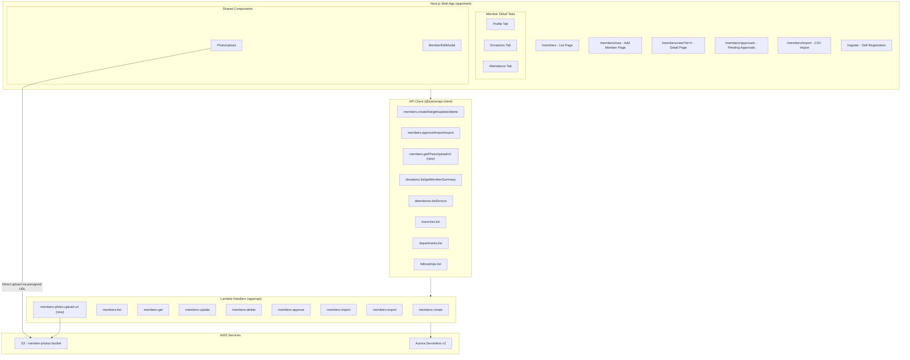

# Members Module — Design Document

## Overview

This design covers the completion of the Members Module frontend and one new backend endpoint (presigned photo upload URL). The backend is fully implemented with 8 Lambda handlers, CDK routes, API client methods, database schema, and types. The frontend has partial pages that need enhancement and new pages/components to build.

The work breaks into three categories:

1. **New frontend pages**: Admin Add Member (`/members/new`)
2. **New backend endpoint**: Presigned S3 upload URL for profile photos (`POST /v1/members/{memberId}/photo-upload-url`)
3. **Frontend enhancements**: Fill placeholder tabs (Donations, Attendance), add photo upload, department/fellowship display, approval workflow improvements, member list enhancements, edit modal admin controls, CSV import file content, post-registration experience, soft delete UX, and responsive design

All work follows existing patterns: Next.js static export with `useSearchParams()`, shared UI components from `@/components/ui`, `@kairos/api-client` for API calls, `useAuth()` for auth context, and the established Lambda handler pattern.

## Architecture

The Members Module sits within the existing Kairos monorepo architecture:



### Key Architecture Decisions

1. **No new Lambda for photo upload URL**: Add a new `members-photo-upload-url.ts` handler and CDK route. The MembersUpdate handler already has S3 access for updating `photoUrl` after upload.

2. **Donations and Attendance tabs use existing API endpoints**: The `donations.list` and `attendance.listService` endpoints already support `memberId` filtering. No new backend work needed.

3. **Department/Fellowship display uses existing list endpoints**: Filter by `memberId` parameter on existing department and fellowship list endpoints.

4. **CSV Import sends mapped JSON rows**: The frontend reads the CSV file content, applies column mapping, and sends the mapped rows as a JSON array to the existing `members.import` endpoint. The API client import method signature needs updating to accept `{ rows: MappedRow[]; branchId: number }`.

5. **Pending approvals badge count**: Fetched via `members.list({ status: 'pending', limit: 1 })` to get the `pagination.total` count without loading all records.

## Components and Interfaces

### New Pages

#### 1. Add Member Page (`/members/new`)
- Full-page form using existing shared UI components (TextInput, SelectInput, DatePicker, Button, Alert)
- Fields: firstName, lastName, email, phone, dateOfBirth, gender, address, city, postalCode, homeBranchId, emergencyContactName, emergencyContactPhone
- Validation: firstName, lastName, homeBranchId required; email format; phone format
- Pastor role: pre-selects and disables branch selector
- On success: calls `members.create()`, navigates to `/members`
- On API error: displays Alert, retains form data

### Enhanced Existing Pages

#### 2. Member Detail Page — Donations Tab
- Fetches donations via `donations.list({ memberId })` with optional date range filters
- Displays DataTable with columns: date (DD/MM/YYYY), amount (£ prefix), purpose, paymentMethod
- Summary card: total donations, breakdown by purpose (Offering, Tithe, Building Fund, Other)
- Empty state: "No donations recorded yet."
- Date range filtering via start/end DatePicker inputs

#### 3. Member Detail Page — Attendance Tab
- Fetches attendance via `attendance.listService({ memberId })` sorted by serviceDate desc
- Displays DataTable with columns: serviceDate (DD/MM/YYYY), serviceType, attendanceStatus (Present/Absent/Virtual)
- Summary card: total attended, attendance percentage, last attendance date
- Empty state: "No attendance records yet."

#### 4. Member Detail Page — Profile Tab Enhancements
- Photo upload component in header area (circular avatar or placeholder icon)
- Department assignments section: fetches via departments API, displays name + join date
- Fellowship assignment section: fetches via fellowships API, displays name + join date
- Branch name resolution: lookup from branches list instead of showing raw ID

#### 5. Photo Upload Component
- Clickable photo area triggers hidden file input (accept: image/jpeg, image/png, image/webp)
- Client-side validation: max 5 MB file size
- Upload flow: request presigned URL → PUT to S3 → update member photoUrl via `members.update()`
- Loading spinner during upload
- Error handling with user-facing messages

#### 6. Approval Workflow Enhancements
- Sidebar badge: pending count fetched on mount, displayed next to "Members" nav or as sub-link
- Success notification on approve: "Member approved. Welcome email sent."
- Confirmation dialog before rejection
- Branch name display in preview modal (resolve from branches list)
- Pastor filtering: already handled by backend `branchId` filter

#### 7. Member List Page Enhancements
- Branch name column: resolve from branches list loaded on mount
- Clickable rows: wrap name cell in `<Link href="/members/view?id={memberId}">`
- Pending approvals link with badge count in page header
- Pending status badge for recently created inactive members

#### 8. Member Edit Modal — Admin Controls
- Admin/Pastor: show branch selector dropdown and active/inactive toggle
- Regular member: hide branch and status fields (existing behavior)
- Branch validation: ensure selected branch is active

#### 9. CSV Import — File Content Upload
- Read CSV file content with FileReader
- Apply column mapping to produce JSON rows
- Preview first 5 mapped rows before submission
- Send mapped rows array to `members.import` API
- Display import errors in scrollable table (row, field, message)
- Success: show created count + link to member list
- Warning for files > 500 rows

#### 10. Post-Registration Experience
- Registration success page: message explaining pending approval + sign-in link
- Pending member dashboard banner: "Your registration is pending approval."
- Navigation restriction: pending members see only own profile + donations tab

#### 11. Soft Delete UX
- Confirmation dialog: "Are you sure you want to deactivate this member? Their data will be retained for reporting purposes."
- Calls `members.delete()` (backend soft-deletes via `is_active = false`)
- Immediate badge update to "Inactive" without page refresh
- Disable deactivate button for already-inactive members

#### 12. Responsive Design
- Member list: single-column on mobile, hide email/phone columns below 640px
- Detail page: single-column card stack on mobile
- Edit modal: full-width on mobile
- Touch targets: all interactive elements min 44x44px (already enforced by UI components)
- CSV import: drag-and-drop zone becomes tap-to-upload button on mobile

### New Backend Endpoint

#### Photo Upload URL Lambda (`members-photo-upload-url.ts`)
- Route: `POST /v1/members/{memberId}/photo-upload-url`
- Request body: `{ contentType: "image/jpeg" | "image/png" | "image/webp", extension: "jpg" | "png" | "webp" }`
- Response: `{ uploadUrl: string, photoKey: string }`
- S3 key pattern: `photos/{memberId}/{timestamp}.{extension}`
- Presigned URL expiry: 300 seconds
- Auth: member can upload own photo; Admin/Pastor can upload for members in their branch
- Follows existing Lambda pattern: `resolveAuthContext → validate → enforceBranchAccess → S3 getSignedUrl → response`

### API Client Addition

```typescript
// Add to members object in packages/api-client/src/api.ts
getPhotoUploadUrl: (id: number, data: { contentType: string; extension: string }) =>
  post<{ uploadUrl: string; photoKey: string }>(`/v1/members/${id}/photo-upload-url`, data),
```

## Data Models

### Existing Models (No Changes)

The `Member` entity in `packages/types/src/entities.ts` already has all required fields including `photoUrl`. No schema changes needed.

```typescript
interface Member extends BaseEntity {
  memberId: number;
  firstName: string;
  lastName: string;
  middleName?: string;
  dateOfBirth?: Date;
  gender?: Gender;
  email?: string;
  phone?: string;
  address?: string;
  city?: string;
  postalCode?: string;
  homeBranchId: number;
  membershipDate: Date;
  isActive: boolean;
  photoUrl?: string;
  emergencyContactName?: string;
  emergencyContactPhone?: string;
}
```

### Frontend State Models

```typescript
// Add Member form state
interface AddMemberFormState {
  firstName: string;
  lastName: string;
  email: string;
  phone: string;
  dateOfBirth: string;
  gender: string;
  address: string;
  city: string;
  postalCode: string;
  homeBranchId: string;
  emergencyContactName: string;
  emergencyContactPhone: string;
}

// Donation summary for the Donations tab
interface DonationSummary {
  total: number;
  byPurpose: Record<string, number>;
}

// Attendance summary for the Attendance tab
interface AttendanceSummary {
  totalAttended: number;
  totalServices: number;
  attendancePercentage: number;
  lastAttendanceDate: string | null;
}

// Photo upload state
interface PhotoUploadState {
  uploading: boolean;
  error: string | null;
}
```

### S3 Key Structure

```
member-photos/
  photos/{memberId}/{timestamp}.{extension}
```

### CSV Import Mapped Row

```typescript
interface MappedRow {
  first_name: string;
  last_name: string;
  email: string;
  phone: string;
  date_of_birth: string;
  gender: string;
  address: string;
  home_branch_id: number;
}
```

## Correctness Properties

*A property is a characteristic or behavior that should hold true across all valid executions of a system — essentially, a formal statement about what the system should do. Properties serve as the bridge between human-readable specifications and machine-verifiable correctness guarantees.*

### Property 1: Add Member form validation rejects invalid input without API call

*For any* form state where firstName is empty/whitespace, or lastName is empty/whitespace, or homeBranchId is not selected, or email is present but not in valid format, or phone is present but not in valid format — submitting the form should display field-level errors and should NOT invoke the `members.create` API method.

**Validates: Requirements 1.2, 1.4**

### Property 2: Donation record display contains required fields in correct format

*For any* donation record, the rendered table row should contain: the donation date formatted as DD/MM/YYYY, the amount prefixed with "£", the donation purpose, and the payment method.

**Validates: Requirements 2.2**

### Property 3: Donation summary correctly computes totals by purpose

*For any* list of donation records, the summary card should display a total equal to the sum of all donation amounts, and the breakdown by purpose should equal the sum of amounts grouped by donationPurpose (Offering, Tithe, Building Fund, Other).

**Validates: Requirements 2.3**

### Property 4: Donation date range filtering

*For any* date range (startDate, endDate) and set of donations, only donations whose donationDate falls within the inclusive range [startDate, endDate] should be included in the filtered results.

**Validates: Requirements 2.5**

### Property 5: Attendance record display contains required fields in correct format

*For any* attendance record, the rendered table row should contain: the service date formatted as DD/MM/YYYY, the service type, and the attendance status (one of Present, Absent, Virtual).

**Validates: Requirements 3.2**

### Property 6: Attendance summary correctly computes statistics

*For any* list of attendance records, the summary should display: total services attended (count of records with status "Present" or "Virtual"), attendance percentage (attended / total * 100), and the most recent service date as last attendance.

**Validates: Requirements 3.3**

### Property 7: Attendance records sorted descending by service date

*For any* list of attendance records displayed in the tab, each record's service date should be greater than or equal to the service date of the record below it.

**Validates: Requirements 3.5**

### Property 8: Photo file size validation rejects files over 5 MB

*For any* file with size greater than 5,242,880 bytes (5 MB), the photo upload component should reject the file and display "Photo must be less than 5 MB" without requesting a presigned URL.

**Validates: Requirements 4.4**

### Property 9: Photo upload URL content type validation

*For any* content type string that is not one of "image/jpeg", "image/png", or "image/webp", the photo upload URL endpoint should return a 400 Bad Request error.

**Validates: Requirements 5.4**

### Property 10: Photo upload URL authorization

*For any* user requesting a photo upload URL for a member, access should be granted only if: (a) the user is the member themselves, or (b) the user has the Admin role, or (c) the user has the Pastor role and the target member belongs to the pastor's branch. All other requests should return 403 Forbidden.

**Validates: Requirements 5.5, 5.6**

### Property 11: Photo upload URL S3 key format

*For any* valid member ID and file extension, the generated S3 key should match the pattern `photos/{memberId}/{timestamp}.{extension}` where timestamp is a numeric value.

**Validates: Requirements 5.2**

### Property 12: Department and fellowship display shows name and join date

*For any* member with active department assignments, the profile tab should display each department's name and join date. *For any* member with an active fellowship assignment, the profile tab should display the fellowship name and join date.

**Validates: Requirements 6.1, 6.2**

### Property 13: Branch name resolution across all display contexts

*For any* member displayed in the member list table, the member detail page, or the approval preview modal, the home branch should be shown as the resolved branch name (from the branches list) rather than the raw numeric branch ID.

**Validates: Requirements 6.5, 7.4, 8.1**

### Property 14: Branch selector only shows active branches

*For any* branch in the edit modal's branch selector dropdown, the branch must have `isActive === true`. Inactive branches should not appear as selectable options.

**Validates: Requirements 9.4**

### Property 15: CSV column mapping produces correct JSON rows

*For any* CSV file content and column mapping configuration, applying the mapping to each CSV row should produce a JSON object where each required field key maps to the value from the corresponding CSV column as specified by the mapping.

**Validates: Requirements 10.1**

### Property 16: CSV preview shows first 5 rows

*For any* CSV file with N data rows (N >= 1), the preview should display exactly min(N, 5) rows of mapped data.

**Validates: Requirements 10.2**

### Property 17: CSV import error display contains row, field, and message

*For any* import error in the API response, the error table should display a row containing the error's row number, field name, and error message.

**Validates: Requirements 10.3**

### Property 18: CSV large file warning threshold

*For any* CSV file with more than 500 data rows, the UI should display the warning message "Large files may take longer to process."

**Validates: Requirements 10.5**

### Property 19: Pending member navigation restriction

*For any* pending member (isActive === false, recently registered), navigation should be restricted to only their own profile page (`/members/view?id={ownId}`) and the donations tab. Attempts to navigate to other member pages should be blocked.

**Validates: Requirements 11.3**

### Property 20: Deactivate button disabled for inactive members

*For any* member where `isActive === false`, the "Deactivate" button on the Member_Detail_Page should be disabled (not clickable).

**Validates: Requirements 12.4**

## Error Handling

### Frontend Error Handling

| Scenario | Behavior |
|----------|----------|
| API call fails (network/server error) | Display Alert with error message, retain current state |
| Form validation fails | Display field-level error messages, prevent API submission |
| Photo upload exceeds 5 MB | Display "Photo must be less than 5 MB", reject upload |
| Photo upload to S3 fails | Display error message, retain existing photo/placeholder |
| CSV file is not .csv format | Display "Please upload a CSV file." |
| CSV import returns validation errors | Display errors in scrollable table with row/field/message |
| Member not found (invalid ID) | Display "Member not found." alert |
| Unauthorized access attempt | Redirect to login or display 403 message |

### Backend Error Handling (Photo Upload URL Endpoint)

| Scenario | HTTP Status | Response |
|----------|-------------|----------|
| Invalid member ID | 404 | `{ error: "Member not found" }` |
| Invalid content type | 400 | `{ error: "Content type must be image/jpeg, image/png, or image/webp" }` |
| Unauthorized (not self, not admin) | 403 | `{ error: "Forbidden" }` |
| Pastor accessing other branch member | 403 | `{ error: "Forbidden" }` |
| S3 presigned URL generation fails | 500 | `{ error: "Internal Server Error" }` |

### Error Recovery Patterns

- All forms retain user input on API errors (no data loss)
- Photo upload failures preserve existing photo or placeholder
- CSV import errors are non-blocking — successful rows are imported, errors are reported
- Deactivation failure preserves current member status
- Network errors show retry-friendly messages

## Testing Strategy

### Property-Based Testing

Use `fast-check` (already installed in the project) for property-based tests. Each property test should run a minimum of 100 iterations.

Property tests target the pure logic functions extracted from components:
- Form validation logic (Properties 1, 8, 9)
- Donation summary computation (Properties 3, 4)
- Attendance summary computation (Properties 6, 7)
- S3 key generation (Property 11)
- CSV column mapping (Properties 15, 16, 18)
- Branch name resolution (Property 13)
- Authorization logic (Property 10)

Each property test must include a comment tag:
```
// Feature: members-module, Property {N}: {property title}
```

### Unit Testing

Unit tests (using Vitest + React Testing Library) cover:
- Component rendering (example tests for each page/component)
- User interactions (click handlers, form submissions, tab switching)
- API integration (mock API calls, verify correct parameters)
- Error states (API failures, empty states, loading states)
- Role-based UI differences (Admin vs Pastor vs Member views)
- Responsive behavior (viewport-dependent rendering)

### Test File Organization

```
apps/web/src/app/(dashboard)/members/
  __tests__/
    add-member.test.tsx          # Req 1: Add Member page
    member-donations-tab.test.tsx # Req 2: Donations tab
    member-attendance-tab.test.tsx # Req 3: Attendance tab
    photo-upload.test.tsx         # Req 4: Photo upload component
    member-detail.test.tsx        # Req 6: Department/fellowship display
    approvals.test.tsx            # Req 7: Approval workflow
    member-list.test.tsx          # Req 8: List enhancements
    member-edit-modal.test.tsx    # Req 9: Admin controls
    csv-import.test.tsx           # Req 10: CSV import
    soft-delete.test.tsx          # Req 12: Soft delete UX

apps/api/src/members/__tests__/
    members-photo-upload-url.test.ts # Req 5: Presigned URL endpoint

packages/utils/src/__tests__/
    member-validation.test.ts     # Property tests for validation logic
    donation-summary.test.ts      # Property tests for donation computation
    attendance-summary.test.ts    # Property tests for attendance computation
    csv-mapping.test.ts           # Property tests for CSV mapping
```

### Testing Priorities

1. **High priority** (property + unit tests): Form validation, donation/attendance summary computation, CSV mapping, photo upload authorization, S3 key generation
2. **Medium priority** (unit tests): Component rendering, API integration, role-based UI, error handling
3. **Lower priority** (manual verification): Responsive layout, visual design, animation/transitions
