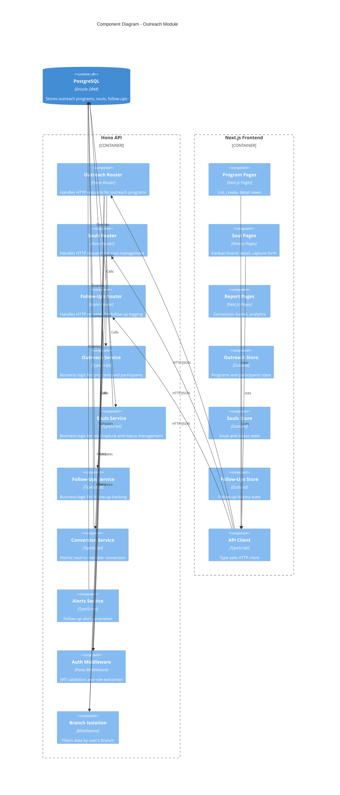

# Design Document: Outreach Module

## Overview

The Outreach Module enables church branches to manage evangelism activities through structured outreach programs and ad-hoc soul capture. The module tracks souls from initial contact through conversion, manages follow-up workflows with automated alerts, provides role-based access control, and generates conversion analytics.

### Key Features

1. **Outreach Program Management**: Create and manage evangelism events with coordinator assignment and worker registration
2. **Soul Capture**: Record contact information for individuals reached through evangelism (program-based or ad-hoc)
3. **Follow-Up Tracking**: Log contact attempts with method, status, duration, and notes
4. **Status Pipeline**: Track souls through conversion stages (New → Following Up → Interested → Converted/Not Interested/Lost Contact)
5. **Kanban Board**: Visual interface for managing souls with drag-and-drop status updates
6. **Automated Alerts**: Notifications when souls haven't been contacted within configured timeframes
7. **Conversion Workflow**: Convert souls to church members with atomic transaction handling
8. **Analytics**: Conversion funnel metrics, program effectiveness, and worker performance reports
9. **Role-Based Access**: Branch isolation for Pastors, assignment-based access for Members, full access for Admins

### Integration Points

- **Members Module**: Soul assignment, conversion to member, coordinator/worker validation
- **Branches Module**: Branch isolation, program organization by branch
- **Authentication Module**: JWT-based auth, role-based access control (Admin/Pastor/Member)
- **Notifications Module**: Follow-up alerts, conversion notifications, reminder notifications

### Technology Stack

- **Backend**: Hono framework (TypeScript), Drizzle ORM, PostgreSQL 15
- **Frontend**: Next.js 15 App Router, Shadcn/ui, Tailwind CSS, Zustand
- **Deployment**: Docker (localhost), future AWS Lambda + Aurora Serverless v2
- **Testing**: Vitest, React Testing Library, TDD approach


## Architecture

### C4 Component Diagram



### Data Flow Patterns

#### Soul Capture Flow
```
User → Soul Capture Form → POST /api/souls → Souls Service → Database
                                                    ↓
                                            Auto-assign to Worker
                                                    ↓
                                            Initialize status='New'
                                                    ↓
                                            Return soul record
```

#### Follow-Up Logging Flow
```
Worker → Follow-Up Form → POST /api/souls/:id/follow-ups → Follow-Ups Service → Database
                                                                    ↓
                                                            Update soul.updated_at
                                                                    ↓
                                                            Check alert thresholds
                                                                    ↓
                                                            Cancel pending reminders
```

#### Soul Conversion Flow
```
Worker → Convert Button → POST /api/souls/:id/convert → Conversion Service
                                                                ↓
                                                        BEGIN TRANSACTION
                                                                ↓
                                                        Create member record
                                                                ↓
                                                        Update soul status='Converted'
                                                                ↓
                                                        Set converted_to_member_id
                                                                ↓
                                                        COMMIT TRANSACTION
                                                                ↓
                                                        Send notifications
```

#### Follow-Up Alert Flow
```
Scheduled Job (EventBridge) → Alerts Service → Query overdue souls
                                                        ↓
                                                Calculate days since last follow-up
                                                        ↓
                                                Filter by status and threshold
                                                        ↓
                                                Generate notifications
                                                        ↓
                                                Send to assigned workers
```


## Components and Interfaces

### Backend Components

#### 1. Outreach Router (`apps/api/src/outreach/router.ts`)

Hono router handling outreach program endpoints.

**Endpoints:**
- `POST /api/outreach/programs` - Create outreach program
- `GET /api/outreach/programs` - List programs with pagination and filtering
- `GET /api/outreach/programs/:id` - Get program details with participants and souls
- `PUT /api/outreach/programs/:id` - Update program details
- `POST /api/outreach/programs/:id/participants` - Register worker for program
- `GET /api/outreach/reports/conversion-funnel` - Get conversion metrics

**Middleware:**
- Authentication (all routes)
- Role-based access (Admin/Pastor for create/update)
- Branch isolation (Pastor sees only their branch)

#### 2. Souls Router (`apps/api/src/outreach/souls-router.ts`)

Hono router handling soul management endpoints.

**Endpoints:**
- `POST /api/souls` - Capture new soul
- `GET /api/souls` - List souls with filtering and search
- `GET /api/souls/:id` - Get soul details with follow-up history
- `PUT /api/souls/:id/status` - Update soul status
- `PUT /api/souls/:id/assign` - Reassign soul to different worker
- `POST /api/souls/:id/follow-ups` - Log follow-up interaction
- `POST /api/souls/:id/convert` - Convert soul to member
- `GET /api/souls/export` - Export souls to CSV

**Middleware:**
- Authentication (all routes)
- Assignment-based access (Members see only assigned souls)
- Branch isolation (Pastor sees branch souls)

#### 3. Outreach Service (`apps/api/src/outreach/service.ts`)

Business logic for outreach programs.

**Functions:**
```typescript
// Program Management
createProgram(db: Database, input: CreateProgramInput, auth: AuthContext): Promise<OutreachProgram>
listPrograms(db: Database, query: ListProgramsQuery, auth: AuthContext): Promise<PaginatedPrograms>
getProgram(db: Database, programId: string, auth: AuthContext): Promise<ProgramWithDetails>
updateProgram(db: Database, programId: string, input: UpdateProgramInput, auth: AuthContext): Promise<OutreachProgram>

// Participant Management
registerWorker(db: Database, programId: string, input: RegisterWorkerInput, auth: AuthContext): Promise<Participant>
listParticipants(db: Database, programId: string, auth: AuthContext): Promise<Participant[]>

// Statistics
getProgramStatistics(db: Database, programId: string, auth: AuthContext): Promise<ProgramStatistics>
```

**Key Logic:**
- Case-insensitive duplicate detection for program names
- Auto-set branch_id for Pastors
- Validate coordinator is active member
- Calculate total_souls_reached from linked souls

#### 4. Souls Service (`apps/api/src/outreach/souls-service.ts`)

Business logic for soul capture and management.

**Functions:**
```typescript
// Soul Capture
captureSoul(db: Database, input: CaptureSoulInput, auth: AuthContext): Promise<Soul>
listSouls(db: Database, query: ListSoulsQuery, auth: AuthContext): Promise<PaginatedSouls>
getSoul(db: Database, soulId: string, auth: AuthContext): Promise<SoulWithDetails>

// Status Management
updateSoulStatus(db: Database, soulId: string, status: SoulStatus, auth: AuthContext): Promise<Soul>
reassignSoul(db: Database, soulId: string, newWorkerId: string, auth: AuthContext): Promise<Soul>

// Search and Filter
searchSouls(db: Database, searchTerm: string, auth: AuthContext): Promise<Soul[]>
filterSoulsByStatus(db: Database, status: SoulStatus, auth: AuthContext): Promise<Soul[]>
getOverdueSouls(db: Database, auth: AuthContext): Promise<SoulWithOverdueInfo[]>

// Export
exportSoulsToCSV(db: Database, query: ExportQuery, auth: AuthContext): Promise<string>
```

**Key Logic:**
- Auto-assign to capturing worker
- Initialize status to 'New'
- Validate phone and email formats
- Normalize status values (trim, case-insensitive)
- Support ad-hoc souls (outreach_id = null)
- Use LEFT JOIN for queries to include ad-hoc souls

#### 5. Follow-Ups Service (`apps/api/src/outreach/follow-ups-service.ts`)

Business logic for follow-up tracking.

**Functions:**
```typescript
// Follow-Up Logging
logFollowUp(db: Database, soulId: string, input: LogFollowUpInput, auth: AuthContext): Promise<FollowUp>
getFollowUpHistory(db: Database, soulId: string, query: PaginationQuery, auth: AuthContext): Promise<PaginatedFollowUps>

// Statistics
getFollowUpStatistics(db: Database, soulId: string, auth: AuthContext): Promise<FollowUpStats>
getWorkerFollowUpStats(db: Database, workerId: string, auth: AuthContext): Promise<WorkerStats>
```

**Key Logic:**
- Validate contact_method and contact_status enums
- Validate duration_minutes > 0 when provided
- Auto-set follow_up_date to current timestamp if not provided
- Update soul.updated_at on follow-up creation
- Cancel pending reminders when follow-up logged

#### 6. Conversion Service (`apps/api/src/outreach/conversion-service.ts`)

Atomic soul-to-member conversion.

**Functions:**
```typescript
convertSoulToMember(db: Database, soulId: string, auth: AuthContext): Promise<ConversionResult>
```

**Transaction Logic:**
```typescript
async function convertSoulToMember(db, soulId, auth) {
  return await db.transaction(async (tx) => {
    // 1. Fetch soul with branch info
    const soul = await tx.query.souls.findFirst({
      where: eq(souls.id, soulId),
      with: { outreachProgram: { with: { branch: true } } }
    });
    
    if (!soul) throw new NotFoundError('Soul not found');
    
    // 2. Validate authorization
    enforceAccess(auth, soul);
    
    // 3. Create member record
    const [member] = await tx.insert(members).values({
      firstName: soul.firstName,
      lastName: soul.lastName,
      phone: soul.phone,
      email: soul.email,
      address: soul.address,
      city: soul.city,
      gender: soul.gender,
      homeBranchId: soul.outreachProgram.branchId,
      membershipDate: new Date(),
      isActive: true,
      approvalStatus: 'approved',
      systemRole: 'member'
    }).returning();
    
    // 4. Update soul status
    await tx.update(souls)
      .set({
        status: 'Converted',
        convertedToMemberId: member.id,
        updatedAt: new Date()
      })
      .where(eq(souls.id, soulId));
    
    // 5. Return result
    return { soul, member };
  });
}
```

**Key Logic:**
- Execute in single database transaction
- Rollback on any failure
- Validate all required member fields before transaction
- Set member.isActive = true
- Set soul.status = 'Converted'
- Link via converted_to_member_id

#### 7. Alerts Service (`apps/api/src/outreach/alerts-service.ts`)

Follow-up alert generation.

**Functions:**
```typescript
generateFollowUpAlerts(db: Database): Promise<AlertResult>
getAlertConfiguration(db: Database): Promise<AlertConfig>
updateAlertConfiguration(db: Database, config: AlertConfig, auth: AuthContext): Promise<AlertConfig>
```

**Alert Logic:**
```typescript
async function generateFollowUpAlerts(db) {
  const config = await getAlertConfiguration(db);
  
  // Query souls needing follow-up
  const overdueSouls = await db
    .select({
      soul: souls,
      lastFollowUp: sql<Date>`MAX(${followUps.followUpDate})`,
      daysSinceFollowUp: sql<number>`EXTRACT(DAY FROM NOW() - MAX(${followUps.followUpDate}))`
    })
    .from(souls)
    .leftJoin(followUps, eq(souls.id, followUps.soulId))
    .where(
      and(
        inArray(souls.status, ['New', 'Following Up', 'Interested']),
        or(
          and(
            eq(souls.status, 'New'),
            sql`EXTRACT(DAY FROM NOW() - MAX(${followUps.followUpDate})) >= ${config.newThreshold}`
          ),
          and(
            eq(souls.status, 'Following Up'),
            sql`EXTRACT(DAY FROM NOW() - MAX(${followUps.followUpDate})) >= ${config.followingUpThreshold}`
          ),
          and(
            eq(souls.status, 'Interested'),
            sql`EXTRACT(DAY FROM NOW() - MAX(${followUps.followUpDate})) >= ${config.interestedThreshold}`
          )
        )
      )
    )
    .groupBy(souls.id);
  
  // Generate notifications
  for (const { soul } of overdueSouls) {
    await createNotification(db, {
      title: 'Follow-Up Overdue',
      message: `${soul.firstName} ${soul.lastName} needs follow-up`,
      type: 'Alert',
      priority: 'High',
      targetScope: 'Member',
      targetMemberId: soul.assignedMemberId
    });
  }
  
  return { alertsGenerated: overdueSouls.length };
}
```

**Key Logic:**
- Default thresholds: New/Following Up = 2 days, Interested = 3 days
- Exclude Converted, Not Interested, Lost Contact statuses
- Send to assigned worker
- Admin-configurable thresholds

### Frontend Components

#### 1. Outreach Programs List (`apps/web/src/app/(dashboard)/outreach/programs/page.tsx`)

**Features:**
- Paginated table of programs
- Filters: is_completed, date range, coordinator
- Search by program_name
- Create new program button
- Display: program_name, program_date, location, coordinator, total_souls_reached, is_completed

**State Management:**
```typescript
interface ProgramsStore {
  programs: OutreachProgram[];
  pagination: PaginationMeta;
  filters: ProgramFilters;
  setFilters: (filters: ProgramFilters) => void;
  fetchPrograms: () => Promise<void>;
}
```

#### 2. Program Detail View (`apps/web/src/app/(dashboard)/outreach/programs/[id]/page.tsx`)

**Features:**
- Program information card
- Participants list with roles
- Souls captured list with statuses
- Follow-up statistics
- Mark as completed button
- Edit program button

#### 3. Soul Capture Form (`apps/web/src/app/(dashboard)/souls/capture/page.tsx`)

**Features:**
- Form fields: first_name, last_name, phone, email, address, city, gender, age_range, notes
- Outreach program selector (optional for ad-hoc)
- Phone and email validation
- Auto-assign to current user
- Success notification with link to soul detail

#### 4. Souls Kanban Board (`apps/web/src/app/(dashboard)/souls/page.tsx`)

**Features:**
- Four columns: New, Following Up, Interested, Converted
- Drag-and-drop status updates
- Soul cards showing: name, phone, days since last follow-up
- Warning indicator for overdue follow-ups
- Filter by assigned worker (Members see only theirs)
- Search by name or phone

**Implementation:**
```typescript
import { DndContext, DragEndEvent } from '@dnd-kit/core';

function SoulsKanbanBoard() {
  const { souls, updateSoulStatus } = useSoulsStore();
  
  const handleDragEnd = async (event: DragEndEvent) => {
    const { active, over } = event;
    if (!over) return;
    
    const soulId = active.id as string;
    const newStatus = over.id as SoulStatus;
    
    await updateSoulStatus(soulId, newStatus);
  };
  
  return (
    <DndContext onDragEnd={handleDragEnd}>
      <div className="grid grid-cols-4 gap-4">
        {['New', 'Following Up', 'Interested', 'Converted'].map(status => (
          <KanbanColumn key={status} status={status} souls={souls.filter(s => s.status === status)} />
        ))}
      </div>
    </DndContext>
  );
}
```

#### 5. Soul Detail View (`apps/web/src/app/(dashboard)/souls/[id]/page.tsx`)

**Features:**
- Soul information card
- Follow-up history (paginated)
- Log follow-up form
- Update status dropdown
- Reassign worker button
- Convert to member button
- Outreach program link (if applicable)
- Converted member link (if converted)

#### 6. Conversion Funnel Report (`apps/web/src/app/(dashboard)/outreach/reports/page.tsx`)

**Features:**
- Funnel visualization showing counts at each status
- Conversion rate percentage
- Drop-off rates between stages
- Average days to conversion
- Filters: date range, outreach program, branch (Admin only)


## Data Models

### Database Schema (Drizzle ORM)

#### Outreach Programs Table

```typescript
// packages/database/src/schema/outreach.ts
import { pgTable, serial, integer, varchar, text, date, boolean, timestamp } from 'drizzle-orm/pg-core';
import { relations } from 'drizzle-orm';
import { branches, members } from './index';

export const outreachPrograms = pgTable('outreach_programs', {
  id: serial('outreach_id').primaryKey(),
  branchId: integer('branch_id').notNull().references(() => branches.id, { onDelete: 'cascade' }),
  programName: varchar('program_name', { length: 200 }).notNull(),
  programDate: date('program_date').notNull(),
  location: varchar('location', { length: 300 }).notNull(),
  address: text('address'),
  city: varchar('city', { length: 100 }),
  description: text('description'),
  coordinatorId: integer('coordinator_id').references(() => members.id, { onDelete: 'set null' }),
  totalSoulsReached: integer('total_souls_reached').default(0).notNull(),
  notes: text('notes'),
  isCompleted: boolean('is_completed').default(false).notNull(),
  createdAt: timestamp('created_at').defaultNow().notNull(),
  updatedAt: timestamp('updated_at').defaultNow().notNull(),
});

export const outreachProgramsRelations = relations(outreachPrograms, ({ one, many }) => ({
  branch: one(branches, {
    fields: [outreachPrograms.branchId],
    references: [branches.id],
  }),
  coordinator: one(members, {
    fields: [outreachPrograms.coordinatorId],
    references: [members.id],
  }),
  participants: many(outreachParticipants),
  souls: many(souls),
}));
```

**Constraints:**
- Unique: (branch_id, program_name, program_date, location) - case-insensitive in application layer
- Check: total_souls_reached >= 0
- Foreign Keys: branch_id (CASCADE), coordinator_id (SET NULL)

**Indexes:**
- branch_id, coordinator_id, program_date, is_completed

#### Souls Table

```typescript
export const souls = pgTable('souls', {
  id: serial('soul_id').primaryKey(),
  outreachId: integer('outreach_id').references(() => outreachPrograms.id, { onDelete: 'cascade' }),
  firstName: varchar('first_name', { length: 100 }).notNull(),
  lastName: varchar('last_name', { length: 100 }).notNull(),
  phone: varchar('phone', { length: 20 }),
  email: varchar('email', { length: 100 }),
  address: text('address'),
  city: varchar('city', { length: 100 }),
  gender: varchar('gender', { length: 10 }),
  ageRange: varchar('age_range', { length: 20 }),
  assignedMemberId: integer('assigned_member_id').references(() => members.id, { onDelete: 'set null' }),
  convertedToMemberId: integer('converted_to_member_id').references(() => members.id, { onDelete: 'set null' }),
  status: varchar('status', { length: 30 }).default('New').notNull(),
  notes: text('notes'),
  createdAt: timestamp('created_at').defaultNow().notNull(),
  updatedAt: timestamp('updated_at').defaultNow().notNull(),
});

export const soulsRelations = relations(souls, ({ one, many }) => ({
  outreachProgram: one(outreachPrograms, {
    fields: [souls.outreachId],
    references: [outreachPrograms.id],
  }),
  assignedMember: one(members, {
    fields: [souls.assignedMemberId],
    references: [members.id],
  }),
  convertedToMember: one(members, {
    fields: [souls.convertedToMemberId],
    references: [members.id],
  }),
  followUps: many(followUps),
}));
```

**Constraints:**
- Check: gender IN ('Male', 'Female') OR NULL
- Check: status IN ('New', 'Following Up', 'Interested', 'Not Interested', 'Converted', 'Lost Contact')
- Unique: (phone, outreach_id) WHERE phone IS NOT NULL
- Unique: (email, outreach_id) WHERE email IS NOT NULL
- Foreign Keys: outreach_id (CASCADE), assigned_member_id (SET NULL), converted_to_member_id (SET NULL)

**Indexes:**
- outreach_id, assigned_member_id, converted_to_member_id, status, phone, email

#### Follow-Ups Table

```typescript
export const followUps = pgTable('follow_ups', {
  id: serial('follow_up_id').primaryKey(),
  soulId: integer('soul_id').notNull().references(() => souls.id, { onDelete: 'cascade' }),
  memberId: integer('member_id').notNull().references(() => members.id, { onDelete: 'cascade' }),
  followUpDate: timestamp('follow_up_date').defaultNow().notNull(),
  contactMethod: varchar('contact_method', { length: 30 }),
  contactStatus: varchar('contact_status', { length: 30 }).notNull(),
  durationMinutes: integer('duration_minutes'),
  notes: text('notes'),
  nextFollowUpDate: date('next_follow_up_date'),
  createdAt: timestamp('created_at').defaultNow().notNull(),
  updatedAt: timestamp('updated_at').defaultNow().notNull(),
});

export const followUpsRelations = relations(followUps, ({ one }) => ({
  soul: one(souls, {
    fields: [followUps.soulId],
    references: [souls.id],
  }),
  member: one(members, {
    fields: [followUps.memberId],
    references: [members.id],
  }),
}));
```

**Constraints:**
- Check: contact_method IN ('Phone Call', 'Text Message', 'Email', 'WhatsApp', 'In-Person Visit', 'Other') OR NULL
- Check: contact_status IN ('Successful', 'No Answer', 'Wrong Number', 'Call Back Later', 'Not Interested', 'Interested')
- Check: duration_minutes > 0 OR NULL
- Foreign Keys: soul_id (CASCADE), member_id (CASCADE)

**Indexes:**
- soul_id, member_id, follow_up_date, contact_status, next_follow_up_date

#### Outreach Participants Table

```typescript
export const outreachParticipants = pgTable('outreach_participants', {
  outreachId: integer('outreach_id').notNull().references(() => outreachPrograms.id, { onDelete: 'cascade' }),
  memberId: integer('member_id').notNull().references(() => members.id, { onDelete: 'cascade' }),
  role: varchar('role', { length: 50 }),
  notes: text('notes'),
  createdAt: timestamp('created_at').defaultNow().notNull(),
}, (table) => ({
  pk: primaryKey({ columns: [table.outreachId, table.memberId] }),
}));

export const outreachParticipantsRelations = relations(outreachParticipants, ({ one }) => ({
  outreachProgram: one(outreachPrograms, {
    fields: [outreachParticipants.outreachId],
    references: [outreachPrograms.id],
  }),
  member: one(members, {
    fields: [outreachParticipants.memberId],
    references: [members.id],
  }),
}));
```

**Constraints:**
- Primary Key: (outreach_id, member_id)
- Foreign Keys: outreach_id (CASCADE), member_id (CASCADE)

**Indexes:**
- outreach_id, member_id

### TypeScript Types

#### Core Types (`packages/types/src/outreach.ts`)

```typescript
export type SoulStatus = 'New' | 'Following Up' | 'Interested' | 'Not Interested' | 'Converted' | 'Lost Contact';

export type ContactMethod = 'Phone Call' | 'Text Message' | 'Email' | 'WhatsApp' | 'In-Person Visit' | 'Other';

export type ContactStatus = 'Successful' | 'No Answer' | 'Wrong Number' | 'Call Back Later' | 'Not Interested' | 'Interested';

export interface OutreachProgram {
  id: string;
  branchId: string;
  programName: string;
  programDate: string;
  location: string;
  address?: string;
  city?: string;
  description?: string;
  coordinatorId?: string;
  totalSoulsReached: number;
  notes?: string;
  isCompleted: boolean;
  createdAt: string;
  updatedAt: string;
}

export interface Soul {
  id: string;
  outreachId?: string;
  firstName: string;
  lastName: string;
  phone?: string;
  email?: string;
  address?: string;
  city?: string;
  gender?: 'Male' | 'Female';
  ageRange?: string;
  assignedMemberId?: string;
  convertedToMemberId?: string;
  status: SoulStatus;
  notes?: string;
  createdAt: string;
  updatedAt: string;
}

export interface FollowUp {
  id: string;
  soulId: string;
  memberId: string;
  followUpDate: string;
  contactMethod?: ContactMethod;
  contactStatus: ContactStatus;
  durationMinutes?: number;
  notes?: string;
  nextFollowUpDate?: string;
  createdAt: string;
  updatedAt: string;
}

export interface OutreachParticipant {
  outreachId: string;
  memberId: string;
  role?: string;
  notes?: string;
  createdAt: string;
}
```

#### Request/Response Types

```typescript
export interface CreateProgramInput {
  branchId?: string; // Required for Admin, auto-set for Pastor
  programName: string;
  programDate: string;
  location: string;
  address?: string;
  city?: string;
  description?: string;
  coordinatorId?: string;
}

export interface CaptureSoulInput {
  outreachId?: string; // Optional for ad-hoc
  firstName: string;
  lastName: string;
  phone?: string;
  email?: string;
  address?: string;
  city?: string;
  gender?: 'Male' | 'Female';
  ageRange?: string;
  notes?: string;
}

export interface LogFollowUpInput {
  contactMethod?: ContactMethod;
  contactStatus: ContactStatus;
  durationMinutes?: number;
  notes?: string;
  nextFollowUpDate?: string;
}

export interface ConversionResult {
  soul: Soul;
  member: Member;
}

export interface ConversionFunnelMetrics {
  statusCounts: Record<SoulStatus, number>;
  conversionRate: number;
  dropOffRates: Record<string, number>;
  averageDaysToConversion: number;
  totalSouls: number;
}
```

### API Schemas (Zod Validation)

```typescript
// apps/api/src/outreach/schemas.ts
import { z } from 'zod';

export const createProgramSchema = z.object({
  branchId: z.string().uuid().optional(),
  programName: z.string().min(1).max(200),
  programDate: z.string().date(),
  location: z.string().min(1).max(300),
  address: z.string().optional(),
  city: z.string().max(100).optional(),
  description: z.string().max(10000).optional(),
  coordinatorId: z.string().uuid().optional(),
});

export const captureSoulSchema = z.object({
  outreachId: z.string().uuid().optional(),
  firstName: z.string().min(1).max(100),
  lastName: z.string().min(1).max(100),
  phone: z.string().min(7).max(20).regex(/^[\d\s\-\(\)\+]+$/).optional(),
  email: z.string().email().max(100).optional(),
  address: z.string().optional(),
  city: z.string().max(100).optional(),
  gender: z.enum(['Male', 'Female']).optional(),
  ageRange: z.string().max(20).optional(),
  notes: z.string().max(10000).optional(),
});

export const logFollowUpSchema = z.object({
  contactMethod: z.enum(['Phone Call', 'Text Message', 'Email', 'WhatsApp', 'In-Person Visit', 'Other']).optional(),
  contactStatus: z.enum(['Successful', 'No Answer', 'Wrong Number', 'Call Back Later', 'Not Interested', 'Interested']),
  durationMinutes: z.number().int().positive().optional(),
  notes: z.string().max(10000).optional(),
  nextFollowUpDate: z.string().date().optional(),
});

export const updateSoulStatusSchema = z.object({
  status: z.enum(['New', 'Following Up', 'Interested', 'Not Interested', 'Converted', 'Lost Contact']),
  convertedToMemberId: z.string().uuid().optional(),
});

export const listProgramsQuerySchema = z.object({
  page: z.coerce.number().int().min(1).default(1),
  limit: z.coerce.number().int().min(10).max(100).default(20),
  isCompleted: z.enum(['true', 'false', 'all']).optional(),
  dateFrom: z.string().date().optional(),
  dateTo: z.string().date().optional(),
  coordinatorId: z.string().uuid().optional(),
  search: z.string().optional(),
});

export const listSoulsQuerySchema = z.object({
  page: z.coerce.number().int().min(1).default(1),
  limit: z.coerce.number().int().min(10).max(100).default(50),
  status: z.enum(['New', 'Following Up', 'Interested', 'Not Interested', 'Converted', 'Lost Contact']).optional(),
  assignedMemberId: z.string().uuid().optional(),
  outreachId: z.string().uuid().optional(),
  search: z.string().optional(),
  dateFrom: z.string().date().optional(),
  dateTo: z.string().date().optional(),
  overdueOnly: z.enum(['true', 'false']).optional(),
});
```

### Access Control Matrix

| Resource | Admin | Pastor | Member |
|----------|-------|--------|--------|
| Create Program | All branches | Own branch only | No access |
| View Programs | All branches | Own branch only | Own branch only |
| Update Program | All branches | Own branch only | No access |
| Register as Worker | All branches | Own branch only | Own branch only |
| Capture Soul | All branches | Own branch only | Own branch only |
| View Souls | All branches | Own branch only | Assigned souls only |
| Update Soul Status | All branches | Own branch only | Assigned souls only |
| Reassign Soul | All branches | Own branch only | No access |
| Log Follow-Up | All branches | Own branch only | Assigned souls only |
| Convert Soul | All branches | Own branch only | Assigned souls only |
| View Reports | All branches | Own branch only | No access |
| Export Data | All branches | Own branch only | No access |

### Branch Isolation Implementation

```typescript
// Enforce branch isolation in service layer
function enforceBranchAccess(auth: AuthContext, resourceBranchId: string) {
  if (auth.systemRole === 'admin') return; // Admin has full access
  if (auth.branchId !== resourceBranchId) {
    throw new ForbiddenError('You can only access resources from your branch');
  }
}

// Enforce soul assignment access
function enforceSoulAccess(auth: AuthContext, soul: Soul) {
  if (auth.systemRole === 'admin') return; // Admin has full access
  if (auth.systemRole === 'pastor') {
    // Pastor can access all souls in their branch
    const soulBranchId = getSoulBranchId(soul);
    if (auth.branchId !== soulBranchId) {
      throw new ForbiddenError('You can only access souls from your branch');
    }
    return;
  }
  // Member can only access assigned souls
  if (soul.assignedMemberId !== auth.memberId) {
    throw new ForbiddenError('You can only access souls assigned to you');
  }
}

// Get soul's branch (via outreach program or assigned member)
function getSoulBranchId(soul: SoulWithRelations): string {
  if (soul.outreachProgram) {
    return soul.outreachProgram.branchId;
  }
  // For ad-hoc souls, use assigned member's branch
  return soul.assignedMember.homeBranchId;
}
```

### Query Patterns for Ad-Hoc Souls

All soul queries must use LEFT JOIN to include ad-hoc souls (where outreach_id is null):

```typescript
// Correct: Includes ad-hoc souls
const souls = await db
  .select({
    soul: souls,
    program: outreachPrograms,
    assignedMember: members,
  })
  .from(souls)
  .leftJoin(outreachPrograms, eq(souls.outreachId, outreachPrograms.id))
  .innerJoin(members, eq(souls.assignedMemberId, members.id))
  .where(conditions);

// Incorrect: Excludes ad-hoc souls
const souls = await db
  .select()
  .from(souls)
  .innerJoin(outreachPrograms, eq(souls.outreachId, outreachPrograms.id)); // ❌ Missing ad-hoc souls
```


## Correctness Properties

*A property is a characteristic or behavior that should hold true across all valid executions of a system—essentially, a formal statement about what the system should do. Properties serve as the bridge between human-readable specifications and machine-verifiable correctness guarantees.*

### Property 1: Program Field Persistence

*For any* valid outreach program input, when creating a program, all specified fields (branch_id, program_name, program_date, location, address, city, description, coordinator_id, is_completed) should be stored and retrievable from the database.

**Validates: Requirements 1.1**

### Property 2: Case-Insensitive Duplicate Program Detection

*For any* program name string, when creating a program with the same name (regardless of case) on the same date and branch as an existing program, the system should reject the creation with a conflict error.

**Validates: Requirements 1.2, 32.1**

### Property 3: Pastor Branch Auto-Assignment

*For any* Pastor user, when creating an outreach program without specifying branch_id, the system should automatically set branch_id to the Pastor's assigned branch.

**Validates: Requirements 1.3**

### Property 4: Admin Branch Requirement

*For any* Admin user, when creating an outreach program without specifying branch_id, the system should reject the request with a validation error.

**Validates: Requirements 1.4**

### Property 5: Branch Isolation for Data Access

*For any* Pastor user, when retrieving outreach programs or souls, the system should return only resources from the Pastor's assigned branch. *For any* Admin user, the system should return resources from all branches.

**Validates: Requirements 1.5, 12.1, 12.2**

### Property 6: Soul Capture Required Fields

*For any* soul capture request, when first_name, last_name, or phone is missing, the system should reject the request with a validation error listing the missing fields.

**Validates: Requirements 3.1**

### Property 7: Soul Auto-Assignment

*For any* authenticated user capturing a soul, the system should automatically set assigned_member_id to the capturing user's member_id.

**Validates: Requirements 3.4**

### Property 8: Soul Status Initialization

*For any* newly captured soul, the system should initialize the status field to 'New'.

**Validates: Requirements 3.5**


### Property 9: Soul Status Enum Validation

*For any* soul status update, the system should accept only the six valid status values ('New', 'Following Up', 'Interested', 'Not Interested', 'Converted', 'Lost Contact') and reject any other value with a validation error.

**Validates: Requirements 4.1**

### Property 10: Conversion Member ID Requirement

*For any* soul status update to 'Converted', when converted_to_member_id is not provided, the system should reject the update with a validation error.

**Validates: Requirements 4.3**

### Property 11: Bidirectional Status Transitions

*For any* soul with any current status, the system should allow updating to any of the six valid status values without restriction.

**Validates: Requirements 4.5, 25.1, 25.2, 25.3, 25.4, 25.5**

### Property 12: Follow-Up Required Fields

*For any* follow-up logging request, when soul_id, member_id, or contact_status is missing, the system should reject the request with a validation error.

**Validates: Requirements 5.1**

### Property 13: Ad-Hoc Soul Query Inclusion

*For any* query retrieving souls with follow-ups, the system should include souls where outreach_id is null (ad-hoc souls) in the results using LEFT JOIN.

**Validates: Requirements 5.5, 29.7**

### Property 14: Follow-Up Duration Validation

*For any* follow-up with duration_minutes specified, when the value is zero or negative, the system should reject the request with a validation error.

**Validates: Requirements 5.8**

### Property 15: Soul-to-Member Data Transfer

*For any* soul being converted to member, all transferable fields (first_name, last_name, phone, email, address, city, gender) should be copied to the new member record.

**Validates: Requirements 10.1, 10.4**

### Property 16: Conversion Transaction Atomicity

*For any* soul conversion attempt, either both member creation and soul status update succeed, or both operations are rolled back, leaving the soul in its original state.

**Validates: Requirements 10.7, 10.8, 31.1, 31.2**

### Property 17: Assignment-Based Access for Members

*For any* Member user accessing soul data, the system should return only souls where assigned_member_id matches the Member's member_id.

**Validates: Requirements 12.3**

### Property 18: Validation Error Field Specificity

*For any* request with invalid data, the system should return an HTTP 400 error with messages identifying the specific fields that failed validation.

**Validates: Requirements 15.1**

### Property 19: SQL Injection Prevention

*For any* text input containing SQL injection attempts, the system should sanitize the input and prevent execution of malicious SQL.

**Validates: Requirements 15.6**

### Property 20: Ad-Hoc Soul Creation

*For any* soul capture request without outreach_id, the system should create the soul record with outreach_id set to null.

**Validates: Requirements 29.1**

### Property 21: Status Value Normalization

*For any* soul status update with leading or trailing whitespace, the system should trim the whitespace before validation and storage.

**Validates: Requirements 33.1**

### Property 22: Phone Number Format Validation

*For any* soul capture with phone number, when the phone contains characters other than digits, spaces, hyphens, parentheses, or plus signs, the system should reject the request with a validation error.

**Validates: Requirements 36.1**

### Property 23: Email Format Validation

*For any* soul capture with email, when the email does not conform to RFC 5322 format, the system should reject the request with a validation error.

**Validates: Requirements 56.1**

### Property 24: Email Lowercase Normalization

*For any* soul capture with email, the system should convert the email to lowercase before storage.

**Validates: Requirements 56.4**


## Error Handling

### Error Types and HTTP Status Codes

| Error Type | HTTP Status | Use Case | Example Message |
|------------|-------------|----------|-----------------|
| ValidationError | 400 Bad Request | Invalid input data | "first_name is required" |
| UnauthorizedError | 401 Unauthorized | Missing or invalid JWT | "Authentication required" |
| ForbiddenError | 403 Forbidden | Insufficient permissions | "You can only access souls assigned to you" |
| NotFoundError | 404 Not Found | Resource doesn't exist | "Soul not found" |
| ConflictError | 409 Conflict | Duplicate or constraint violation | "A program with this name already exists on this date" |
| InternalServerError | 500 Internal Server Error | Unexpected errors | "An unexpected error occurred" |

### Error Response Format

```typescript
interface ErrorResponse {
  success: false;
  error: {
    code: string;
    message: string;
    fields?: Record<string, string>; // Field-specific validation errors
    details?: unknown; // Additional context (dev mode only)
  };
}
```

### Validation Error Handling

```typescript
// Example: Soul capture validation
try {
  const validated = captureSoulSchema.parse(input);
} catch (error) {
  if (error instanceof z.ZodError) {
    const fieldErrors = error.errors.reduce((acc, err) => {
      const field = err.path.join('.');
      acc[field] = err.message;
      return acc;
    }, {} as Record<string, string>);
    
    throw new ValidationError('Validation failed', fieldErrors);
  }
  throw error;
}
```

### Transaction Error Handling

```typescript
// Example: Soul conversion with rollback
async function convertSoulToMember(db, soulId, auth) {
  try {
    return await db.transaction(async (tx) => {
      // Operations...
    });
  } catch (error) {
    // Transaction automatically rolled back
    if (error.code === '23505') { // Unique constraint violation
      throw new ConflictError('A member with this email already exists');
    }
    if (error.code === '23503') { // Foreign key violation
      throw new ValidationError('Invalid member reference');
    }
    throw new InternalServerError('Conversion failed', error);
  }
}
```

### Authorization Error Handling

```typescript
function enforceSoulAccess(auth: AuthContext, soul: Soul) {
  if (auth.systemRole === 'admin') return;
  
  if (auth.systemRole === 'pastor') {
    const soulBranchId = getSoulBranchId(soul);
    if (auth.branchId !== soulBranchId) {
      throw new ForbiddenError('You can only access souls from your branch');
    }
    return;
  }
  
  if (soul.assignedMemberId !== auth.memberId) {
    throw new ForbiddenError('You can only access souls assigned to you');
  }
}
```

### Client-Side Error Display

```typescript
// Toast notifications for errors
import { toast } from 'sonner';

async function captureSoul(data: CaptureSoulInput) {
  try {
    const result = await apiClient.souls.capture(data);
    toast.success('Soul captured successfully');
    return result;
  } catch (error) {
    if (error instanceof ValidationError) {
      // Display field-specific errors inline
      Object.entries(error.fields).forEach(([field, message]) => {
        setFieldError(field, message);
      });
    } else if (error instanceof ForbiddenError) {
      toast.error(error.message);
    } else {
      toast.error('An unexpected error occurred. Please try again.');
    }
    throw error;
  }
}
```

### Logging Strategy

```typescript
// Server-side error logging
import { logger } from '@kairos/utils';

try {
  // Operation...
} catch (error) {
  logger.error('Soul conversion failed', {
    soulId,
    userId: auth.memberId,
    error: error.message,
    stack: error.stack,
    timestamp: new Date().toISOString(),
  });
  throw error;
}
```


## Testing Strategy

### Dual Testing Approach

The outreach module requires both unit tests and property-based tests for comprehensive coverage:

- **Unit tests**: Verify specific examples, edge cases, and error conditions
- **Property tests**: Verify universal properties across all inputs

Both testing approaches are complementary and necessary. Unit tests catch concrete bugs in specific scenarios, while property tests verify general correctness across a wide range of inputs.

### Property-Based Testing Configuration

**Library:** fast-check (TypeScript property-based testing library)

**Configuration:**
- Minimum 100 iterations per property test
- Each property test must reference its design document property
- Tag format: `Feature: outreach-module, Property {number}: {property_text}`

**Example Property Test:**

```typescript
// apps/api/src/outreach/service.test.ts
import fc from 'fast-check';
import { describe, it, expect } from 'vitest';

describe('Outreach Service - Property Tests', () => {
  // Feature: outreach-module, Property 8: Soul Status Initialization
  it('should initialize all new souls with status="New"', async () => {
    await fc.assert(
      fc.asyncProperty(
        fc.record({
          firstName: fc.string({ minLength: 1, maxLength: 100 }),
          lastName: fc.string({ minLength: 1, maxLength: 100 }),
          phone: fc.option(fc.string({ minLength: 7, maxLength: 20 })),
          email: fc.option(fc.emailAddress()),
        }),
        async (soulInput) => {
          const soul = await captureSoul(db, soulInput, mockAuth);
          expect(soul.status).toBe('New');
        }
      ),
      { numRuns: 100 }
    );
  });

  // Feature: outreach-module, Property 11: Bidirectional Status Transitions
  it('should allow transitioning from any status to any other status', async () => {
    await fc.assert(
      fc.asyncProperty(
        fc.constantFrom('New', 'Following Up', 'Interested', 'Not Interested', 'Converted', 'Lost Contact'),
        fc.constantFrom('New', 'Following Up', 'Interested', 'Not Interested', 'Converted', 'Lost Contact'),
        async (fromStatus, toStatus) => {
          const soul = await createSoulWithStatus(db, fromStatus);
          const updated = await updateSoulStatus(db, soul.id, toStatus, mockAuth);
          expect(updated.status).toBe(toStatus);
        }
      ),
      { numRuns: 100 }
    );
  });

  // Feature: outreach-module, Property 16: Conversion Transaction Atomicity
  it('should rollback entire conversion if any operation fails', async () => {
    await fc.assert(
      fc.asyncProperty(
        fc.record({
          firstName: fc.string({ minLength: 1, maxLength: 100 }),
          lastName: fc.string({ minLength: 1, maxLength: 100 }),
          email: fc.emailAddress(),
        }),
        async (soulData) => {
          const soul = await captureSoul(db, soulData, mockAuth);
          const originalStatus = soul.status;
          
          // Simulate member creation failure
          const mockDb = createMockDbWithFailure('members.insert');
          
          try {
            await convertSoulToMember(mockDb, soul.id, mockAuth);
            expect.fail('Should have thrown error');
          } catch (error) {
            // Verify soul unchanged
            const unchangedSoul = await getSoul(db, soul.id, mockAuth);
            expect(unchangedSoul.status).toBe(originalStatus);
            expect(unchangedSoul.convertedToMemberId).toBeNull();
          }
        }
      ),
      { numRuns: 100 }
    );
  });
});
```


### Unit Testing Strategy

**Test Organization:**
- `apps/api/src/outreach/service.test.ts` - Service layer unit tests
- `apps/api/src/outreach/router.test.ts` - Router integration tests
- `apps/web/src/app/(dashboard)/souls/__tests__/` - Frontend component tests

**Unit Test Coverage:**

```typescript
// Example: Service layer unit tests
describe('Outreach Service - Unit Tests', () => {
  describe('createProgram', () => {
    it('should create program with all fields', async () => {
      const input = {
        branchId: 'branch-1',
        programName: 'Jesus Campaign 2024',
        programDate: '2024-06-15',
        location: 'City Center',
        coordinatorId: 'member-1',
      };
      
      const program = await createProgram(db, input, adminAuth);
      
      expect(program.programName).toBe(input.programName);
      expect(program.branchId).toBe(input.branchId);
      expect(program.isCompleted).toBe(false);
      expect(program.totalSoulsReached).toBe(0);
    });

    it('should auto-set branch for Pastor', async () => {
      const input = {
        programName: 'Outreach Event',
        programDate: '2024-06-15',
        location: 'Park',
      };
      
      const program = await createProgram(db, input, pastorAuth);
      
      expect(program.branchId).toBe(pastorAuth.branchId);
    });

    it('should reject duplicate program name (case-insensitive)', async () => {
      await createProgram(db, {
        branchId: 'branch-1',
        programName: 'Summer Outreach',
        programDate: '2024-07-01',
        location: 'Beach',
      }, adminAuth);
      
      await expect(
        createProgram(db, {
          branchId: 'branch-1',
          programName: 'SUMMER OUTREACH', // Different case
          programDate: '2024-07-01',
          location: 'Beach',
        }, adminAuth)
      ).rejects.toThrow(ConflictError);
    });

    it('should allow same name on different dates', async () => {
      await createProgram(db, {
        branchId: 'branch-1',
        programName: 'Weekly Outreach',
        programDate: '2024-06-01',
        location: 'Park',
      }, adminAuth);
      
      const program2 = await createProgram(db, {
        branchId: 'branch-1',
        programName: 'Weekly Outreach',
        programDate: '2024-06-08', // Different date
        location: 'Park',
      }, adminAuth);
      
      expect(program2).toBeDefined();
    });
  });

  describe('captureSoul', () => {
    it('should capture soul with required fields only', async () => {
      const input = {
        firstName: 'John',
        lastName: 'Doe',
        phone: '+44 7700 900000',
      };
      
      const soul = await captureSoul(db, input, memberAuth);
      
      expect(soul.firstName).toBe(input.firstName);
      expect(soul.assignedMemberId).toBe(memberAuth.memberId);
      expect(soul.status).toBe('New');
    });

    it('should capture ad-hoc soul without outreach_id', async () => {
      const input = {
        firstName: 'Jane',
        lastName: 'Smith',
        phone: '+44 7700 900001',
      };
      
      const soul = await captureSoul(db, input, memberAuth);
      
      expect(soul.outreachId).toBeNull();
    });

    it('should validate phone format', async () => {
      const input = {
        firstName: 'Test',
        lastName: 'User',
        phone: 'invalid-phone!@#',
      };
      
      await expect(
        captureSoul(db, input, memberAuth)
      ).rejects.toThrow(ValidationError);
    });

    it('should normalize email to lowercase', async () => {
      const input = {
        firstName: 'Test',
        lastName: 'User',
        phone: '+44 7700 900002',
        email: 'Test.User@EXAMPLE.COM',
      };
      
      const soul = await captureSoul(db, input, memberAuth);
      
      expect(soul.email).toBe('test.user@example.com');
    });
  });

  describe('convertSoulToMember', () => {
    it('should create member and update soul atomically', async () => {
      const soul = await captureSoul(db, {
        firstName: 'Convert',
        lastName: 'Test',
        phone: '+44 7700 900003',
        email: 'convert@example.com',
      }, memberAuth);
      
      const result = await convertSoulToMember(db, soul.id, memberAuth);
      
      expect(result.member.firstName).toBe(soul.firstName);
      expect(result.member.email).toBe(soul.email);
      expect(result.soul.status).toBe('Converted');
      expect(result.soul.convertedToMemberId).toBe(result.member.id);
    });

    it('should rollback on member creation failure', async () => {
      const soul = await captureSoul(db, {
        firstName: 'Rollback',
        lastName: 'Test',
        phone: '+44 7700 900004',
      }, memberAuth);
      
      // Create member with same email to trigger conflict
      await createMember(db, {
        firstName: 'Existing',
        lastName: 'Member',
        email: 'existing@example.com',
        homeBranchId: 'branch-1',
      }, adminAuth);
      
      const soulWithEmail = await updateSoul(db, soul.id, {
        email: 'existing@example.com',
      }, memberAuth);
      
      await expect(
        convertSoulToMember(db, soulWithEmail.id, memberAuth)
      ).rejects.toThrow(ConflictError);
      
      // Verify soul unchanged
      const unchangedSoul = await getSoul(db, soul.id, memberAuth);
      expect(unchangedSoul.status).toBe('New');
      expect(unchangedSoul.convertedToMemberId).toBeNull();
    });
  });

  describe('Branch Isolation', () => {
    it('should filter programs by Pastor branch', async () => {
      await createProgram(db, {
        branchId: 'branch-1',
        programName: 'Branch 1 Program',
        programDate: '2024-06-01',
        location: 'Location 1',
      }, adminAuth);
      
      await createProgram(db, {
        branchId: 'branch-2',
        programName: 'Branch 2 Program',
        programDate: '2024-06-01',
        location: 'Location 2',
      }, adminAuth);
      
      const pastorAuth = { ...memberAuth, systemRole: 'pastor', branchId: 'branch-1' };
      const programs = await listPrograms(db, {}, pastorAuth);
      
      expect(programs.data).toHaveLength(1);
      expect(programs.data[0].branchId).toBe('branch-1');
    });

    it('should allow Admin to see all branches', async () => {
      await createProgram(db, {
        branchId: 'branch-1',
        programName: 'Program 1',
        programDate: '2024-06-01',
        location: 'Location 1',
      }, adminAuth);
      
      await createProgram(db, {
        branchId: 'branch-2',
        programName: 'Program 2',
        programDate: '2024-06-01',
        location: 'Location 2',
      }, adminAuth);
      
      const programs = await listPrograms(db, {}, adminAuth);
      
      expect(programs.data.length).toBeGreaterThanOrEqual(2);
    });

    it('should filter souls by assignment for Members', async () => {
      const soul1 = await captureSoul(db, {
        firstName: 'Assigned',
        lastName: 'Soul',
        phone: '+44 7700 900005',
      }, memberAuth);
      
      const otherMemberAuth = { ...memberAuth, memberId: 'other-member' };
      const soul2 = await captureSoul(db, {
        firstName: 'Other',
        lastName: 'Soul',
        phone: '+44 7700 900006',
      }, otherMemberAuth);
      
      const souls = await listSouls(db, {}, memberAuth);
      
      expect(souls.data).toHaveLength(1);
      expect(souls.data[0].id).toBe(soul1.id);
    });
  });
});
```

### Frontend Component Tests

```typescript
// apps/web/src/app/(dashboard)/souls/__tests__/kanban-board.test.tsx
import { render, screen, fireEvent, waitFor } from '@testing-library/react';
import { describe, it, expect, vi } from 'vitest';
import SoulsKanbanBoard from '../page';

describe('Souls Kanban Board', () => {
  it('should render four columns', () => {
    render(<SoulsKanbanBoard />);
    
    expect(screen.getByText('New')).toBeInTheDocument();
    expect(screen.getByText('Following Up')).toBeInTheDocument();
    expect(screen.getByText('Interested')).toBeInTheDocument();
    expect(screen.getByText('Converted')).toBeInTheDocument();
  });

  it('should update soul status on drag and drop', async () => {
    const mockUpdateStatus = vi.fn();
    vi.mock('@/hooks/use-souls', () => ({
      useSoulsStore: () => ({
        souls: [
          { id: '1', firstName: 'John', lastName: 'Doe', status: 'New' },
        ],
        updateSoulStatus: mockUpdateStatus,
      }),
    }));
    
    render(<SoulsKanbanBoard />);
    
    const soulCard = screen.getByText('John Doe');
    const followingUpColumn = screen.getByTestId('column-following-up');
    
    fireEvent.dragStart(soulCard);
    fireEvent.drop(followingUpColumn);
    
    await waitFor(() => {
      expect(mockUpdateStatus).toHaveBeenCalledWith('1', 'Following Up');
    });
  });

  it('should display warning indicator for overdue souls', () => {
    const overdueSoul = {
      id: '1',
      firstName: 'Overdue',
      lastName: 'Soul',
      status: 'New',
      lastFollowUpDate: new Date(Date.now() - 3 * 24 * 60 * 60 * 1000), // 3 days ago
    };
    
    render(<SoulCard soul={overdueSoul} />);
    
    expect(screen.getByTestId('overdue-indicator')).toBeInTheDocument();
  });
});
```

### Test Coverage Goals

- **Service Layer**: 80%+ code coverage
- **Router Layer**: 70%+ code coverage
- **Frontend Components**: 60%+ code coverage
- **Critical Paths**: 100% coverage (conversion, branch isolation, authorization)

### TDD Workflow

1. Write failing test for new feature
2. Implement minimal code to pass test
3. Refactor while keeping tests green
4. Add property-based test for general case
5. Repeat for next feature


## API Endpoint Specifications

### Outreach Programs Endpoints

#### POST /api/outreach/programs

Create new outreach program.

**Authentication:** Required  
**Authorization:** Admin, Pastor

**Request Body:**
```typescript
{
  branchId?: string; // Required for Admin, auto-set for Pastor
  programName: string;
  programDate: string; // ISO date format
  location: string;
  address?: string;
  city?: string;
  description?: string;
  coordinatorId?: string;
}
```

**Response:** 201 Created
```typescript
{
  success: true;
  data: OutreachProgram;
  message: "Program created";
}
```

**Errors:**
- 400: Validation error (missing required 
fields)
- 403: Forbidden (insufficient permissions)
- 409: Conflict (duplicate program name)

#### GET /api/outreach/programs

List outreach programs with pagination and filtering.

**Authentication:** Required  
**Authorization:** All roles

**Query Parameters:**
```typescript
{
  page?: number; // Default: 1
  limit?: number; // Default: 20, max: 100
  isCompleted?: 'true' | 'false' | 'all'; // Default: 'all'
  dateFrom?: string; // ISO date
  dateTo?: string; // ISO date
  coordinatorId?: string;
  search?: string; // Search program_name
}
```

**Response:** 200 OK
```typescript
{
  success: true;
  data: OutreachProgram[];
  pagination: {
    page: number;
    limit: number;
    total: number;
    totalPages: number;
  };
}
```

#### GET /api/outreach/programs/:id

Get program details with participants and souls.

**Authentication:** Required  
**Authorization:** All roles (branch-filtered)

**Response:** 200 OK
```typescript
{
  success: true;
  data: {
    program: OutreachProgram;
    coordinator: Member | null;
    participants: Array<{
      member: Member;
      role?: string;
      notes?: string;
    }>;
    souls: Array<{
      id: string;
      firstName: string;
      lastName: string;
      status: SoulStatus;
    }>;
    statistics: {
      totalWorkers: number;
      totalSouls: number;
      statusDistribution: Record<SoulStatus, number>;
      averageFollowUpsPerSoul: number;
      conversionRate: number;
    };
  };
}
```

**Errors:**
- 404: Program not found
- 403: Forbidden (wrong branch)

#### PUT /api/outreach/programs/:id

Update program details.

**Authentication:** Required  
**Authorization:** Admin, Pastor, Coordinator

**Request Body:**
```typescript
{
  programName?: string;
  location?: string;
  address?: string;
  city?: string;
  description?: string;
  coordinatorId?: string;
  notes?: string;
  isCompleted?: boolean;
}
```

**Response:** 200 OK
```typescript
{
  success: true;
  data: OutreachProgram;
  message: "Program updated";
}
```

#### POST /api/outreach/programs/:id/participants

Register worker for program.

**Authentication:** Required  
**Authorization:** All roles (own branch only)

**Request Body:**
```typescript
{
  memberId?: string; // Optional, defaults to current user
  role?: string;
  notes?: string;
}
```

**Response:** 201 Created
```typescript
{
  success: true;
  data: OutreachParticipant;
  message: "Registered for program";
}
```

**Errors:**
- 409: Already registered

### Souls Endpoints

#### POST /api/souls

Capture new soul.

**Authentication:** Required  
**Authorization:** All roles

**Request Body:**
```typescript
{
  outreachId?: string; // Optional for ad-hoc
  firstName: string;
  lastName: string;
  phone?: string;
  email?: string;
  address?: string;
  city?: string;
  gender?: 'Male' | 'Female';
  ageRange?: string;
  notes?: string;
}
```

**Response:** 201 Created
```typescript
{
  success: true;
  data: Soul;
  message: "Soul captured";
}
```

#### GET /api/souls

List souls with filtering and search.

**Authentication:** Required  
**Authorization:** All roles (filtered by role)

**Query Parameters:**
```typescript
{
  page?: number;
  limit?: number;
  status?: SoulStatus;
  assignedMemberId?: string;
  outreachId?: string;
  search?: string; // Search name, phone, email
  dateFrom?: string;
  dateTo?: string;
  overdueOnly?: 'true' | 'false';
}
```

**Response:** 200 OK
```typescript
{
  success: true;
  data: Array<Soul & {
    assignedMemberName: string;
    outreachProgramName?: string;
    daysSinceLastFollowUp: number;
    isOverdue: boolean;
  }>;
  pagination: PaginationMeta;
}
```

#### GET /api/souls/:id

Get soul details with follow-up history.

**Authentication:** Required  
**Authorization:** Admin, Pastor (own branch), Member (assigned only)

**Response:** 200 OK
```typescript
{
  success: true;
  data: {
    soul: Soul;
    assignedMember: Member;
    convertedToMember?: Member;
    outreachProgram?: OutreachProgram;
    followUps: FollowUp[];
    statistics: {
      totalFollowUps: number;
      lastFollowUpDate?: string;
      daysSinceLastFollowUp: number;
      averageDuration: number;
    };
  };
}
```

#### PUT /api/souls/:id/status

Update soul status.

**Authentication:** Required  
**Authorization:** Admin, Pastor (own branch), Member (assigned only)

**Request Body:**
```typescript
{
  status: SoulStatus;
  convertedToMemberId?: string; // Required if status='Converted'
}
```

**Response:** 200 OK
```typescript
{
  success: true;
  data: Soul;
  message: "Status updated";
}
```

#### PUT /api/souls/:id/assign

Reassign soul to different worker.

**Authentication:** Required  
**Authorization:** Admin, Pastor (own branch)

**Request Body:**
```typescript
{
  assignedMemberId: string;
}
```

**Response:** 200 OK
```typescript
{
  success: true;
  data: Soul;
  message: "Soul reassigned";
}
```

#### POST /api/souls/:id/follow-ups

Log follow-up interaction.

**Authentication:** Required  
**Authorization:** Admin, Pastor (own branch), Member (assigned only)

**Request Body:**
```typescript
{
  contactMethod?: ContactMethod;
  contactStatus: ContactStatus;
  durationMinutes?: number;
  notes?: string;
  nextFollowUpDate?: string;
}
```

**Response:** 201 Created
```typescript
{
  success: true;
  data: FollowUp;
  message: "Follow-up logged";
}
```

#### POST /api/souls/:id/convert

Convert soul to member.

**Authentication:** Required  
**Authorization:** Admin, Pastor (own branch), Member (assigned only)

**Response:** 200 OK
```typescript
{
  success: true;
  data: {
    soul: Soul;
    member: Member;
  };
  message: "Soul converted to member";
}
```

**Errors:**
- 409: Email already exists
- 500: Transaction failed

#### GET /api/souls/export

Export souls to CSV.

**Authentication:** Required  
**Authorization:** Admin, Pastor

**Query Parameters:** Same as GET /api/souls

**Response:** 200 OK
```
Content-Type: text/csv
Content-Disposition: attachment; filename="souls-export.csv"

soul_id,first_name,last_name,phone,email,status,assigned_member_name,outreach_program_name,created_at
...
```

### Reports Endpoints

#### GET /api/outreach/reports/conversion-funnel

Get conversion funnel metrics.

**Authentication:** Required  
**Authorization:** Admin, Pastor

**Query Parameters:**
```typescript
{
  branchId?: string; // Admin only
  outreachId?: string;
  dateFrom?: string;
  dateTo?: string;
}
```

**Response:** 200 OK
```typescript
{
  success: true;
  data: {
    statusCounts: {
      'New': number;
      'Following Up': number;
      'Interested': number;
      'Not Interested': number;
      'Converted': number;
      'Lost Contact': number;
    };
    conversionRate: number; // Percentage
    dropOffRates: {
      'New to Following Up': number;
      'Following Up to Interested': number;
      'Interested to Converted': number;
    };
    averageDaysToConversion: number;
    totalSouls: number;
  };
}
```


## Implementation Details

### Hono Router Structure

```typescript
// apps/api/src/outreach/router.ts
import { Hono } from 'hono';
import { zValidator } from '@hono/zod-validator';
import { authMiddleware, requireRole, getAuth } from '../middleware/auth';
import { successResponse } from '@kairos/utils';
import {
  createProgramSchema,
  listProgramsQuerySchema,
  registerWorkerSchema,
} from './schemas';
import {
  createProgram,
  listPrograms,
  getProgram,
  updateProgram,
  registerWorker,
  getProgramStatistics,
} from './service';

export const outreachRouter = new Hono();

// All routes require authentication
outreachRouter.use('*', authMiddleware);

// Programs
outreachRouter.post('/programs', requireRole('admin', 'pastor'), zValidator('json', createProgramSchema), async (c) => {
  const auth = getAuth(c);
  const input = c.req.valid('json');
  const program = await createProgram(db, input, auth);
  return c.json(successResponse(program, 'Program created'), 201);
});

outreachRouter.get('/programs', zValidator('query', listProgramsQuerySchema), async (c) => {
  const auth = getAuth(c);
  const query = c.req.valid('query');
  const result = await listPrograms(db, query, auth);
  return c.json(successResponse(result));
});

outreachRouter.get('/programs/:id', async (c) => {
  const auth = getAuth(c);
  const program = await getProgram(db, c.req.param('id'), auth);
  return c.json(successResponse(program));
});

outreachRouter.put('/programs/:id', requireRole('admin', 'pastor'), zValidator('json', updateProgramSchema), async (c) => {
  const auth = getAuth(c);
  const program = await updateProgram(db, c.req.param('id'), c.req.valid('json'), auth);
  return c.json(successResponse(program, 'Program updated'));
});

outreachRouter.post('/programs/:id/participants', zValidator('json', registerWorkerSchema), async (c) => {
  const auth = getAuth(c);
  const participant = await registerWorker(db, c.req.param('id'), c.req.valid('json'), auth);
  return c.json(successResponse(participant, 'Registered for program'), 201);
});

// Reports
outreachRouter.get('/reports/conversion-funnel', requireRole('admin', 'pastor'), zValidator('query', conversionFunnelQuerySchema), async (c) => {
  const auth = getAuth(c);
  const query = c.req.valid('query');
  const metrics = await getConversionFunnelMetrics(db, query, auth);
  return c.json(successResponse(metrics));
});
```

```typescript
// apps/api/src/outreach/souls-router.ts
import { Hono } from 'hono';
import { zValidator } from '@hono/zod-validator';
import { authMiddleware, getAuth } from '../middleware/auth';
import { successResponse } from '@kairos/utils';
import {
  captureSoulSchema,
  listSoulsQuerySchema,
  updateSoulStatusSchema,
  reassignSoulSchema,
  logFollowUpSchema,
} from './schemas';
import {
  captureSoul,
  listSouls,
  getSoul,
  updateSoulStatus,
  reassignSoul,
  convertSoulToMember,
  exportSoulsToCSV,
} from './souls-service';
import {
  logFollowUp,
} from './follow-ups-service';

export const soulsRouter = new Hono();

soulsRouter.use('*', authMiddleware);

soulsRouter.post('/', zValidator('json', captureSoulSchema), async (c) => {
  const auth = getAuth(c);
  const soul = await captureSoul(db, c.req.valid('json'), auth);
  return c.json(successResponse(soul, 'Soul captured'), 201);
});

soulsRouter.get('/', zValidator('query', listSoulsQuerySchema), async (c) => {
  const auth = getAuth(c);
  const result = await listSouls(db, c.req.valid('query'), auth);
  return c.json(successResponse(result));
});

soulsRouter.get('/export', zValidator('query', listSoulsQuerySchema), async (c) => {
  const auth = getAuth(c);
  const csv = await exportSoulsToCSV(db, c.req.valid('query'), auth);
  return new Response(csv, {
    headers: {
      'Content-Type': 'text/csv',
      'Content-Disposition': 'attachment; filename="souls-export.csv"',
    },
  });
});

soulsRouter.get('/:id', async (c) => {
  const auth = getAuth(c);
  const soul = await getSoul(db, c.req.param('id'), auth);
  return c.json(successResponse(soul));
});

soulsRouter.put('/:id/status', zValidator('json', updateSoulStatusSchema), async (c) => {
  const auth = getAuth(c);
  const soul = await updateSoulStatus(db, c.req.param('id'), c.req.valid('json'), auth);
  return c.json(successResponse(soul, 'Status updated'));
});

soulsRouter.put('/:id/assign', zValidator('json', reassignSoulSchema), async (c) => {
  const auth = getAuth(c);
  const soul = await reassignSoul(db, c.req.param('id'), c.req.valid('json'), auth);
  return c.json(successResponse(soul, 'Soul reassigned'));
});

soulsRouter.post('/:id/follow-ups', zValidator('json', logFollowUpSchema), async (c) => {
  const auth = getAuth(c);
  const followUp = await logFollowUp(db, c.req.param('id'), c.req.valid('json'), auth);
  return c.json(successResponse(followUp, 'Follow-up logged'), 201);
});

soulsRouter.post('/:id/convert', async (c) => {
  const auth = getAuth(c);
  const result = await convertSoulToMember(db, c.req.param('id'), auth);
  return c.json(successResponse(result, 'Soul converted to member'));
});
```

### Service Layer Implementation Patterns

```typescript
// apps/api/src/outreach/service.ts
import { eq, and, or, ilike, count, sql } from 'drizzle-orm';
import type { Database } from '@kairos/database';
import { outreachPrograms, souls, members, branches } from '@kairos/database';
import type { AuthContext } from '@kairos/types';
import { NotFoundError, ForbiddenError, ConflictError, ValidationError } from '@kairos/utils';

export async function createProgram(
  db: Database,
  input: CreateProgramInput,
  auth: AuthContext,
) {
  // Auto-set branch for Pastor
  let branchId = input.branchId;
  if (auth.systemRole === 'pastor') {
    branchId = auth.branchId;
  } else if (auth.systemRole === 'admin' && !branchId) {
    throw new ValidationError('branchId is required for Admin users');
  }

  // Validate branch exists and is active
  const [branch] = await db
    .select({ id: branches.id })
    .from(branches)
    .where(and(eq(branches.id, branchId!), eq(branches.isActive, true)));
  
  if (!branch) throw new ValidationError('Branch not found or inactive');

  // Check for duplicate (case-insensitive)
  const normalizedName = input.programName.toLowerCase().trim();
  const [existing] = await db
    .select({ id: outreachPrograms.id })
    .from(outreachPrograms)
    .where(
      and(
        eq(outreachPrograms.branchId, branchId!),
        eq(outreachPrograms.programDate, input.programDate),
        sql`LOWER(TRIM(${outreachPrograms.programName})) = ${normalizedName}`,
      )
    );
  
  if (existing) {
    throw new ConflictError('A program with this name already exists on this date for your branch');
  }

  // Validate coordinator if provided
  if (input.coordinatorId) {
    const [coordinator] = await db
      .select({ id: members.id, homeBranchId: members.homeBranchId })
      .from(members)
      .where(and(eq(members.id, input.coordinatorId), eq(members.isActive, true)));
    
    if (!coordinator) throw new ValidationError('Coordinator not found or inactive');
    
    // Pastor can only assign coordinators from their branch
    if (auth.systemRole === 'pastor' && coordinator.homeBranchId !== auth.branchId) {
      throw new ForbiddenError('Coordinator must be from your branch');
    }
  }

  // Create program
  const [program] = await db
    .insert(outreachPrograms)
    .values({
      branchId: branchId!,
      programName: input.programName,
      programDate: input.programDate,
      location: input.location,
      address: input.address ?? null,
      city: input.city ?? null,
      description: input.description ?? null,
      coordinatorId: input.coordinatorId ?? null,
    })
    .returning();

  return program;
}

export async function listPrograms(
  db: Database,
  query: ListProgramsQuery,
  auth: AuthContext,
) {
  const conditions: SQL[] = [];

  // Branch isolation
  if (auth.systemRole !== 'admin') {
    conditions.push(eq(outreachPrograms.branchId, auth.branchId));
  }

  // Filters
  if (query.isCompleted === 'true') {
    conditions.push(eq(outreachPrograms.isCompleted, true));
  } else if (query.isCompleted === 'false') {
    conditions.push(eq(outreachPrograms.isCompleted, false));
  }

  if (query.dateFrom) {
    conditions.push(sql`${outreachPrograms.programDate} >= ${query.dateFrom}`);
  }

  if (query.dateTo) {
    conditions.push(sql`${outreachPrograms.programDate} <= ${query.dateTo}`);
  }

  if (query.coordinatorId) {
    conditions.push(eq(outreachPrograms.coordinatorId, query.coordinatorId));
  }

  if (query.search) {
    conditions.push(ilike(outreachPrograms.programName, `%${query.search}%`));
  }

  const where = and(...conditions);
  const offset = (query.page - 1) * query.limit;

  const [rows, [total]] = await Promise.all([
    db
      .select({
        id: outreachPrograms.id,
        branchId: outreachPrograms.branchId,
        branchName: branches.branchName,
        programName: outreachPrograms.programName,
        programDate: outreachPrograms.programDate,
        location: outreachPrograms.location,
        coordinatorId: outreachPrograms.coordinatorId,
        coordinatorName: sql<string>`CONCAT(${members.firstName}, ' ', ${members.lastName})`,
        totalSoulsReached: outreachPrograms.totalSoulsReached,
        isCompleted: outreachPrograms.isCompleted,
        createdAt: outreachPrograms.createdAt,
      })
      .from(outreachPrograms)
      .innerJoin(branches, eq(outreachPrograms.branchId, branches.id))
      .leftJoin(members, eq(outreachPrograms.coordinatorId, members.id))
      .where(where)
      .limit(query.limit)
      .offset(offset)
      .orderBy(outreachPrograms.programDate),
    db.select({ count: count() }).from(outreachPrograms).where(where),
  ]);

  return {
    data: rows,
    pagination: {
      page: query.page,
      limit: query.limit,
      total: total!.count,
      totalPages: Math.ceil(total!.count / query.limit),
    },
  };
}
```


### Frontend Implementation Patterns

#### Zustand Store

```typescript
// apps/web/src/stores/souls-store.ts
import { create } from 'zustand';
import { apiClient } from '@/lib/api-client';
import type { Soul, SoulStatus } from '@kairos/types';

interface SoulsStore {
  souls: Soul[];
  loading: boolean;
  error: string | null;
  filters: {
    status?: SoulStatus;
    search?: string;
    overdueOnly?: boolean;
  };
  
  fetchSouls: () => Promise<void>;
  updateSoulStatus: (soulId: string, status: SoulStatus) => Promise<void>;
  setFilters: (filters: Partial<SoulsStore['filters']>) => void;
  clearFilters: () => void;
}

export const useSoulsStore = create<SoulsStore>((set, get) => ({
  souls: [],
  loading: false,
  error: null,
  filters: {},
  
  fetchSouls: async () => {
    set({ loading: true, error: null });
    try {
      const { filters } = get();
      const response = await apiClient.souls.list(filters);
      set({ souls: response.data, loading: false });
    } catch (error) {
      set({ error: error.message, loading: false });
    }
  },
  
  updateSoulStatus: async (soulId, status) => {
    try {
      const updated = await apiClient.souls.updateStatus(soulId, { status });
      set((state) => ({
        souls: state.souls.map((s) => (s.id === soulId ? updated : s)),
      }));
    } catch (error) {
      set({ error: error.message });
      throw error;
    }
  },
  
  setFilters: (filters) => {
    set((state) => ({ filters: { ...state.filters, ...filters } }));
    get().fetchSouls();
  },
  
  clearFilters: () => {
    set({ filters: {} });
    get().fetchSouls();
  },
}));
```

#### API Client

```typescript
// packages/api-client/src/outreach.ts
import type {
  OutreachProgram,
  Soul,
  FollowUp,
  CreateProgramInput,
  CaptureSoulInput,
  LogFollowUpInput,
  ConversionResult,
} from '@kairos/types';

export class OutreachClient {
  constructor(private baseUrl: string, private getToken: () => string) {}

  // Programs
  async createProgram(input: CreateProgramInput): Promise<OutreachProgram> {
    const response = await fetch(`${this.baseUrl}/api/outreach/programs`, {
      method: 'POST',
      headers: {
        'Content-Type': 'application/json',
        Authorization: `Bearer ${this.getToken()}`,
      },
      body: JSON.stringify(input),
    });
    
    if (!response.ok) throw await this.handleError(response);
    const result = await response.json();
    return result.data;
  }

  async listPrograms(query?: ListProgramsQuery): Promise<PaginatedResponse<OutreachProgram>> {
    const params = new URLSearchParams(query as any);
    const response = await fetch(`${this.baseUrl}/api/outreach/programs?${params}`, {
      headers: { Authorization: `Bearer ${this.getToken()}` },
    });
    
    if (!response.ok) throw await this.handleError(response);
    return response.json();
  }

  // Souls
  async captureSoul(input: CaptureSoulInput): Promise<Soul> {
    const response = await fetch(`${this.baseUrl}/api/souls`, {
      method: 'POST',
      headers: {
        'Content-Type': 'application/json',
        Authorization: `Bearer ${this.getToken()}`,
      },
      body: JSON.stringify(input),
    });
    
    if (!response.ok) throw await this.handleError(response);
    const result = await response.json();
    return result.data;
  }

  async updateSoulStatus(soulId: string, input: { status: SoulStatus }): Promise<Soul> {
    const response = await fetch(`${this.baseUrl}/api/souls/${soulId}/status`, {
      method: 'PUT',
      headers: {
        'Content-Type': 'application/json',
        Authorization: `Bearer ${this.getToken()}`,
      },
      body: JSON.stringify(input),
    });
    
    if (!response.ok) throw await this.handleError(response);
    const result = await response.json();
    return result.data;
  }

  async convertSoul(soulId: string): Promise<ConversionResult> {
    const response = await fetch(`${this.baseUrl}/api/souls/${soulId}/convert`, {
      method: 'POST',
      headers: {
        'Content-Type': 'application/json',
        Authorization: `Bearer ${this.getToken()}`,
      },
    });
    
    if (!response.ok) throw await this.handleError(response);
    const result = await response.json();
    return result.data;
  }

  async logFollowUp(soulId: string, input: LogFollowUpInput): Promise<FollowUp> {
    const response = await fetch(`${this.baseUrl}/api/souls/${soulId}/follow-ups`, {
      method: 'POST',
      headers: {
        'Content-Type': 'application/json',
        Authorization: `Bearer ${this.getToken()}`,
      },
      body: JSON.stringify(input),
    });
    
    if (!response.ok) throw await this.handleError(response);
    const result = await response.json();
    return result.data;
  }

  private async handleError(response: Response): Promise<Error> {
    const error = await response.json();
    return new Error(error.error?.message || 'An error occurred');
  }
}
```

#### Kanban Board Component

```typescript
// apps/web/src/app/(dashboard)/souls/page.tsx
'use client';

import { useEffect } from 'react';
import { DndContext, DragEndEvent, DragOverlay } from '@dnd-kit/core';
import { useSoulsStore } from '@/stores/souls-store';
import { KanbanColumn } from '@/components/souls/kanban-column';
import { SoulCard } from '@/components/souls/soul-card';
import { Input } from '@/components/ui/input';
import { Button } from '@/components/ui/button';
import { Plus, Filter } from 'lucide-react';
import { useRouter } from 'next/navigation';

const COLUMNS: SoulStatus[] = ['New', 'Following Up', 'Interested', 'Converted'];

export default function SoulsKanbanPage() {
  const router = useRouter();
  const { souls, loading, filters, fetchSouls, updateSoulStatus, setFilters } = useSoulsStore();

  useEffect(() => {
    fetchSouls();
  }, [fetchSouls]);

  const handleDragEnd = async (event: DragEndEvent) => {
    const { active, over } = event;
    if (!over) return;

    const soulId = active.id as string;
    const newStatus = over.id as SoulStatus;

    await updateSoulStatus(soulId, newStatus);
  };

  const soulsByStatus = COLUMNS.reduce((acc, status) => {
    acc[status] = souls.filter((s) => s.status === status);
    return acc;
  }, {} as Record<SoulStatus, Soul[]>);

  return (
    <div className="space-y-6">
      <div className="flex justify-between items-center">
        <h1 className="text-3xl font-semibold">My Souls</h1>
        <Button onClick={() => router.push('/souls/capture')}>
          <Plus className="w-4 h-4 mr-2" />
          Capture Soul
        </Button>
      </div>

      <div className="flex gap-4">
        <Input
          placeholder="Search by name or phone..."
          value={filters.search || ''}
          onChange={(e) => setFilters({ search: e.target.value })}
          className="max-w-md"
        />
        <Button
          variant={filters.overdueOnly ? 'default' : 'outline'}
          onClick={() => setFilters({ overdueOnly: !filters.overdueOnly })}
        >
          <Filter className="w-4 h-4 mr-2" />
          Overdue Only
        </Button>
      </div>

      <DndContext onDragEnd={handleDragEnd}>
        <div className="grid grid-cols-1 md:grid-cols-2 lg:grid-cols-4 gap-4">
          {COLUMNS.map((status) => (
            <KanbanColumn
              key={status}
              status={status}
              souls={soulsByStatus[status]}
              loading={loading}
            />
          ))}
        </div>
      </DndContext>
    </div>
  );
}
```

```typescript
// apps/web/src/components/souls/kanban-column.tsx
import { useDroppable } from '@dnd-kit/core';
import { SoulCard } from './soul-card';
import { Card } from '@/components/ui/card';
import { Badge } from '@/components/ui/badge';
import type { Soul, SoulStatus } from '@kairos/types';

interface KanbanColumnProps {
  status: SoulStatus;
  souls: Soul[];
  loading: boolean;
}

export function KanbanColumn({ status, souls, loading }: KanbanColumnProps) {
  const { setNodeRef } = useDroppable({ id: status });

  return (
    <Card className="p-4" ref={setNodeRef} data-testid={`column-${status.toLowerCase().replace(' ', '-')}`}>
      <div className="flex items-center justify-between mb-4">
        <h3 className="font-semibold">{status}</h3>
        <Badge variant="secondary">{souls.length}</Badge>
      </div>

      <div className="space-y-2">
        {loading ? (
          <div className="text-sm text-muted-foreground">Loading...</div>
        ) : souls.length === 0 ? (
          <div className="text-sm text-muted-foreground">No souls</div>
        ) : (
          souls.map((soul) => <SoulCard key={soul.id} soul={soul} />)
        )}
      </div>
    </Card>
  );
}
```

```typescript
// apps/web/src/components/souls/soul-card.tsx
import { useDraggable } from '@dnd-kit/core';
import { Card } from '@/components/ui/card';
import { Badge } from '@/components/ui/badge';
import { AlertCircle, Phone } from 'lucide-react';
import { useRouter } from 'next/navigation';
import type { Soul } from '@kairos/types';

interface SoulCardProps {
  soul: Soul & {
    daysSinceLastFollowUp?: number;
    isOverdue?: boolean;
  };
}

export function SoulCard({ soul }: SoulCardProps) {
  const router = useRouter();
  const { attributes, listeners, setNodeRef, transform } = useDraggable({
    id: soul.id,
  });

  const style = transform
    ? {
        transform: `translate3d(${transform.x}px, ${transform.y}px, 0)`,
      }
    : undefined;

  return (
    <Card
      ref={setNodeRef}
      style={style}
      {...listeners}
      {...attributes}
      className="p-3 cursor-move hover:shadow-md transition-shadow"
      onClick={() => router.push(`/souls/${soul.id}`)}
    >
      <div className="space-y-2">
        <div className="flex items-start justify-between">
          <div>
            <p className="font-medium">
              {soul.firstName} {soul.lastName}
            </p>
            {soul.phone && (
              <p className="text-sm text-muted-foreground flex items-center gap-1">
                <Phone className="w-3 h-3" />
                {soul.phone}
              </p>
            )}
          </div>
          {soul.isOverdue && (
            <Badge variant="destructive" className="flex items-center gap-1" data-testid="overdue-indicator">
              <AlertCircle className="w-3 h-3" />
              Overdue
            </Badge>
          )}
        </div>

        {soul.daysSinceLastFollowUp !== undefined && (
          <p className="text-xs text-muted-foreground">
            Last contact: {soul.daysSinceLastFollowUp} days ago
          </p>
        )}
      </div>
    </Card>
  );
}
```

### Database Migration

```sql
-- database/migrations/0005_outreach_module.sql

-- Outreach programs table
CREATE TABLE outreach_programs (
    outreach_id SERIAL PRIMARY KEY,
    branch_id INTEGER NOT NULL REFERENCES branches(branch_id) ON DELETE CASCADE,
    program_name VARCHAR(200) NOT NULL,
    program_date DATE NOT NULL,
    location VARCHAR(300) NOT NULL,
    address TEXT,
    city VARCHAR(100),
    description TEXT,
    coordinator_id INTEGER REFERENCES members(member_id) ON DELETE SET NULL,
    total_souls_reached INTEGER DEFAULT 0 NOT NULL CHECK (total_souls_reached >= 0),
    notes TEXT,
    is_completed BOOLEAN DEFAULT FALSE NOT NULL,
    created_at TIMESTAMP DEFAULT CURRENT_TIMESTAMP NOT NULL,
    updated_at TIMESTAMP DEFAULT CURRENT_TIMESTAMP NOT NULL,
    CONSTRAINT uq_outreach_programs_unique UNIQUE (branch_id, program_name, program_date, location)
);

CREATE INDEX idx_outreach_programs_branch_id ON outreach_programs(branch_id);
CREATE INDEX idx_outreach_programs_coordinator_id ON outreach_programs(coordinator_id);
CREATE INDEX idx_outreach_programs_program_date ON outreach_programs(program_date);
CREATE INDEX idx_outreach_programs_is_completed ON outreach_programs(is_completed);

CREATE TRIGGER outreach_programs_updated_at
    BEFORE UPDATE ON outreach_programs
    FOR EACH ROW
    EXECUTE FUNCTION update_updated_at_column();

-- Souls table
CREATE TABLE souls (
    soul_id SERIAL PRIMARY KEY,
    outreach_id INTEGER REFERENCES outreach_programs(outreach_id) ON DELETE CASCADE,
    first_name VARCHAR(100) NOT NULL,
    last_name VARCHAR(100) NOT NULL,
    phone VARCHAR(20),
    email VARCHAR(100),
    address TEXT,
    city VARCHAR(100),
    gender VARCHAR(10) CHECK (gender IS NULL OR gender IN ('Male', 'Female')),
    age_range VARCHAR(20),
    assigned_member_id INTEGER REFERENCES members(member_id) ON DELETE SET NULL,
    converted_to_member_id INTEGER REFERENCES members(member_id) ON DELETE SET NULL,
    status VARCHAR(30) DEFAULT 'New' NOT NULL CHECK (status IN ('New', 'Following Up', 'Interested', 'Not Interested', 'Converted', 'Lost Contact')),
    notes TEXT,
    created_at TIMESTAMP DEFAULT CURRENT_TIMESTAMP NOT NULL,
    updated_at TIMESTAMP DEFAULT CURRENT_TIMESTAMP NOT NULL
);

CREATE INDEX idx_souls_outreach_id ON souls(outreach_id);
CREATE INDEX idx_souls_assigned_member_id ON souls(assigned_member_id);
CREATE INDEX idx_souls_converted_to_member_id ON souls(converted_to_member_id);
CREATE INDEX idx_souls_status ON souls(status);
CREATE INDEX idx_souls_phone ON souls(phone);
CREATE INDEX idx_souls_email ON souls(email);

CREATE UNIQUE INDEX idx_souls_phone_outreach ON souls(phone, outreach_id) WHERE phone IS NOT NULL;
CREATE UNIQUE INDEX idx_souls_email_outreach ON souls(email, outreach_id) WHERE email IS NOT NULL;

CREATE TRIGGER souls_updated_at
    BEFORE UPDATE ON souls
    FOR EACH ROW
    EXECUTE FUNCTION update_updated_at_column();

-- Follow-ups table
CREATE TABLE follow_ups (
    follow_up_id SERIAL PRIMARY KEY,
    soul_id INTEGER NOT NULL REFERENCES souls(soul_id) ON DELETE CASCADE,
    member_id INTEGER NOT NULL REFERENCES members(member_id) ON DELETE CASCADE,
    follow_up_date TIMESTAMP DEFAULT CURRENT_TIMESTAMP NOT NULL,
    contact_method VARCHAR(30) CHECK (contact_method IS NULL OR contact_method IN ('Phone Call', 'Text Message', 'Email', 'WhatsApp', 'In-Person Visit', 'Other')),
    contact_status VARCHAR(30) NOT NULL CHECK (contact_status IN ('Successful', 'No Answer', 'Wrong Number', 'Call Back Later', 'Not Interested', 'Interested')),
    duration_minutes INTEGER CHECK (duration_minutes IS NULL OR duration_minutes > 0),
    notes TEXT,
    next_follow_up_date DATE,
    created_at TIMESTAMP DEFAULT CURRENT_TIMESTAMP NOT NULL,
    updated_at TIMESTAMP DEFAULT CURRENT_TIMESTAMP NOT NULL
);

CREATE INDEX idx_follow_ups_soul_id ON follow_ups(soul_id);
CREATE INDEX idx_follow_ups_member_id ON follow_ups(member_id);
CREATE INDEX idx_follow_ups_follow_up_date ON follow_ups(follow_up_date);
CREATE INDEX idx_follow_ups_contact_status ON follow_ups(contact_status);
CREATE INDEX idx_follow_ups_next_follow_up_date ON follow_ups(next_follow_up_date);

CREATE TRIGGER follow_ups_updated_at
    BEFORE UPDATE ON follow_ups
    FOR EACH ROW
    EXECUTE FUNCTION update_updated_at_column();

-- Outreach participants table
CREATE TABLE outreach_participants (
    outreach_id INTEGER NOT NULL REFERENCES outreach_programs(outreach_id) ON DELETE CASCADE,
    member_id INTEGER NOT NULL REFERENCES members(member_id) ON DELETE CASCADE,
    role VARCHAR(50),
    notes TEXT,
    created_at TIMESTAMP DEFAULT CURRENT_TIMESTAMP NOT NULL,
    PRIMARY KEY (outreach_id, member_id)
);

CREATE INDEX idx_outreach_participants_outreach_id ON outreach_participants(outreach_id);
CREATE INDEX idx_outreach_participants_member_id ON outreach_participants(member_id);
```

## Deployment Considerations

### Localhost Deployment (Current)

- Docker PostgreSQL 15 on port 5432
- Hono API on port 3001
- Next.js frontend on port 3000
- No external dependencies (AWS services)
- bcrypt + jsonwebtoken for auth

### Future AWS Deployment

- Aurora Serverless v2 (PostgreSQL-compatible)
- Lambda functions (one per endpoint)
- API Gateway HTTP API
- Cognito for authentication
- S3 + CloudFront for file storage
- EventBridge for scheduled alerts

### Migration Path

1. Update Drizzle connection to Aurora Data API
2. Replace bcrypt/jsonwebtoken with Cognito SDK
3. Deploy Lambda functions via AWS CDK
4. Configure API Gateway with custom authorizer
5. Set up EventBridge rules for follow-up alerts
6. Deploy Next.js to Vercel or AWS Amplify

