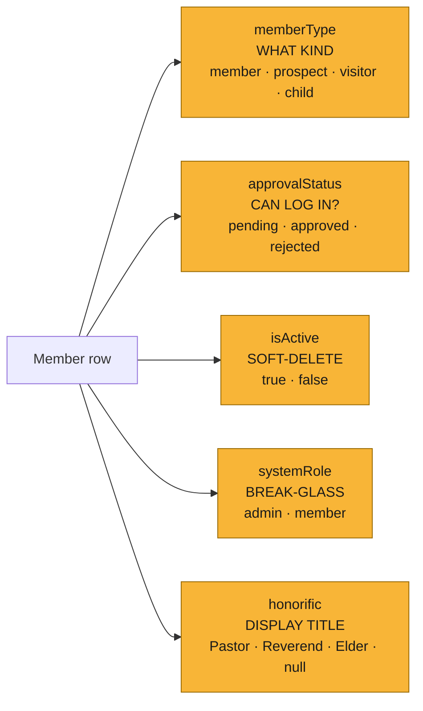
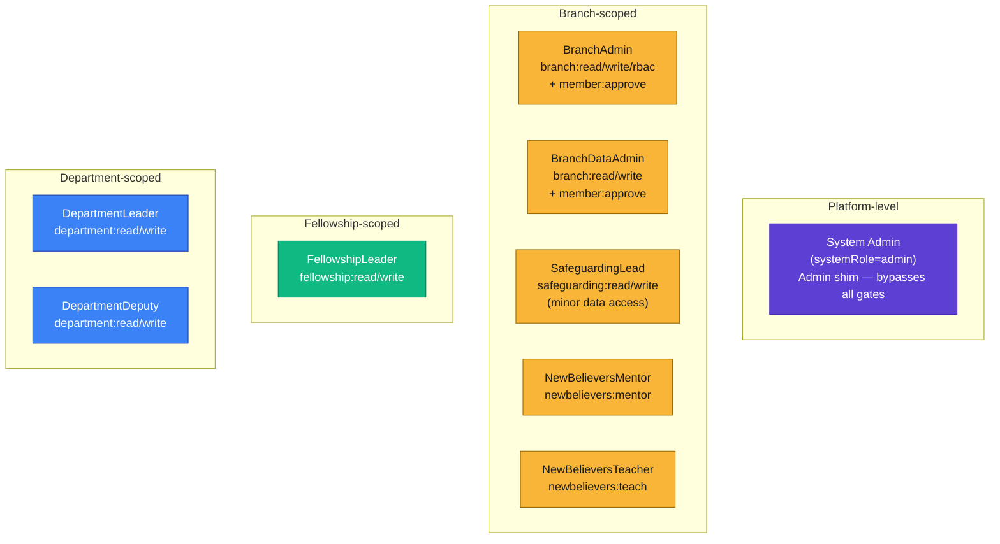
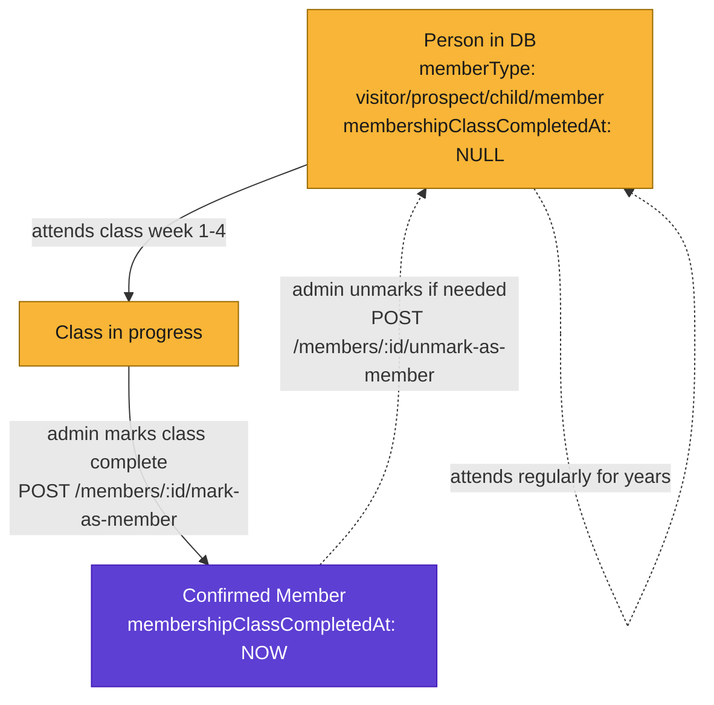
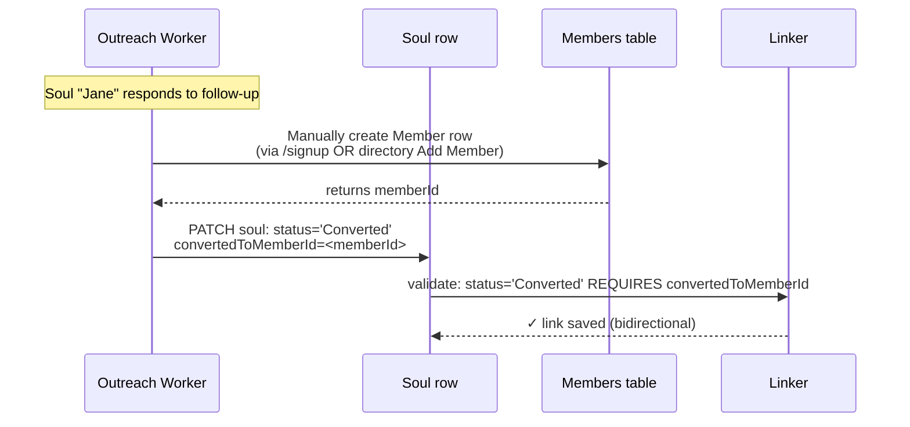
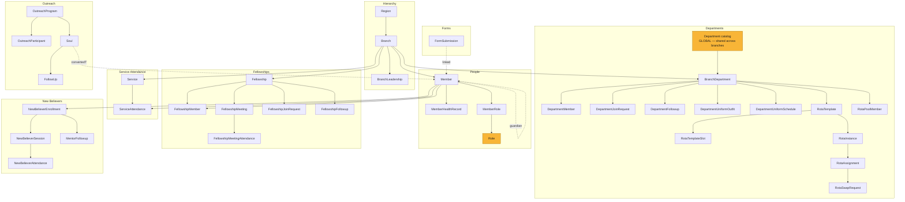

# Kairos — Domain Model

A working map of personas, entities, and lifecycle transitions, grounded in the
code (not aspirational). Last updated 2026-06-23.

Open this file in a Mermaid-aware Markdown viewer (GitHub, VSCode preview,
Obsidian, etc.) to see the diagrams render.

---

## 0. CRITICAL DOMAIN CLARIFICATION — what "Member" actually means

In this church, **a Member is specifically someone who has completed the 4-week
membership class and received their membership certificate.** Nothing else
makes you a Member:

- Attending every Sunday for a year → NOT a Member
- Serving in a department → NOT a Member
- Leading a fellowship → NOT a Member (unusual, possible)
- Self-signing up via `/signup` → NOT a Member
- Completing the New Believers programme → NOT a Member

You can be a fully active participant in church life and still not be a
"Member" in the formal sense, because that title is gated by one specific
act: completing the class and receiving the certificate.

**The current `memberType='member'` field is MISNAMED for this domain.** It
actually means "row was originated through self-signup / admin-add" — a
provenance tag, not a membership status. The true Membership signal is
**absent from the schema today** and will be introduced in [Task #33] as
`membershipClassCompletedAt timestamp`. Until that lands, the system has no
way to distinguish a confirmed Member from a regular attender.

Implications:
- The `Member` entity in this doc is the row in `members` — i.e. "any person
  attached to the church," regardless of formal membership status.
- "Confirmed Member" / "Class-completed Member" refers to someone whose
  `membershipClassCompletedAt` will be populated after Task #33.
- Visitors STAY visible everywhere (directory, attendance rollups) — they're
  in the church, they need to be counted. They're just clearly labelled as
  Visitor / Prospect / Member so the difference is obvious.

---

## 1. The four classifiers on a Member row

Every person in Kairos lives in one table — `members`. Four orthogonal fields
classify them:



A row's "real" persona is the **combination** of these — e.g. a long-serving
volunteer might be `memberType=visitor`, `approvalStatus=approved`,
`isActive=true`, `systemRole=member`, `honorific=null` — yet hold a
`DepartmentLeader` grant in `member_roles`. The row's classifier fields and
its grants are independent stores.

---

## 2. Operational personas — what you can DO

Authority lives in `member_roles` rows, NOT in `systemRole`. A person can hold
multiple grants at multiple scopes simultaneously.



---

## 3. The Member lifecycle (current state vs. proposed)

This is the **most important diagram** for the question "what classifies a
member." It shows what flips `memberType` today and what doesn't.

```mermaid
stateDiagram-v2
  direction LR
  [*] --> Prospect: Outreach forms<br/>(altar call, testimony, baby naming)
  [*] --> Visitor: First-timer form<br/>OR walk-in attendance
  [*] --> Child: under-16 in first-timer<br/>OR baby naming/dedication
  [*] --> MemberSignup: Self-signup<br/>(/signup)

  state "Member (memberType='member')" as Member
  state "Prospect (memberType='prospect')" as Prospect
  state "Visitor (memberType='visitor')" as Visitor
  state "Child (memberType='child')" as Child
  state "Member — pending approval" as MemberSignup

  MemberSignup --> Member: member:approve<br/>(admin/BSA/BDA)
  MemberSignup --> [*]: rejected

  Prospect -.->|🟥 NO AUTO PATH TODAY<br/>manual flip only| Member
  Visitor -.->|🟥 NO AUTO PATH TODAY<br/>manual flip only| Member
  Child -->|age ≥ 16 + opt-in| Member

  Member --> Inactive: isActive=false
  Inactive --> Member: reactivate
```

**Red dashed arrows = gaps the codebase doesn't fill.** Today a visitor who
joins a fellowship, serves in a department, AND completes the new-believers
program stays tagged as `memberType='visitor'`. Stats counters (which filter
`memberType='member'`) silently exclude them.

### Proposed lifecycle — corrected for class-based membership (Task #33)

The **only** trigger that turns someone into a confirmed Member is completing
the 4-week membership class. Department/fellowship joining and NB completion
do NOT promote — those are independent participation tracks.



Dashed self-loops emphasise: **none of these activities promote you to
Confirmed Member**. They're parallel participation tracks. Only the
membership class does.

Today the class doesn't exist as a module — Task #33 introduces the column +
admin "Mark as Member" button so the signal can exist before the full module
is built. The class module itself is a future ticket.

---

## 4. Soul → Member conversion (today: manual)



**No automation.** The worker has to consciously create the Member row first.
A reasonable improvement is a "Convert to Member" button on the soul card
that runs both steps in one transaction (creates member shell + sets link).

---

## 5. Entities — the full landscape (grouped by module)



Yellow boxes = **global catalogs** (one row per "kind of thing"). Everything
else is branch-scoped or person-scoped.

---

## 6. Tracked gaps (all in backlog as of 2026-06-23)

| # | Task | Impact | Effort |
|---|---|---|---|
| #33 | **Membership class signifier** — `membershipClassCompletedAt` column + admin mark/unmark workflow | The actual missing definition of "Member" in this church | Phase 1+2 ~3 days; Phase 3 (full Class module) uncosted |
| #34 | **Visitors visible in directory + rollups** — clearly marked, not excluded | Today's `memberType='member'` filter silently hides visitors who attend regularly | ~1 day (couples with #33) |
| #35 | **Rename `member:approve` → `signup:approve`** | Disambiguates from the new `member:promote` capability coming in #33 | ~30 min |
| #36 | **Soul → Member one-click conversion** | Today's flow is two manual steps; orphan rows + friction | ~3-4 hrs |
| #37 | **Tighten `system_role` CHECK constraint** | Schema drift: enforced constraint still allows old `'pastor'/'leader'` values | ~15 min |
| #38 | **Extract `is_real_member()` predicate helper** | 6+ sites implicitly filter; easy to forget in new queries | ~2 hrs (must follow #33 Phase 2) |

**Sequencing recommendation:** #35 (cheap, no dependencies) → #37 (one-line migration) → #33 Phase 1 → #34 → #33 Phase 2 → #38 → #36 (can land anytime). Phase 3 of #33 (full Membership Class module) is a future feature build, not in this cluster.
