# Kairos - System Architecture

## Document Overview
This document defines the system architecture for Kairos church administration platform using the C4 model. It includes system context, container architecture, component design, and deployment architecture.

**Architecture Principles:**
- Serverless-first (AWS Lambda, Aurora Serverless v2)
- Event-driven where appropriate
- Branch-level data isolation enforced at authorization layer
- Stateless API design
- Infrastructure as Code (AWS CDK)

---

## Table of Contents
1. [C4 Level 1: System Context](#c4-level-1-system-context)
2. [C4 Level 2: Container Architecture](#c4-level-2-container-architecture)
3. [C4 Level 3: Component Architecture](#c4-level-3-component-architecture)
4. [Deployment Architecture](#deployment-architecture)
5. [API Design](#api-design)
6. [Data Flow Patterns](#data-flow-patterns)
7. [Security Architecture](#security-architecture)
8. [Scalability & Performance](#scalability--performance)

---

## C4 Level 1: System Context

### Overview
Kairos is a multi-tenant church administration SaaS platform that enables church administrators, pastors, leaders, and members to manage church operations including membership, attendance, donations, evangelism, and communications.

### System Context Diagram

**Structurizr DSL:**
```structurizr
workspace "Kairos Church Administration System" "Multi-tenant church management platform" {

    model {
        # External Actors
        member = person "Church Member" "A registered church member who can view their profile, donate, and fill forms"
        leader = person "Department/Fellowship Leader" "Manages their department or fellowship, tracks attendance and follow-ups"
        pastor = person "Pastor" "Manages their branch, views reports, oversees operations"
        admin = person "Church Administrator" "Full system access, manages all aspects of the church"
        
        # External Systems
        stripe = softwareSystem "Stripe" "Payment processing platform" "External"
        ses = softwareSystem "Amazon SES" "Email delivery service" "External"
        powerbi = softwareSystem "Power BI" "Business intelligence and reporting" "External"
        
        # Kairos System
        kairos = softwareSystem "Kairos" "Church administration platform for managing members, attendance, donations, evangelism, and communications" {
            tags "Kairos System"
        }
        
        # Relationships
        member -> kairos "Views profile, makes donations, fills forms, views notifications"
        leader -> kairos "Manages department/fellowship, records attendance, tracks follow-ups"
        pastor -> kairos "Manages branch, views reports, oversees members"
        admin -> kairos "Manages all church operations, configures system"
        
        kairos -> stripe "Processes online donations"
        kairos -> ses "Sends email notifications"
        kairos -> powerbi "Exports data for analytics" "S3"
    }
    
    views {
        systemContext kairos "SystemContext" {
            include *
            autoLayout
        }
        
        styles {
            element "Person" {
                shape person
                background #08427b
                color #ffffff
            }
            element "Kairos System" {
                background #1168bd
                color #ffffff
            }
            element "External" {
                background #999999
                color #ffffff
            }
        }
    }
}
```


**Mermaid Diagram (Fallback):**
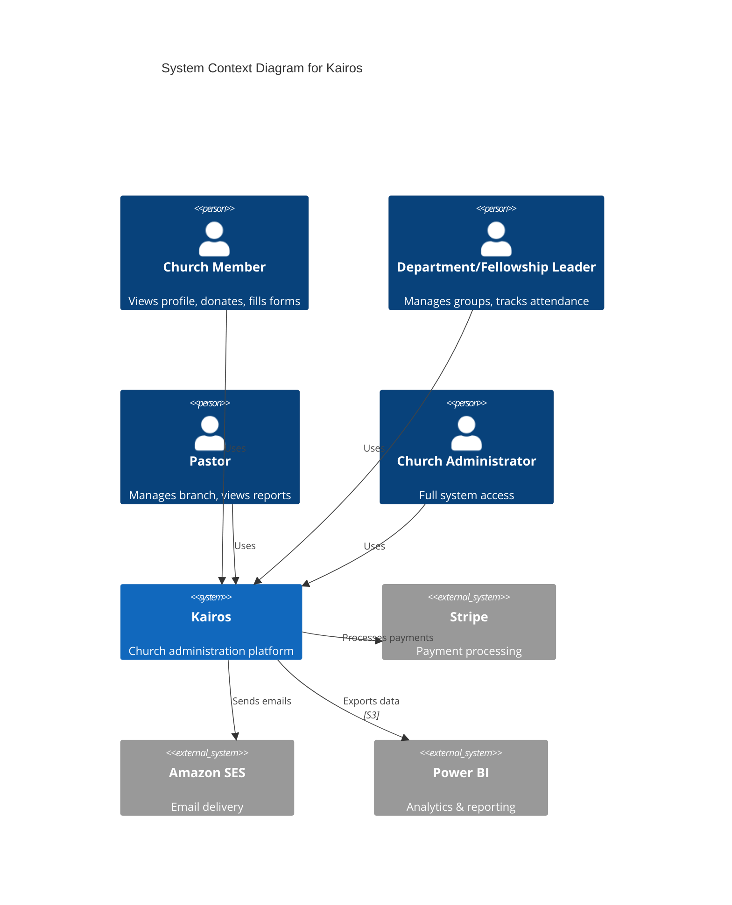

### External Systems

| System | Purpose | Integration Method | Data Flow |
|--------|---------|-------------------|-----------|
| **Stripe** | Payment processing for online donations | Stripe SDK in Lambda | Kairos → Stripe (payment intent), Stripe → Kairos (webhook) |
| **Amazon SES** | Transactional email delivery | AWS SDK in Lambda | Kairos → SES (send email) |
| **Power BI** | Analytics and reporting | S3 data export | Kairos → S3 (nightly export), Power BI → S3 (read) |
| **Amazon Cognito** | User authentication | AWS SDK + API Gateway integration | User → Cognito (auth), Cognito → API Gateway (JWT) |

---

## C4 Level 2: Container Architecture

### Overview
Kairos uses a serverless architecture with AWS Lambda for compute, Aurora Serverless v2 for data persistence, and Next.js for the web frontend. All containers are deployed in a single AWS account with staging and production environments.

### Container Diagram

**Structurizr DSL:**
```structurizr
workspace "Kairos Container Architecture" {

    model {
        user = person "User" "Church member, leader, pastor, or admin"
        
        kairos = softwareSystem "Kairos" {
            # Frontend
            webapp = container "Web Application" "Next.js application providing UI for all users" "Next.js, React, TypeScript" {
                tags "Web App"
            }
            
            # API Layer
            httpApi = container "HTTP API" "RESTful API for CRUD operations" "API Gateway HTTP API" {
                tags "API Gateway"
            }
            
            wsApi = container "WebSocket API" "Real-time notifications and updates" "API Gateway WebSocket API" {
                tags "API Gateway"
            }
            
            # Authorization
            authorizer = container "Custom Authorizer" "Validates JWT and enforces branch-level permissions" "Lambda, TypeScript" {
                tags "Lambda"
            }
            
            # Lambda Functions (Grouped)
            memberLambdas = container "Member Management Lambdas" "CRUD operations for members" "Lambda, TypeScript, Drizzle" {
                tags "Lambda"
            }
            
            branchLambdas = container "Branch Management Lambdas" "CRUD operations for branches and leadership" "Lambda, TypeScript, Drizzle" {
                tags "Lambda"
            }
            
            deptLambdas = container "Department Management Lambdas" "Department and member assignment operations" "Lambda, TypeScript, Drizzle" {
                tags "Lambda"
            }
            
            fellowshipLambdas = container "Fellowship Management Lambdas" "Fellowship and meeting operations" "Lambda, TypeScript, Drizzle" {
                tags "Lambda"
            }
            
            attendanceLambdas = container "Attendance Lambdas" "Service and fellowship attendance tracking" "Lambda, TypeScript, Drizzle" {
                tags "Lambda"
            }
            
            outreachLambdas = container "Outreach Lambdas" "Outreach program management" "Lambda, TypeScript, Drizzle" {
                tags "Lambda"
            }
            
            soulLambdas = container "Evangelism Lambdas" "Soul capture and follow-up tracking" "Lambda, TypeScript, Drizzle" {
                tags "Lambda"
            }
            
            donationLambdas = container "Donation Lambdas" "Donation recording and reporting" "Lambda, TypeScript, Drizzle" {
                tags "Lambda"
            }
            
            formLambdas = container "Form Lambdas" "Form builder and submission handling" "Lambda, TypeScript, Drizzle" {
                tags "Lambda"
            }
            
            notificationLambdas = container "Notification Lambdas" "Email and in-app notifications" "Lambda, TypeScript, Drizzle" {
                tags "Lambda"
            }
            
            reportLambdas = container "Report Lambdas" "Dashboard data and CSV exports" "Lambda, TypeScript, Drizzle" {
                tags "Lambda"
            }
            
            exportLambda = container "Analytics Export Lambda" "Nightly S3 export for Power BI" "Lambda, TypeScript, Drizzle" {
                tags "Lambda"
            }
            
            wsLambdas = container "WebSocket Lambdas" "Connection management and message routing" "Lambda, TypeScript" {
                tags "Lambda"
            }
            
            # Data Storage
            database = container "Database" "Stores all application data" "Aurora Serverless v2 (PostgreSQL)" {
                tags "Database"
            }
            
            s3 = container "File Storage" "Stores member photos, form uploads, analytics exports" "Amazon S3" {
                tags "Storage"
            }
            
            cdn = container "CDN" "Delivers static assets and files globally" "CloudFront" {
                tags "CDN"
            }
            
            # Secrets
            secrets = container "Secrets Manager" "Stores database credentials with auto-rotation" "AWS Secrets Manager" {
                tags "AWS Service"
            }
            
            params = container "Parameter Store" "Stores API keys and configuration" "AWS Systems Manager Parameter Store" {
                tags "AWS Service"
            }
            
            # Auth
            cognito = container "User Pool" "User authentication and JWT issuance" "Amazon Cognito" {
                tags "AWS Service"
            }
            
            # Scheduling
            eventBridge = container "Event Scheduler" "Triggers scheduled tasks" "Amazon EventBridge" {
                tags "AWS Service"
            }
        }
        
        stripe = softwareSystem "Stripe" "Payment processing" "External"
        ses = softwareSystem "Amazon SES" "Email delivery" "External"
        powerbi = softwareSystem "Power BI" "Analytics" "External"
        
        # User interactions
        user -> webapp "Uses" "HTTPS"
        user -> cognito "Authenticates" "HTTPS"
        
        # Web app interactions
        webapp -> httpApi "Makes API calls" "HTTPS, JSON"
        webapp -> wsApi "Connects for real-time updates" "WSS"
        webapp -> cdn "Loads static assets and files" "HTTPS"
        
        # API Gateway interactions
        httpApi -> authorizer "Validates requests" "Lambda invoke"
        wsApi -> wsLambdas "Routes messages" "Lambda invoke"
        
        # Authorizer interactions
        authorizer -> cognito "Validates JWT" "AWS SDK"
        authorizer -> database "Checks permissions" "PostgreSQL"
        
        # Lambda interactions with database
        memberLambdas -> database "Reads/writes member data" "PostgreSQL"
        branchLambdas -> database "Reads/writes branch data" "PostgreSQL"
        deptLambdas -> database "Reads/writes department data" "PostgreSQL"
        fellowshipLambdas -> database "Reads/writes fellowship data" "PostgreSQL"
        attendanceLambdas -> database "Reads/writes attendance data" "PostgreSQL"
        outreachLambdas -> database "Reads/writes outreach data" "PostgreSQL"
        soulLambdas -> database "Reads/writes soul data" "PostgreSQL"
        donationLambdas -> database "Reads/writes donation data" "PostgreSQL"
        formLambdas -> database "Reads/writes form data" "PostgreSQL"
        notificationLambdas -> database "Reads/writes notification data" "PostgreSQL"
        reportLambdas -> database "Reads data for reports" "PostgreSQL"
        exportLambda -> database "Reads data for export" "PostgreSQL"
        wsLambdas -> database "Reads/writes connection data" "PostgreSQL"
        
        # Lambda interactions with S3
        memberLambdas -> s3 "Uploads member photos" "AWS SDK"
        formLambdas -> s3 "Stores form submissions" "AWS SDK"
        exportLambda -> s3 "Exports analytics data" "AWS SDK"
        reportLambdas -> s3 "Generates CSV exports" "AWS SDK"
        
        # CDN interactions
        cdn -> s3 "Caches and serves files" "Origin fetch"
        
        # Lambda interactions with secrets
        memberLambdas -> secrets "Retrieves DB credentials" "AWS SDK"
        memberLambdas -> params "Retrieves config" "AWS SDK"
        
        # External integrations
        donationLambdas -> stripe "Processes payments" "Stripe SDK"
        notificationLambdas -> ses "Sends emails" "AWS SDK"
        powerbi -> s3 "Reads analytics data" "S3 API"
        
        # Scheduling
        eventBridge -> exportLambda "Triggers nightly export" "Lambda invoke"
        eventBridge -> notificationLambdas "Triggers scheduled notifications" "Lambda invoke"
    }
    
    views {
        container kairos "Containers" {
            include *
            autoLayout
        }
        
        styles {
            element "Web App" {
                shape WebBrowser
                background #438dd5
                color #ffffff
            }
            element "API Gateway" {
                shape RoundedBox
                background #ff9900
                color #ffffff
            }
            element "Lambda" {
                shape RoundedBox
                background #ff9900
                color #ffffff
            }
            element "Database" {
                shape Cylinder
                background #3b48cc
                color #ffffff
            }
            element "Storage" {
                shape Folder
                background #569a31
                color #ffffff
            }
            element "CDN" {
                shape Component
                background #8c4fff
                color #ffffff
            }
            element "AWS Service" {
                shape RoundedBox
                background #ff9900
                color #ffffff
            }
            element "External" {
                background #999999
                color #ffffff
            }
        }
    }
}
```


**Mermaid Diagram (Fallback):**
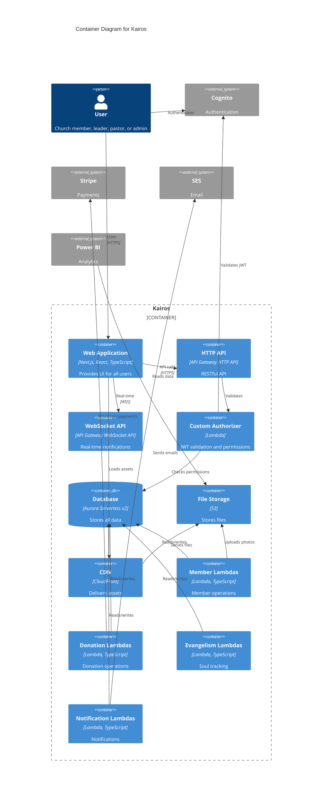

### Container Descriptions

| Container | Technology | Purpose | Scaling |
|-----------|-----------|---------|---------|
| **Web Application** | Next.js, React, TypeScript | User interface for all personas | Horizontal (multiple instances) |
| **HTTP API** | API Gateway HTTP API | RESTful endpoints for CRUD operations | Auto-scales with requests |
| **WebSocket API** | API Gateway WebSocket API | Real-time notifications | Auto-scales with connections |
| **Custom Authorizer** | Lambda (TypeScript) | JWT validation and branch-level authorization | Auto-scales with API requests |
| **Member Lambdas** | Lambda (TypeScript, Drizzle) | Member CRUD, import, export | Auto-scales per operation |
| **Branch Lambdas** | Lambda (TypeScript, Drizzle) | Branch and leadership management | Auto-scales per operation |
| **Department Lambdas** | Lambda (TypeScript, Drizzle) | Department management and assignments | Auto-scales per operation |
| **Fellowship Lambdas** | Lambda (TypeScript, Drizzle) | Fellowship and meeting management | Auto-scales per operation |
| **Attendance Lambdas** | Lambda (TypeScript, Drizzle) | Service and fellowship attendance | Auto-scales per operation |
| **Outreach Lambdas** | Lambda (TypeScript, Drizzle) | Outreach program management | Auto-scales per operation |
| **Evangelism Lambdas** | Lambda (TypeScript, Drizzle) | Soul capture and follow-up tracking | Auto-scales per operation |
| **Donation Lambdas** | Lambda (TypeScript, Drizzle) | Donation recording and Stripe integration | Auto-scales per operation |
| **Form Lambdas** | Lambda (TypeScript, Drizzle) | Form builder and submissions | Auto-scales per operation |
| **Notification Lambdas** | Lambda (TypeScript, Drizzle) | Email and in-app notifications | Auto-scales per operation |
| **Report Lambdas** | Lambda (TypeScript, Drizzle) | Dashboard data and CSV exports | Auto-scales per operation |
| **Analytics Export Lambda** | Lambda (TypeScript, Drizzle) | Nightly S3 export for Power BI | Scheduled (EventBridge) |
| **WebSocket Lambdas** | Lambda (TypeScript) | Connection management and message routing | Auto-scales with connections |
| **Database** | Aurora Serverless v2 (PostgreSQL) | Primary data store | Auto-scales (0.5-16 ACUs) |
| **File Storage** | Amazon S3 | Member photos, form uploads, analytics exports | Unlimited |
| **CDN** | CloudFront | Global content delivery | Edge locations worldwide |
| **Secrets Manager** | AWS Secrets Manager | Database credentials (auto-rotation) | Managed service |
| **Parameter Store** | AWS Systems Manager | API keys and configuration | Managed service |
| **User Pool** | Amazon Cognito | User authentication and JWT issuance | Managed service |
| **Event Scheduler** | Amazon EventBridge | Scheduled tasks (nightly exports, alerts) | Managed service |

---

## C4 Level 3: Component Architecture

### Overview
This section details the internal components of key containers: Lambda function groups and the Next.js web application.

---

### 3.1 Lambda Functions Component Architecture

Each Lambda function follows a consistent structure with shared components for database access, validation, and error handling.

**Structurizr DSL:**
```structurizr
workspace "Lambda Component Architecture" {

    model {
        httpApi = softwareSystem "HTTP API" "API Gateway"
        database = softwareSystem "Database" "Aurora Serverless v2"
        s3 = softwareSystem "S3" "File Storage"
        
        memberLambdas = container "Member Management Lambdas" {
            # Individual Lambda Functions
            membersCreate = component "members-create" "Creates new member record" "Lambda Function"
            membersList = component "members-list" "Lists members with filtering" "Lambda Function"
            membersGet = component "members-get" "Retrieves single member" "Lambda Function"
            membersUpdate = component "members-update" "Updates member record" "Lambda Function"
            membersDelete = component "members-delete" "Soft deletes member" "Lambda Function"
            membersImport = component "members-import" "Bulk imports members from CSV" "Lambda Function"
            membersExport = component "members-export" "Exports members to CSV" "Lambda Function"
            membersApprove = component "members-approve" "Approves pending member registration" "Lambda Function"
            
            # Shared Components (Lambda Layers)
            dbClient = component "Database Client" "Drizzle ORM connection and query builder" "Shared Layer"
            validator = component "Input Validator" "Validates request payloads" "Shared Layer"
            errorHandler = component "Error Handler" "Standardized error responses" "Shared Layer"
            authContext = component "Auth Context" "Extracts user info from authorizer" "Shared Layer"
            logger = component "Logger" "Structured logging" "Shared Layer"
        }
        
        # Relationships
        httpApi -> membersCreate "Invokes" "POST /v1/members"
        httpApi -> membersList "Invokes" "GET /v1/members"
        httpApi -> membersGet "Invokes" "GET /v1/members/{id}"
        httpApi -> membersUpdate "Invokes" "PUT /v1/members/{id}"
        httpApi -> membersDelete "Invokes" "DELETE /v1/members/{id}"
        httpApi -> membersImport "Invokes" "POST /v1/members/import"
        httpApi -> membersExport "Invokes" "GET /v1/members/export"
        httpApi -> membersApprove "Invokes" "POST /v1/members/{id}/approve"
        
        membersCreate -> dbClient "Uses"
        membersCreate -> validator "Uses"
        membersCreate -> errorHandler "Uses"
        membersCreate -> authContext "Uses"
        membersCreate -> logger "Uses"
        
        membersList -> dbClient "Uses"
        membersGet -> dbClient "Uses"
        membersUpdate -> dbClient "Uses"
        membersDelete -> dbClient "Uses"
        membersImport -> dbClient "Uses"
        membersExport -> dbClient "Uses"
        membersApprove -> dbClient "Uses"
        
        dbClient -> database "Queries" "PostgreSQL"
        membersImport -> s3 "Reads CSV" "AWS SDK"
        membersExport -> s3 "Writes CSV" "AWS SDK"
    }
    
    views {
        component memberLambdas "MemberLambdasComponents" {
            include *
            autoLayout
        }
        
        styles {
            element "Lambda Function" {
                shape RoundedBox
                background #ff9900
                color #ffffff
            }
            element "Shared Layer" {
                shape Component
                background #ffcc00
                color #000000
            }
        }
    }
}
```

**Mermaid Diagram (Fallback):**


### Lambda Function Patterns

All Lambda functions follow this structure:

```typescript
// Example: members-create Lambda
import { APIGatewayProxyEvent, APIGatewayProxyResult } from 'aws-lambda';
import { db } from '@kairos/db-client'; // Shared layer
import { validateMemberInput } from '@kairos/validator'; // Shared layer
import { handleError } from '@kairos/error-handler'; // Shared layer
import { getAuthContext } from '@kairos/auth-context'; // Shared layer
import { logger } from '@kairos/logger'; // Shared layer

export const handler = async (
  event: APIGatewayProxyEvent
): Promise<APIGatewayProxyResult> => {
  try {
    // 1. Extract auth context (user, branch, role)
    const authContext = getAuthContext(event);
    
    // 2. Parse and validate input
    const input = JSON.parse(event.body || '{}');
    const validatedInput = validateMemberInput(input);
    
    // 3. Enforce branch-level authorization
    if (authContext.role !== 'Admin' && validatedInput.branchId !== authContext.branchId) {
      return handleError(new Error('Unauthorized'), 403);
    }
    
    // 4. Business logic
    const member = await db.members.create({
      ...validatedInput,
      createdBy: authContext.userId,
    });
    
    // 5. Log and return
    logger.info('Member created', { memberId: member.id, branchId: member.branchId });
    
    return {
      statusCode: 201,
      body: JSON.stringify(member),
    };
  } catch (error) {
    return handleError(error);
  }
};
```

### Lambda Function Groups

| Lambda Group | Functions | Purpose |
|--------------|-----------|---------|
| **Member Management** | create, list, get, update, delete, import, export, approve | Member CRUD and bulk operations |
| **Branch Management** | create, list, get, update, delete, assign-pastor, assign-elder | Branch and leadership management |
| **Department Management** | create, list, get, update, delete, assign-member, approve-request, remove-member | Department operations |
| **Fellowship Management** | create, list, get, update, delete, assign-member, remove-member, record-meeting | Fellowship operations |
| **Attendance** | record-service, list-service, record-fellowship, list-fellowship, get-trends | Attendance tracking |
| **Outreach** | create-program, list-programs, get-program, register-worker, list-workers | Outreach management |
| **Evangelism** | capture-soul, list-souls, get-soul, assign-worker, log-followup, update-status | Soul tracking |
| **Donations** | create-online, create-manual, list, get, export, get-reports | Donation management |
| **Forms** | create-form, list-forms, get-form, submit-form, list-submissions, export-submissions | Form builder |
| **Notifications** | create, list, get, mark-read, send-broadcast | Notification management |
| **Reports** | get-dashboard, get-attendance-trends, get-donation-summary, export-csv | Reporting |
| **Analytics Export** | export-to-s3 | Nightly Power BI export |
| **WebSocket** | connect, disconnect, send-message | Real-time messaging |

---

### 3.2 Next.js Web Application Component Architecture

The Next.js application follows a feature-based structure with shared components and utilities.

**Structurizr DSL:**
```structurizr
workspace "Next.js Application Architecture" {

    model {
        user = person "User"
        httpApi = softwareSystem "HTTP API"
        wsApi = softwareSystem "WebSocket API"
        cognito = softwareSystem "Cognito"
        
        webapp = container "Web Application" {
            # Pages (Routes)
            loginPage = component "Login Page" "User authentication" "Next.js Page"
            dashboardPage = component "Dashboard Page" "Role-based dashboard" "Next.js Page"
            membersPage = component "Members Page" "Member list and management" "Next.js Page"
            memberDetailPage = component "Member Detail Page" "Single member view/edit" "Next.js Page"
            attendancePage = component "Attendance Page" "Attendance tracking" "Next.js Page"
            donationsPage = component "Donations Page" "Donation management" "Next.js Page"
            soulsPage = component "Souls Page" "Evangelism tracking" "Next.js Page"
            formsPage = component "Forms Page" "Form builder and submissions" "Next.js Page"
            reportsPage = component "Reports Page" "Analytics and reports" "Next.js Page"
            
            # Shared Components
            layout = component "Layout Component" "App shell with navigation" "React Component"
            authProvider = component "Auth Provider" "Authentication context" "React Context"
            apiClient = component "API Client" "Type-safe API calls" "Generated from OpenAPI"
            wsClient = component "WebSocket Client" "Real-time connection" "WebSocket Client"
            stateManager = component "State Manager" "Global state management" "Zustand"
            formBuilder = component "Form Builder Component" "Drag-and-drop form creator" "React Component"
            dataTable = component "Data Table Component" "Reusable table with sorting/filtering" "React Component"
            notificationCenter = component "Notification Center" "In-app notifications" "React Component"
            
            # Utilities
            authUtils = component "Auth Utilities" "Token management, refresh" "TypeScript"
            validationUtils = component "Validation Utilities" "Client-side validation" "Zod"
            dateUtils = component "Date Utilities" "Date formatting, timezone" "date-fns"
        }
        
        # Relationships
        user -> loginPage "Visits"
        user -> dashboardPage "Visits"
        
        loginPage -> authProvider "Uses"
        dashboardPage -> layout "Uses"
        membersPage -> layout "Uses"
        
        authProvider -> cognito "Authenticates" "AWS SDK"
        authProvider -> authUtils "Uses"
        
        membersPage -> apiClient "Fetches members"
        membersPage -> dataTable "Renders"
        
        apiClient -> httpApi "Makes requests" "HTTPS"
        wsClient -> wsApi "Connects" "WSS"
        
        notificationCenter -> wsClient "Receives messages"
        notificationCenter -> stateManager "Updates state"
        
        formsPage -> formBuilder "Uses"
        formBuilder -> apiClient "Saves form"
    }
    
    views {
        component webapp "WebAppComponents" {
            include *
            autoLayout
        }
        
        styles {
            element "Next.js Page" {
                shape WebBrowser
                background #438dd5
                color #ffffff
            }
            element "React Component" {
                shape Component
                background #61dafb
                color #000000
            }
            element "React Context" {
                shape Component
                background #764abc
                color #ffffff
            }
            element "TypeScript" {
                shape Component
                background #3178c6
                color #ffffff
            }
        }
    }
}
```


**Mermaid Diagram (Fallback):**
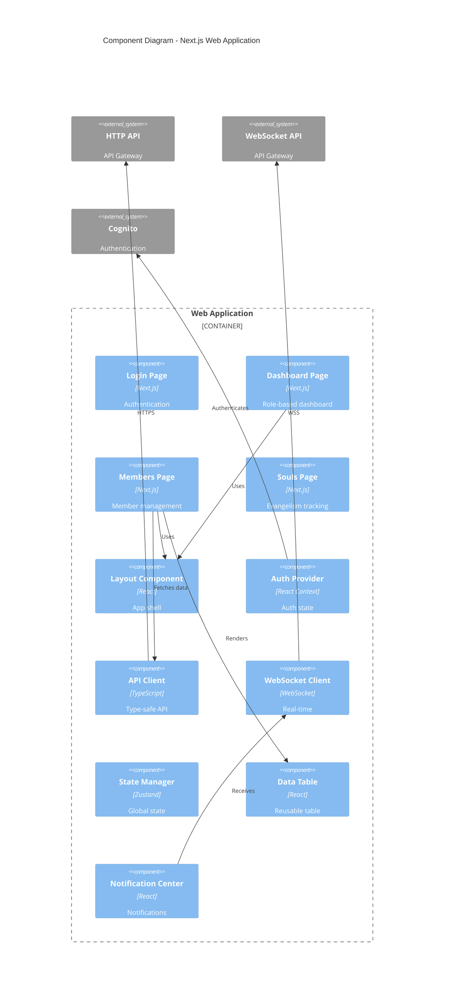

### Next.js Application Structure

```
apps/web/
├── src/
│   ├── app/                      # Next.js App Router
│   │   ├── (auth)/              # Auth layout group
│   │   │   ├── login/
│   │   │   └── register/
│   │   ├── (dashboard)/         # Dashboard layout group
│   │   │   ├── layout.tsx       # Shared dashboard layout
│   │   │   ├── page.tsx         # Dashboard home
│   │   │   ├── members/
│   │   │   │   ├── page.tsx     # Member list
│   │   │   │   └── [id]/
│   │   │   │       └── page.tsx # Member detail
│   │   │   ├── attendance/
│   │   │   ├── donations/
│   │   │   ├── souls/
│   │   │   ├── forms/
│   │   │   └── reports/
│   │   └── api/                 # API routes (if needed)
│   ├── components/              # Shared components
│   │   ├── ui/                  # Base UI components
│   │   │   ├── Button.tsx
│   │   │   ├── Input.tsx
│   │   │   ├── Table.tsx
│   │   │   └── Modal.tsx
│   │   ├── layout/              # Layout components
│   │   │   ├── Header.tsx
│   │   │   ├── Sidebar.tsx
│   │   │   └── Footer.tsx
│   │   ├── forms/               # Form components
│   │   │   ├── FormBuilder.tsx
│   │   │   └── FormRenderer.tsx
│   │   └── notifications/       # Notification components
│   │       └── NotificationCenter.tsx
│   ├── lib/                     # Utilities and clients
│   │   ├── api-client.ts        # Generated API client
│   │   ├── ws-client.ts         # WebSocket client
│   │   ├── auth.ts              # Auth utilities
│   │   └── validation.ts        # Validation schemas
│   ├── hooks/                   # Custom React hooks
│   │   ├── useAuth.ts
│   │   ├── useMembers.ts
│   │   ├── useDonations.ts
│   │   └── useNotifications.ts
│   ├── store/                   # Zustand stores
│   │   ├── authStore.ts
│   │   ├── notificationStore.ts
│   │   └── uiStore.ts
│   └── types/                   # TypeScript types
│       └── index.ts             # Shared types from @kairos/types
└── public/                      # Static assets
```

### Key Component Descriptions

| Component | Purpose | Technology |
|-----------|---------|------------|
| **Login Page** | User authentication flow | Next.js Page, Cognito SDK |
| **Dashboard Page** | Role-based landing page (Admin/Pastor/Leader/Member) | Next.js Page, Server Components |
| **Members Page** | Member list with search, filter, pagination | Next.js Page, Data Table |
| **Member Detail Page** | View/edit single member, view history | Next.js Page, Forms |
| **Attendance Page** | Record service and fellowship attendance | Next.js Page, Bulk selection |
| **Donations Page** | Record donations, view history, Stripe integration | Next.js Page, Stripe Elements |
| **Souls Page** | Soul capture, follow-up tracking, status pipeline | Next.js Page, Kanban board |
| **Forms Page** | Form builder, form submissions, exports | Next.js Page, Drag-and-drop |
| **Reports Page** | Dashboards, charts, CSV exports | Next.js Page, Charts.js |
| **Layout Component** | App shell with header, sidebar, footer | React Component |
| **Auth Provider** | Authentication context, token management | React Context, Cognito |
| **API Client** | Type-safe API calls, auto-generated from OpenAPI | TypeScript, openapi-typescript |
| **WebSocket Client** | Real-time connection management | WebSocket API |
| **State Manager** | Global state (notifications, UI state) | Zustand |
| **Form Builder** | Drag-and-drop form creator | React DnD |
| **Data Table** | Reusable table with sorting, filtering, pagination | TanStack Table |
| **Notification Center** | In-app notification display | React Component |

---

## Deployment Architecture

### Overview
Kairos is deployed entirely on AWS using a serverless architecture. All infrastructure is defined as code using AWS CDK (TypeScript). The system supports two environments (staging and production) within a single AWS account.

### Deployment Diagram

**Structurizr DSL:**
```structurizr
workspace "Kairos Deployment Architecture" {

    model {
        user = person "User"
        
        deploymentEnvironment "Production" {
            deploymentNode "AWS Cloud" {
                tags "AWS"
                
                deploymentNode "CloudFront" {
                    tags "CDN"
                    cdnNode = infrastructureNode "CloudFront Distribution" "Global CDN" "CloudFront"
                }
                
                deploymentNode "Route 53" {
                    tags "DNS"
                    dnsNode = infrastructureNode "DNS" "Domain routing" "Route 53"
                }
                
                deploymentNode "AWS Region: eu-west-2 (London)" {
                    tags "Region"
                    
                    deploymentNode "VPC: kairos-prod-vpc" {
                        tags "VPC"
                        
                        deploymentNode "Private Subnet 1 (AZ-a)" {
                            tags "Subnet"
                            
                            dbInstance1 = infrastructureNode "Aurora Instance 1" "Primary database instance" "Aurora Serverless v2"
                        }
                        
                        deploymentNode "Private Subnet 2 (AZ-b)" {
                            tags "Subnet"
                            
                            dbInstance2 = infrastructureNode "Aurora Instance 2" "Replica for HA" "Aurora Serverless v2"
                        }
                        
                        deploymentNode "Lambda Execution Environment" {
                            tags "Lambda"
                            
                            lambdaContainer = containerInstance webapp "Lambda Functions" "All Lambda functions run here"
                        }
                    }
                    
                    deploymentNode "API Gateway" {
                        tags "API Gateway"
                        
                        httpApiNode = infrastructureNode "HTTP API" "RESTful API endpoints" "API Gateway HTTP API"
                        wsApiNode = infrastructureNode "WebSocket API" "Real-time connections" "API Gateway WebSocket API"
                    }
                    
                    deploymentNode "S3" {
                        tags "Storage"
                        
                        s3Node = infrastructureNode "S3 Buckets" "File storage" "Amazon S3"
                    }
                    
                    deploymentNode "Cognito" {
                        tags "Auth"
                        
                        cognitoNode = infrastructureNode "User Pool" "Authentication" "Amazon Cognito"
                    }
                    
                    deploymentNode "Secrets Manager" {
                        tags "Secrets"
                        
                        secretsNode = infrastructureNode "Secrets" "Credential storage" "AWS Secrets Manager"
                    }
                    
                    deploymentNode "EventBridge" {
                        tags "Scheduler"
                        
                        eventBridgeNode = infrastructureNode "Event Bus" "Scheduled tasks" "Amazon EventBridge"
                    }
                    
                    deploymentNode "CloudWatch" {
                        tags "Monitoring"
                        
                        cloudWatchNode = infrastructureNode "Logs & Metrics" "Monitoring" "CloudWatch"
                        xrayNode = infrastructureNode "X-Ray" "Distributed tracing" "AWS X-Ray"
                    }
                }
                
                deploymentNode "Vercel / AWS Amplify" {
                    tags "Hosting"
                    
                    webappNode = containerInstance webapp "Next.js Application" "Web application hosting"
                }
            }
            
            deploymentNode "External Services" {
                tags "External"
                
                stripeNode = infrastructureNode "Stripe" "Payment processing" "Stripe"
                sesNode = infrastructureNode "SES" "Email delivery" "Amazon SES"
            }
        }
        
        # Relationships
        user -> dnsNode "Resolves domain" "DNS"
        dnsNode -> cdnNode "Routes to" "HTTPS"
        dnsNode -> webappNode "Routes to" "HTTPS"
        
        user -> webappNode "Accesses" "HTTPS"
        webappNode -> httpApiNode "API calls" "HTTPS"
        webappNode -> wsApiNode "WebSocket" "WSS"
        webappNode -> cdnNode "Loads assets" "HTTPS"
        
        cdnNode -> s3Node "Origin fetch" "HTTPS"
        
        httpApiNode -> lambdaContainer "Invokes" "Lambda"
        wsApiNode -> lambdaContainer "Invokes" "Lambda"
        
        lambdaContainer -> dbInstance1 "Queries" "PostgreSQL"
        lambdaContainer -> s3Node "Reads/writes" "AWS SDK"
        lambdaContainer -> secretsNode "Retrieves credentials" "AWS SDK"
        lambdaContainer -> stripeNode "Processes payments" "HTTPS"
        lambdaContainer -> sesNode "Sends emails" "AWS SDK"
        
        lambdaContainer -> cloudWatchNode "Logs" "CloudWatch Logs"
        lambdaContainer -> xrayNode "Traces" "X-Ray SDK"
        
        eventBridgeNode -> lambdaContainer "Triggers" "Lambda"
        
        dbInstance1 -> dbInstance2 "Replicates" "Aurora replication"
    }
    
    views {
        deployment * "Production" "ProductionDeployment" {
            include *
            autoLayout
        }
        
        styles {
            element "AWS" {
                shape RoundedBox
                background #ff9900
                color #ffffff
            }
            element "CDN" {
                background #8c4fff
                color #ffffff
            }
            element "DNS" {
                background #8c4fff
                color #ffffff
            }
            element "Region" {
                background #ff9900
                color #ffffff
            }
            element "VPC" {
                background #3b48cc
                color #ffffff
            }
            element "Subnet" {
                background #569a31
                color #ffffff
            }
            element "Lambda" {
                background #ff9900
                color #ffffff
            }
            element "API Gateway" {
                background #ff9900
                color #ffffff
            }
            element "Storage" {
                background #569a31
                color #ffffff
            }
            element "Auth" {
                background #dd344c
                color #ffffff
            }
            element "Secrets" {
                background #dd344c
                color #ffffff
            }
            element "Scheduler" {
                background #ff9900
                color #ffffff
            }
            element "Monitoring" {
                background #ff9900
                color #ffffff
            }
            element "Hosting" {
                background #438dd5
                color #ffffff
            }
            element "External" {
                background #999999
                color #ffffff
            }
        }
    }
}
```


**Mermaid Diagram (Fallback):**
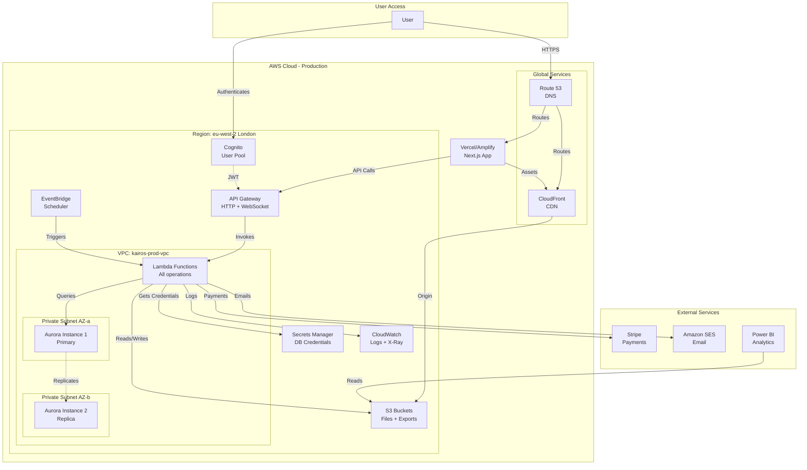

### Infrastructure Components

| Component | Configuration | Purpose | High Availability |
|-----------|--------------|---------|-------------------|
| **Route 53** | Hosted zone for kairos.church | DNS routing | Multi-region (AWS managed) |
| **CloudFront** | Global distribution, S3 origin | CDN for static assets and files | Edge locations worldwide |
| **VPC** | CIDR: 10.0.0.0/16 | Network isolation | Multi-AZ |
| **Private Subnets** | 2 subnets across 2 AZs | Database and Lambda isolation | Multi-AZ |
| **Aurora Serverless v2** | PostgreSQL 15, 0.5-16 ACUs | Primary database | Multi-AZ with replica |
| **Lambda Functions** | Node.js 20, 512MB-1024MB memory | Compute layer | Auto-scaling, multi-AZ |
| **API Gateway HTTP API** | Regional endpoint | RESTful API | Multi-AZ (AWS managed) |
| **API Gateway WebSocket API** | Regional endpoint | Real-time connections | Multi-AZ (AWS managed) |
| **S3 Buckets** | Standard storage class | File storage and exports | Multi-AZ (AWS managed) |
| **Cognito User Pool** | Email + password auth | User authentication | Multi-region (AWS managed) |
| **Secrets Manager** | Auto-rotation enabled | Database credentials | Multi-AZ (AWS managed) |
| **Parameter Store** | Standard parameters | Configuration | Multi-AZ (AWS managed) |
| **EventBridge** | Cron schedules | Scheduled tasks | Multi-AZ (AWS managed) |
| **CloudWatch** | 7-30 day retention | Logs and metrics | Multi-region (AWS managed) |
| **X-Ray** | Sampling rate: 10% | Distributed tracing | Multi-region (AWS managed) |
| **Next.js App** | Vercel or AWS Amplify | Web application | Global edge network |

### Network Architecture

```
VPC: kairos-prod-vpc (10.0.0.0/16)
├── Private Subnet 1 (10.0.1.0/24) - AZ: eu-west-2a
│   ├── Aurora Primary Instance
│   └── Lambda ENIs (when accessing VPC resources)
├── Private Subnet 2 (10.0.2.0/24) - AZ: eu-west-2b
│   ├── Aurora Replica Instance
│   └── Lambda ENIs (when accessing VPC resources)
└── VPC Endpoints
    ├── S3 Gateway Endpoint (no data transfer charges)
    ├── Secrets Manager Interface Endpoint
    └── Systems Manager Interface Endpoint
```

**Note:** Lambda functions access Aurora via VPC ENIs in private subnets. S3 access uses VPC Gateway Endpoint to avoid NAT Gateway costs.

### Environment Strategy

| Environment | Purpose | Configuration | Cost |
|-------------|---------|--------------|------|
| **Staging** | Pre-production testing | Smaller Aurora (0.5-2 ACUs), fewer Lambda concurrency | ~$30-50/month |
| **Production** | Live customer data | Full Aurora (0.5-16 ACUs), higher Lambda concurrency | ~$100-500/month (scales with usage) |

**Resource Naming Convention:**
- Staging: `kairos-staging-{resource}`
- Production: `kairos-prod-{resource}`

### Deployment Process

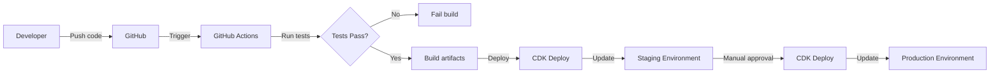

**Deployment Steps:**
1. Developer pushes code to GitHub
2. GitHub Actions runs tests (unit + integration)
3. If tests pass, build artifacts (Lambda bundles, Next.js build)
4. CDK synthesizes CloudFormation templates
5. Deploy to staging environment
6. Run smoke tests on staging
7. Manual approval required for production
8. Deploy to production environment
9. Monitor CloudWatch for errors

### CDK Stack Structure

```
infrastructure/
├── bin/
│   └── kairos.ts                 # CDK app entry point
├── lib/
│   ├── kairos-stack.ts           # Main stack
│   ├── stacks/
│   │   ├── network-stack.ts      # VPC, subnets, endpoints
│   │   ├── database-stack.ts     # Aurora Serverless v2
│   │   ├── auth-stack.ts         # Cognito User Pool
│   │   ├── api-stack.ts          # API Gateway (HTTP + WebSocket)
│   │   ├── lambda-stack.ts       # All Lambda functions
│   │   ├── storage-stack.ts      # S3 buckets, CloudFront
│   │   ├── secrets-stack.ts      # Secrets Manager, Parameter Store
│   │   └── monitoring-stack.ts   # CloudWatch, X-Ray, alarms
│   └── constructs/
│       ├── lambda-function.ts    # Reusable Lambda construct
│       └── api-route.ts          # Reusable API route construct
└── cdk.json                      # CDK configuration
```

### Monitoring & Alerting

**CloudWatch Alarms:**
- Lambda error rate > 5%
- Lambda duration > 10 seconds (p99)
- API Gateway 5xx errors > 1%
- Aurora CPU > 80%
- Aurora connections > 80% of max

**CloudWatch Dashboards:**
- API performance (latency, error rate, request count)
- Lambda performance (duration, errors, throttles)
- Database performance (CPU, connections, queries)
- Business metrics (members, donations, souls)

**X-Ray Tracing:**
- Sample 10% of requests
- Trace Lambda → Aurora queries
- Identify slow queries and bottlenecks

---

## API Design

### Overview
Kairos uses a RESTful API design with URL-based versioning (`/v1/`). All endpoints follow consistent patterns for CRUD operations, filtering, pagination, and error handling.

### API Structure

**Base URL:** `https://api.kairos.church/v1`

### Endpoint Patterns

| Resource | Endpoint | Method | Purpose |
|----------|----------|--------|---------|
| **Members** | `/v1/members` | GET | List members (with filtering) |
| | `/v1/members` | POST | Create member |
| | `/v1/members/{id}` | GET | Get single member |
| | `/v1/members/{id}` | PUT | Update member |
| | `/v1/members/{id}` | DELETE | Soft delete member |
| | `/v1/members/{id}/approve` | POST | Approve pending member |
| | `/v1/members/import` | POST | Bulk import from CSV |
| | `/v1/members/export` | GET | Export to CSV |
| **Branches** | `/v1/branches` | GET | List branches |
| | `/v1/branches` | POST | Create branch |
| | `/v1/branches/{id}` | GET | Get single branch |
| | `/v1/branches/{id}` | PUT | Update branch |
| | `/v1/branches/{id}/leadership` | POST | Assign pastor/elder |
| **Departments** | `/v1/departments` | GET | List departments |
| | `/v1/departments` | POST | Create department |
| | `/v1/departments/{id}/members` | POST | Assign member |
| | `/v1/departments/{id}/requests` | GET | List join requests |
| | `/v1/departments/{id}/requests/{requestId}/approve` | POST | Approve request |
| **Fellowships** | `/v1/fellowships` | GET | List fellowships |
| | `/v1/fellowships` | POST | Create fellowship |
| | `/v1/fellowships/{id}/members` | POST | Add member |
| | `/v1/fellowships/{id}/meetings` | POST | Record meeting |
| | `/v1/fellowships/{id}/meetings/{meetingId}/attendance` | POST | Record attendance |
| **Attendance** | `/v1/attendance/services` | POST | Record service attendance |
| | `/v1/attendance/services` | GET | List service attendance |
| | `/v1/attendance/fellowships/{fellowshipId}` | GET | Get fellowship attendance |
| **Outreach** | `/v1/outreach/programs` | GET | List programs |
| | `/v1/outreach/programs` | POST | Create program |
| | `/v1/outreach/programs/{id}/workers` | POST | Register worker |
| **Souls** | `/v1/souls` | POST | Capture soul |
| | `/v1/souls` | GET | List souls |
| | `/v1/souls/{id}` | GET | Get soul details |
| | `/v1/souls/{id}/followups` | POST | Log follow-up |
| | `/v1/souls/{id}/assign` | POST | Assign/reassign worker |
| | `/v1/souls/{id}/status` | PUT | Update status |
| **Donations** | `/v1/donations` | POST | Record donation (online or manual) |
| | `/v1/donations` | GET | List donations |
| | `/v1/donations/{id}` | GET | Get donation details |
| | `/v1/donations/reports` | GET | Get donation reports |
| | `/v1/donations/export` | GET | Export to CSV |
| **Forms** | `/v1/forms` | GET | List forms |
| | `/v1/forms` | POST | Create form |
| | `/v1/forms/{id}` | GET | Get form definition |
| | `/v1/forms/{id}/submit` | POST | Submit form |
| | `/v1/forms/{id}/submissions` | GET | List submissions |
| **Notifications** | `/v1/notifications` | GET | List notifications for user |
| | `/v1/notifications` | POST | Create notification (broadcast) |
| | `/v1/notifications/{id}/read` | POST | Mark as read |
| **Reports** | `/v1/reports/dashboard` | GET | Get dashboard data |
| | `/v1/reports/attendance` | GET | Get attendance trends |
| | `/v1/reports/donations` | GET | Get donation summary |

### Request/Response Patterns

#### Pagination
All list endpoints support pagination:

```http
GET /v1/members?page=1&limit=50
```

**Response:**
```json
{
  "data": [...],
  "pagination": {
    "page": 1,
    "limit": 50,
    "total": 250,
    "totalPages": 5
  }
}
```

#### Filtering
List endpoints support filtering via query parameters:

```http
GET /v1/members?branchId=123&status=active&search=john
```

#### Sorting
```http
GET /v1/members?sortBy=lastName&sortOrder=asc
```

#### Error Responses
All errors follow a consistent format:

```json
{
  "error": {
    "code": "VALIDATION_ERROR",
    "message": "Invalid input data",
    "details": [
      {
        "field": "email",
        "message": "Invalid email format"
      }
    ]
  }
}
```

**HTTP Status Codes:**
- `200 OK` - Success
- `201 Created` - Resource created
- `400 Bad Request` - Invalid input
- `401 Unauthorized` - Missing or invalid token
- `403 Forbidden` - Insufficient permissions
- `404 Not Found` - Resource not found
- `409 Conflict` - Resource conflict (e.g., duplicate email)
- `422 Unprocessable Entity` - Validation error
- `500 Internal Server Error` - Server error

### Authentication & Authorization

**Authentication Header:**
```http
Authorization: Bearer <JWT_TOKEN>
```

**JWT Payload:**
```json
{
  "sub": "user-id",
  "email": "user@example.com",
  "cognito:groups": ["Admin"],
  "custom:branchId": "branch-123",
  "custom:role": "Admin",
  "exp": 1234567890
}
```

**Authorization Flow:**
1. Client sends request with JWT in `Authorization` header
2. API Gateway invokes Custom Authorizer Lambda
3. Authorizer validates JWT with Cognito
4. Authorizer extracts user context (userId, branchId, role)
5. Authorizer checks branch-level permissions
6. Authorizer returns policy document (Allow/Deny)
7. API Gateway forwards request to Lambda with context
8. Lambda enforces additional business logic permissions

### WebSocket API

**Connection URL:** `wss://ws.kairos.church`

**Connection Flow:**
1. Client connects with JWT in query string: `wss://ws.kairos.church?token=<JWT>`
2. `$connect` route invokes connection Lambda
3. Lambda validates JWT and stores connection in database
4. Client receives connection ID

**Message Format:**
```json
{
  "action": "sendMessage",
  "data": {
    "type": "notification",
    "payload": {...}
  }
}
```

**Routes:**
- `$connect` - Handle new connections
- `$disconnect` - Handle disconnections
- `sendMessage` - Send message to user/group
- `$default` - Handle unknown actions

**Server-to-Client Messages:**
```json
{
  "type": "notification",
  "data": {
    "notificationId": "123",
    "title": "New Soul Assigned",
    "message": "You have been assigned a new soul for follow-up",
    "priority": "High"
  }
}
```

### OpenAPI Specification

The complete API is documented in OpenAPI 3.0 format:

```yaml
openapi: 3.0.0
info:
  title: Kairos API
  version: 1.0.0
  description: Church administration platform API

servers:
  - url: https://api.kairos.church/v1
    description: Production
  - url: https://api-staging.kairos.church/v1
    description: Staging

components:
  securitySchemes:
    BearerAuth:
      type: http
      scheme: bearer
      bearerFormat: JWT

  schemas:
    Member:
      type: object
      properties:
        id:
          type: string
          format: uuid
        firstName:
          type: string
        lastName:
          type: string
        email:
          type: string
          format: email
        phone:
          type: string
        branchId:
          type: string
        status:
          type: string
          enum: [active, inactive, pending]
        createdAt:
          type: string
          format: date-time

    Error:
      type: object
      properties:
        error:
          type: object
          properties:
            code:
              type: string
            message:
              type: string
            details:
              type: array
              items:
                type: object

security:
  - BearerAuth: []

paths:
  /members:
    get:
      summary: List members
      parameters:
        - name: page
          in: query
          schema:
            type: integer
            default: 1
        - name: limit
          in: query
          schema:
            type: integer
            default: 50
        - name: branchId
          in: query
          schema:
            type: string
        - name: status
          in: query
          schema:
            type: string
            enum: [active, inactive, pending]
      responses:
        '200':
          description: Success
          content:
            application/json:
              schema:
                type: object
                properties:
                  data:
                    type: array
                    items:
                      $ref: '#/components/schemas/Member'
                  pagination:
                    type: object
    
    post:
      summary: Create member
      requestBody:
        required: true
        content:
          application/json:
            schema:
              $ref: '#/components/schemas/Member'
      responses:
        '201':
          description: Created
          content:
            application/json:
              schema:
                $ref: '#/components/schemas/Member'
        '400':
          description: Bad Request
          content:
            application/json:
              schema:
                $ref: '#/components/schemas/Error'
```

---

## Data Flow Patterns

### 1. Member Registration Flow

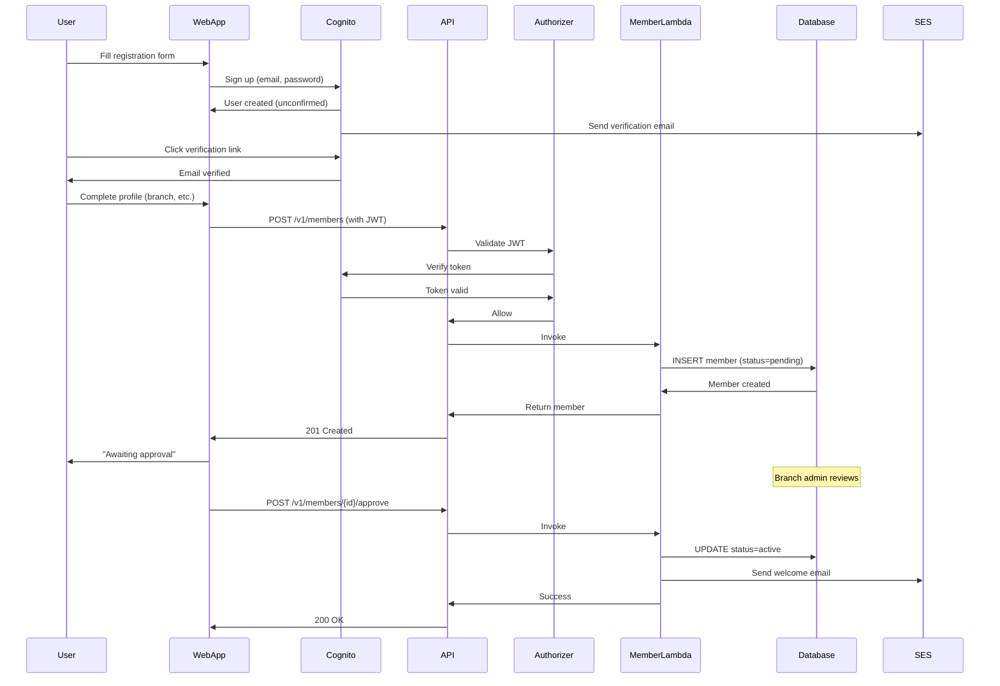

### 2. Donation Processing Flow (Online)

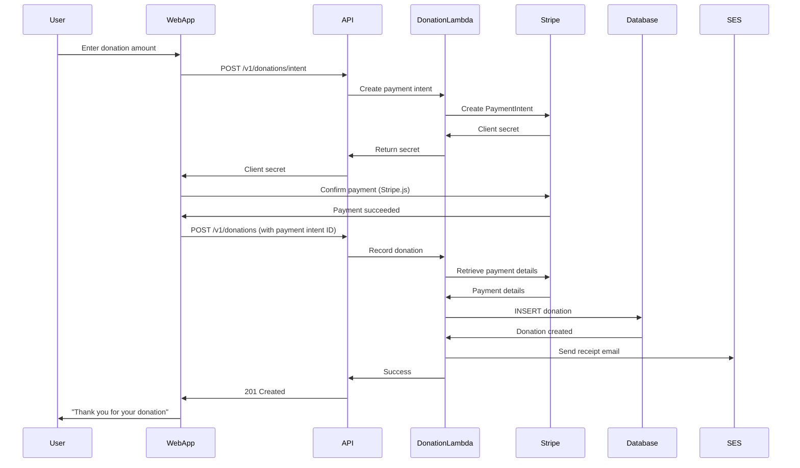

### 3. Soul Capture & Follow-up Flow

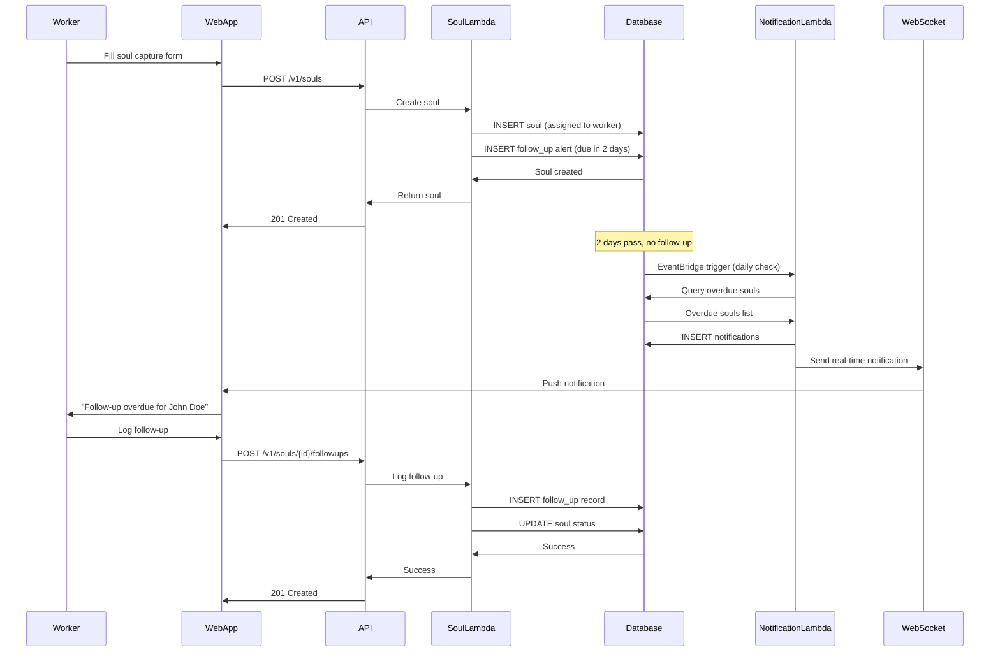

### 4. Attendance Recording Flow

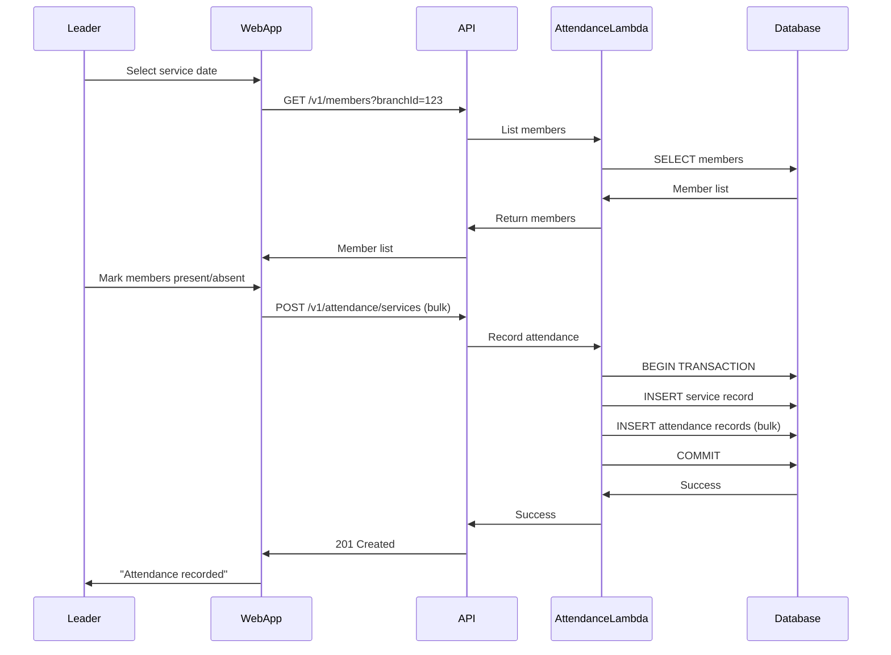

### 5. Nightly Analytics Export Flow

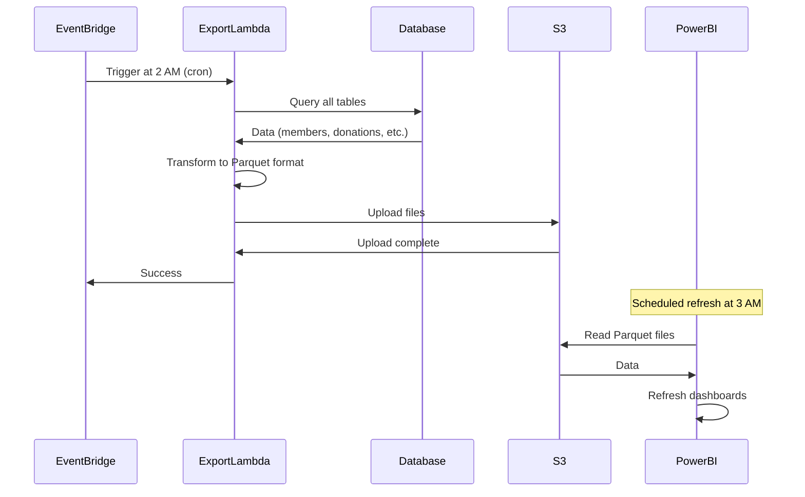

### 6. Real-time Notification Flow

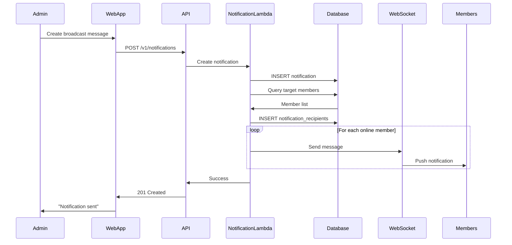

---

## Security Architecture

### Overview
Security is implemented at multiple layers: network, application, data, and identity. All security controls follow AWS Well-Architected Framework security pillar best practices.

### Security Layers

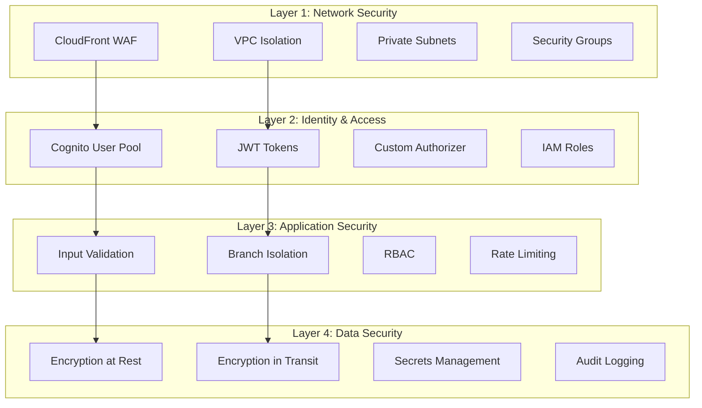

### 1. Network Security

**VPC Configuration:**
- Aurora database in private subnets (no internet access)
- Lambda functions access Aurora via VPC ENIs
- No public-facing database endpoints
- VPC endpoints for AWS services (S3, Secrets Manager)

**Security Groups:**
```
Aurora Security Group:
- Inbound: Port 5430 from Lambda Security Group only
- Outbound: None

Lambda Security Group:
- Inbound: None
- Outbound: Port 5430 to Aurora Security Group
- Outbound: Port 443 to VPC endpoints
```

**CloudFront WAF (Optional - Phase 2):**
- Rate limiting (1000 requests/5 minutes per IP)
- Geo-blocking (if needed)
- SQL injection protection
- XSS protection

### 2. Identity & Access Management

**Cognito User Pool Configuration:**
```json
{
  "passwordPolicy": {
    "minimumLength": 12,
    "requireUppercase": true,
    "requireLowercase": true,
    "requireNumbers": true,
    "requireSymbols": true
  },
  "mfaConfiguration": "OPTIONAL",
  "emailVerificationRequired": true,
  "accountRecoverySetting": {
    "recoveryMechanisms": [
      { "priority": 1, "name": "verified_email" }
    ]
  }
}
```

**JWT Token Structure:**
```json
{
  "sub": "user-uuid",
  "email": "user@example.com",
  "email_verified": true,
  "cognito:groups": ["Admin"],
  "custom:branchId": "branch-123",
  "custom:role": "Admin",
  "custom:memberId": "member-456",
  "iat": 1234567890,
  "exp": 1234571490
}
```

**Custom Authorizer Logic:**
```typescript
export const handler = async (event: APIGatewayAuthorizerEvent) => {
  try {
    // 1. Extract and validate JWT
    const token = extractToken(event.authorizationToken);
    const decoded = await verifyJWT(token); // Verify with Cognito
    
    // 2. Extract user context
    const userId = decoded.sub;
    const branchId = decoded['custom:branchId'];
    const role = decoded['custom:role'];
    
    // 3. Check branch-level permissions
    const resource = event.methodArn; // e.g., /v1/members/123
    const allowed = await checkPermissions(userId, branchId, role, resource);
    
    if (!allowed) {
      return generatePolicy('Deny', event.methodArn);
    }
    
    // 4. Return policy with context
    return generatePolicy('Allow', event.methodArn, {
      userId,
      branchId,
      role,
      memberId: decoded['custom:memberId']
    });
  } catch (error) {
    return generatePolicy('Deny', event.methodArn);
  }
};
```

**IAM Roles:**
- Lambda Execution Role: Minimal permissions (logs, X-Ray, VPC, Secrets Manager)
- Lambda Function Roles: Specific permissions per function group
- CDK Deployment Role: Infrastructure management permissions

### 3. Application Security

**Branch-Level Data Isolation:**

Every Lambda function enforces branch isolation:

```typescript
// Example: List members
export const handler = async (event: APIGatewayProxyEvent) => {
  const authContext = event.requestContext.authorizer;
  const { branchId, role } = authContext;
  
  // Admins can see all branches
  if (role === 'Admin') {
    const requestedBranchId = event.queryStringParameters?.branchId;
    return await db.members.findMany({
      where: { branchId: requestedBranchId || undefined }
    });
  }
  
  // Pastors/Leaders/Members can only see their branch
  return await db.members.findMany({
    where: { branchId }
  });
};
```

**Role-Based Access Control (RBAC):**

| Role | Permissions |
|------|-------------|
| **Admin** | Full access to all branches and features |
| **Pastor** | Full access to their branch only |
| **Leader** | Access to their department/fellowship only |
| **Member** | Access to their own profile and public data |

**Permission Matrix:**

| Action | Admin | Pastor | Leader | Member |
|--------|-------|--------|--------|--------|
| View all members | ✅ All branches | ✅ Own branch | ✅ Own dept/fellowship | ❌ |
| Create member | ✅ | ✅ | ❌ | ❌ |
| Edit member | ✅ | ✅ Own branch | ❌ | ✅ Own profile |
| Delete member | ✅ | ✅ Own branch | ❌ | ❌ |
| View donations | ✅ All | ✅ Own branch | ❌ | ✅ Own donations |
| Record donation | ✅ | ✅ | ❌ | ❌ |
| Capture soul | ✅ | ✅ | ✅ | ✅ |
| View all souls | ✅ All | ✅ Own branch | ✅ Assigned | ✅ Own captured |
| Approve department join | ✅ | ✅ | ✅ Own dept | ❌ |
| Create form | ✅ | ✅ | ✅ | ❌ |
| Submit form | ✅ | ✅ | ✅ | ✅ |

**Input Validation:**

All inputs validated using Zod schemas:

```typescript
import { z } from 'zod';

const MemberSchema = z.object({
  firstName: z.string().min(1).max(100),
  lastName: z.string().min(1).max(100),
  email: z.string().email(),
  phone: z.string().regex(/^\+?[1-9]\d{1,14}$/),
  branchId: z.string().uuid(),
  dateOfBirth: z.string().date().optional(),
  gender: z.enum(['Male', 'Female']),
});

export const validateMemberInput = (input: unknown) => {
  return MemberSchema.parse(input); // Throws if invalid
};
```

**SQL Injection Protection:**
- Drizzle ORM parameterizes all queries
- No raw SQL with user input
- Prepared statements for all database operations

**XSS Protection:**
- React automatically escapes output
- Content Security Policy headers
- Sanitize user-generated content (form submissions)

**Rate Limiting:**
- API Gateway throttling: 1000 requests/second per account
- Per-user throttling: 100 requests/minute (enforced in authorizer)
- Burst limit: 2000 requests

### 4. Data Security

**Encryption at Rest:**
- Aurora: AES-256 encryption enabled
- S3: Server-side encryption (SSE-S3)
- Secrets Manager: KMS encryption
- CloudWatch Logs: KMS encryption

**Encryption in Transit:**
- All API calls: TLS 1.2+
- Database connections: SSL/TLS enforced
- S3 uploads: HTTPS only
- WebSocket: WSS (TLS)

**Secrets Management:**

```typescript
// Database credentials
const dbCredentials = await secretsManager.getSecretValue({
  SecretId: 'kairos-prod-db-credentials'
}).promise();

const { username, password, host, port } = JSON.parse(dbCredentials.SecretString);

// Connection with SSL
const db = drizzle(postgres({
  host,
  port,
  username,
  password,
  database: 'kairos',
  ssl: { rejectUnauthorized: true }
}));
```

**Secrets Rotation:**
- Database credentials: Auto-rotate every 30 days
- API keys: Manual rotation (documented process)
- JWT signing keys: Rotate on security events

**Data Retention:**
- Active member data: Retained indefinitely
- Inactive member data: Retained for 7 years (GDPR compliance)
- Audit logs: Retained for 90 days
- CloudWatch logs: 7-30 days (configurable)
- Soft-deleted records: Retained for 30 days, then hard delete

**Personal Data Handling:**
- Member data classified as PII
- Donation data classified as sensitive
- Access logged in CloudWatch
- Data export requests handled via admin interface
- Data deletion requests processed within 30 days

### 5. Audit & Compliance

**CloudTrail Logging:**
- All API calls logged
- S3 access logged
- Database admin actions logged
- Secrets access logged

**Application Logging:**
```typescript
logger.info('Member created', {
  action: 'CREATE_MEMBER',
  userId: authContext.userId,
  branchId: authContext.branchId,
  memberId: member.id,
  timestamp: new Date().toISOString()
});
```

**GDPR Compliance:**
- Right to access: Member can export their data
- Right to rectification: Member can update their profile
- Right to erasure: Admin can delete member (soft delete, then hard delete after 30 days)
- Right to data portability: CSV export available
- Consent management: Tracked in member record

**Security Monitoring:**
- CloudWatch alarms for suspicious activity
- X-Ray for request tracing
- Failed login attempts tracked
- Unusual API patterns detected

### 6. Incident Response

**Security Incident Playbook:**

1. **Detection**
   - CloudWatch alarm triggers
   - Manual report from user
   - Automated security scan

2. **Containment**
   - Disable compromised user accounts
   - Rotate affected credentials
   - Block malicious IPs (WAF)

3. **Investigation**
   - Review CloudTrail logs
   - Check X-Ray traces
   - Identify affected data

4. **Remediation**
   - Patch vulnerabilities
   - Update security rules
   - Deploy fixes

5. **Recovery**
   - Restore from backups if needed
   - Re-enable services
   - Notify affected users

6. **Post-Incident**
   - Document incident
   - Update security policies
   - Conduct retrospective

---

## Scalability & Performance

### Overview
Kairos is designed to scale from 10 churches to 1000+ churches without architectural changes. The serverless architecture auto-scales with demand.

### Scaling Dimensions

| Component | Current Scale | Target Scale | Scaling Strategy |
|-----------|--------------|--------------|------------------|
| **Members** | 500 | 50,000+ | Database indexes, pagination |
| **Branches** | 5 | 500+ | Horizontal (no limits) |
| **Concurrent Users** | 100 | 5,000+ | Lambda auto-scaling |
| **API Requests** | 1,000/min | 100,000/min | API Gateway throttling |
| **Database** | 0.5 ACU | 16 ACU | Aurora auto-scaling |
| **File Storage** | 10 GB | 1 TB+ | S3 (unlimited) |
| **WebSocket Connections** | 100 | 10,000+ | API Gateway auto-scaling |

### Performance Targets

| Metric | Target | Measurement |
|--------|--------|-------------|
| **API Response Time (p50)** | < 200ms | CloudWatch |
| **API Response Time (p95)** | < 500ms | CloudWatch |
| **API Response Time (p99)** | < 1000ms | CloudWatch |
| **Page Load Time** | < 3 seconds | Lighthouse |
| **Database Query Time (p95)** | < 100ms | X-Ray |
| **Lambda Cold Start** | < 500ms | CloudWatch |
| **Lambda Warm Start** | < 50ms | CloudWatch |

### Database Performance

**Indexing Strategy:**

```sql
-- Primary keys (automatic)
CREATE INDEX idx_members_branch_id ON members(home_branch_id);
CREATE INDEX idx_members_email ON members(email) WHERE is_active = TRUE;
CREATE INDEX idx_members_phone ON members(phone) WHERE is_active = TRUE;
CREATE INDEX idx_members_status ON members(is_active);

-- Composite indexes for common queries
CREATE INDEX idx_members_branch_status ON members(home_branch_id, is_active);
CREATE INDEX idx_donations_member_date ON donations(member_id, donation_date DESC);
CREATE INDEX idx_souls_assigned_status ON souls(assigned_member_id, status) WHERE status != 'Converted';
CREATE INDEX idx_attendance_service_member ON service_attendance(service_id, member_id);

-- Full-text search indexes
CREATE INDEX idx_members_search ON members USING gin(to_tsvector('english', first_name || ' ' || last_name || ' ' || email));
```

**Query Optimization:**
- Use `EXPLAIN ANALYZE` for slow queries
- Limit result sets with pagination
- Use database connection pooling
- Avoid N+1 queries (use joins or batch queries)

**Connection Pooling:**

Aurora Serverless v2 handles connection pooling automatically, but Lambda functions should reuse connections:

```typescript
// Reuse database connection across Lambda invocations
let db: ReturnType<typeof drizzle> | null = null;

export const handler = async (event: APIGatewayProxyEvent) => {
  if (!db) {
    db = await initializeDatabase();
  }
  
  // Use db for queries
  const members = await db.select().from(membersTable);
  
  return {
    statusCode: 200,
    body: JSON.stringify(members)
  };
};
```

### Lambda Performance

**Cold Start Optimization:**
- Keep bundle size small (< 5MB)
- Use Lambda layers for shared dependencies
- Use Drizzle ORM (lightweight vs Prisma)
- Minimize dependencies
- Use esbuild for bundling

**Memory Configuration:**
- Start with 512MB
- Monitor CloudWatch metrics
- Increase if CPU-bound (memory = CPU in Lambda)
- Typical range: 512MB-1024MB

**Provisioned Concurrency (if needed):**
- Reserve capacity for critical lambdas
- Eliminates cold starts
- More expensive (pay for idle time)
- Use for high-traffic endpoints only

### API Gateway Performance

**Caching:**
- Enable caching for read-heavy endpoints
- Cache TTL: 5 minutes for dashboards, 1 minute for lists
- Invalidate cache on updates

**Throttling:**
- Account-level: 10,000 requests/second
- Per-route: 1,000 requests/second
- Burst: 5,000 requests

### CDN Performance

**CloudFront Configuration:**
- Cache static assets (images, CSS, JS) for 1 year
- Cache member photos for 1 day
- Use gzip/brotli compression
- Enable HTTP/2

**Cache Invalidation:**
- Invalidate on file upload
- Use versioned URLs for assets (`/assets/v1/logo.png`)

### Monitoring & Optimization

**CloudWatch Dashboards:**

```
Kairos Performance Dashboard
├── API Performance
│   ├── Request count (by endpoint)
│   ├── Latency (p50, p95, p99)
│   ├── Error rate (4xx, 5xx)
│   └── Throttled requests
├── Lambda Performance
│   ├── Invocation count
│   ├── Duration (p50, p95, p99)
│   ├── Error count
│   ├── Throttles
│   └── Cold starts
├── Database Performance
│   ├── CPU utilization
│   ├── Connection count
│   ├── Query duration
│   └── ACU usage
└── Business Metrics
    ├── Active users
    ├── Members created
    ├── Donations processed
    └── Souls captured
```

**X-Ray Tracing:**

```typescript
import AWSXRay from 'aws-xray-sdk-core';
import { captureAWSv3Client } from 'aws-xray-sdk-core';

// Wrap AWS SDK clients
const s3Client = captureAWSv3Client(new S3Client({}));

// Custom segments
export const handler = async (event: APIGatewayProxyEvent) => {
  const segment = AWSXRay.getSegment();
  
  const subsegment = segment.addNewSubsegment('database-query');
  try {
    const members = await db.select().from(membersTable);
    subsegment.close();
    return { statusCode: 200, body: JSON.stringify(members) };
  } catch (error) {
    subsegment.addError(error);
    subsegment.close();
    throw error;
  }
};
```

### Load Testing

**Test Scenarios:**

1. **Normal Load**
   - 100 concurrent users
   - 1000 requests/minute
   - Mix of read/write operations

2. **Peak Load (Sunday Service)**
   - 500 concurrent users
   - 5000 requests/minute
   - Heavy attendance recording

3. **Spike Load (Event Registration)**
   - 1000 concurrent users
   - 10,000 requests/minute
   - Burst traffic

**Tools:**
- Artillery for API load testing
- Lighthouse for frontend performance
- k6 for WebSocket load testing

### Scaling Strategies

**Horizontal Scaling:**
- Lambda: Auto-scales to 1000 concurrent executions (default)
- API Gateway: Auto-scales (no limits)
- Aurora: Add read replicas if needed (Phase 2)

**Vertical Scaling:**
- Lambda: Increase memory (512MB → 1024MB)
- Aurora: Increase ACU (0.5 → 16)

**Caching:**
- API Gateway caching for read-heavy endpoints
- CloudFront caching for static assets
- Application-level caching (Redis - Phase 2)

**Database Optimization:**
- Add indexes for slow queries
- Partition large tables (if > 10M rows)
- Archive old data (soft-deleted records)

### Cost Optimization

**Current Costs (500 members, 5 branches):**
- Aurora Serverless v2: $30-50/month
- Lambda: $10-20/month
- API Gateway: $5-10/month
- S3 + CloudFront: $5/month
- Other services: $10/month
- **Total: ~$60-95/month**

**Projected Costs (10,000 members, 100 branches):**
- Aurora Serverless v2: $200-400/month
- Lambda: $100-200/month
- API Gateway: $50-100/month
- S3 + CloudFront: $50/month
- Other services: $50/month
- **Total: ~$450-800/month**

**Cost Optimization Strategies:**
- Use S3 Intelligent-Tiering for old files
- Use CloudWatch Logs retention policies
- Use Lambda reserved concurrency only when needed
- Use Aurora auto-pause (if traffic is very low)
- Monitor and right-size Lambda memory

---

## Architecture Decision Records (ADRs)

### ADR-001: Serverless Architecture

**Status:** Accepted

**Context:** Need to build a scalable, cost-effective church administration platform with variable load patterns.

**Decision:** Use AWS Lambda for compute, Aurora Serverless v2 for database, and API Gateway for API layer.

**Consequences:**
- ✅ Auto-scaling with demand
- ✅ Pay-per-use pricing
- ✅ No server management
- ✅ Fast iteration
- ❌ Cold start latency
- ❌ Vendor lock-in (AWS)

---

### ADR-002: Granular Lambda Functions

**Status:** Accepted

**Context:** Need to decide between monolithic lambdas (one per module) vs granular lambdas (one per operation).

**Decision:** Use granular lambdas (e.g., `members-create`, `members-list`, `members-get`).

**Consequences:**
- ✅ True single responsibility
- ✅ Independent scaling
- ✅ Smaller blast radius
- ✅ Faster cold starts
- ❌ More lambdas to manage (mitigated by CDK)
- ❌ Potential code duplication (mitigated by layers)

---

### ADR-003: Drizzle ORM

**Status:** Accepted

**Context:** Need to choose an ORM for TypeScript + PostgreSQL in serverless environment.

**Decision:** Use Drizzle ORM instead of Prisma.

**Consequences:**
- ✅ Lightweight (~30KB vs 2-3MB)
- ✅ Faster cold starts
- ✅ TypeScript-native schema
- ✅ Better for serverless
- ❌ Less mature than Prisma
- ❌ Smaller community

---

### ADR-004: Next.js for Web App

**Status:** Accepted

**Context:** Need to choose a frontend framework for the web application.

**Decision:** Use Next.js (React framework) with TypeScript.

**Consequences:**
- ✅ Server-side rendering
- ✅ Great TypeScript support
- ✅ Built-in routing
- ✅ Large ecosystem
- ✅ Can share types with backend
- ❌ Learning curve for team

---

### ADR-005: Defer Native Mobile Apps to Phase 2

**Status:** Accepted

**Context:** 10-week timeline is tight. Need to decide on mobile strategy.

**Decision:** Launch web-only (responsive), defer React Native apps to Phase 2.

**Consequences:**
- ✅ Saves 2-3 weeks development time
- ✅ Web app works on mobile browsers
- ✅ Can gather user feedback before building native
- ❌ No offline capabilities
- ❌ No push notifications (Phase 1)

---

### ADR-006: Branch-Level Data Isolation

**Status:** Accepted

**Context:** Multi-tenant system needs data isolation strategy.

**Decision:** Enforce branch-level isolation in custom authorizer + application code (not database-level).

**Consequences:**
- ✅ Simpler database schema
- ✅ Flexible permissions (admins can see all)
- ✅ Easier to implement cross-branch features later
- ❌ Must enforce in every Lambda function
- ❌ Risk of bugs exposing data

---

### ADR-007: OpenAPI for API Documentation

**Status:** Accepted

**Context:** Need to document API and generate type-safe clients.

**Decision:** Use OpenAPI 3.0 spec + `openapi-typescript` for client generation.

**Consequences:**
- ✅ Type-safe API calls
- ✅ Auto-generated client
- ✅ Industry standard
- ✅ Can generate Postman collections
- ❌ Must keep spec in sync with implementation

---

## Appendix

### Technology Stack Summary

| Layer | Technology | Version | Purpose |
|-------|-----------|---------|---------|
| **Frontend** | Next.js | 14.x | Web application framework |
| | React | 18.x | UI library |
| | TypeScript | 5.x | Type safety |
| | Zustand | 4.x | State management |
| | TanStack Table | 8.x | Data tables |
| | React Hook Form | 7.x | Form management |
| | Zod | 3.x | Validation |
| **Backend** | Node.js | 20.x | Lambda runtime |
| | TypeScript | 5.x | Type safety |
| | Drizzle ORM | 0.29.x | Database ORM |
| | AWS SDK v3 | Latest | AWS service clients |
| **Infrastructure** | AWS CDK | 2.x | Infrastructure as Code |
| | TypeScript | 5.x | CDK language |
| **Database** | PostgreSQL | 15.x | Aurora Serverless v2 |
| **API** | API Gateway | HTTP API | REST API |
| | API Gateway | WebSocket API | Real-time |
| **Auth** | Amazon Cognito | - | User authentication |
| **Storage** | Amazon S3 | - | File storage |
| | CloudFront | - | CDN |
| **Monitoring** | CloudWatch | - | Logs and metrics |
| | X-Ray | - | Distributed tracing |
| **CI/CD** | GitHub Actions | - | Deployment pipeline |
| **External** | Stripe | Latest | Payment processing |
| | Amazon SES | - | Email delivery |

### Glossary

- **ACU:** Aurora Capacity Unit - measure of database compute/memory
- **CDK:** Cloud Development Kit - Infrastructure as Code framework
- **CDN:** Content Delivery Network - global file distribution
- **JWT:** JSON Web Token - authentication token format
- **ORM:** Object-Relational Mapping - database abstraction layer
- **RBAC:** Role-Based Access Control - permission system
- **VPC:** Virtual Private Cloud - isolated network
- **WAF:** Web Application Firewall - security layer

---

## Document Metadata

**Version:** 1.0  
**Date:** February 3, 2026  
**Status:** Draft - Pending Review  
**Authors:** Architecture Team  

**Change Log:**
- 2026-02-03: Initial architecture document created

**Next Steps:**
1. Review and approve architecture
2. Create design.md (UI/UX requirements)
3. Begin infrastructure setup (Week 1)
4. Implement core lambdas (Week 2-4)

---

*This architecture document defines the technical foundation for Kairos. All implementation decisions should align with these architectural patterns and principles.*
